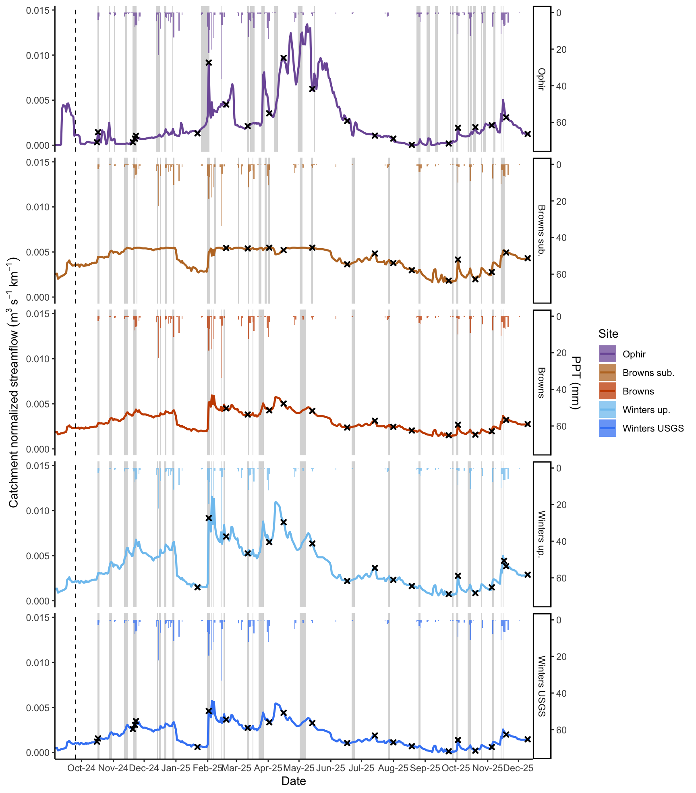
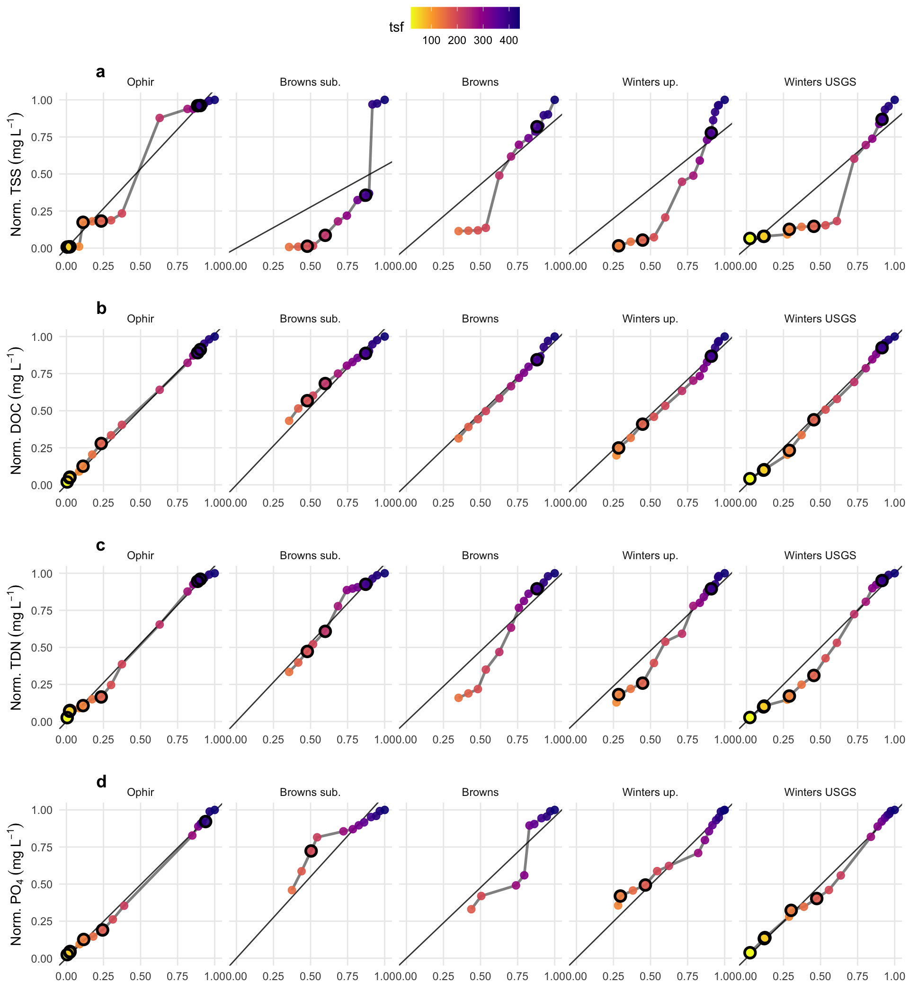
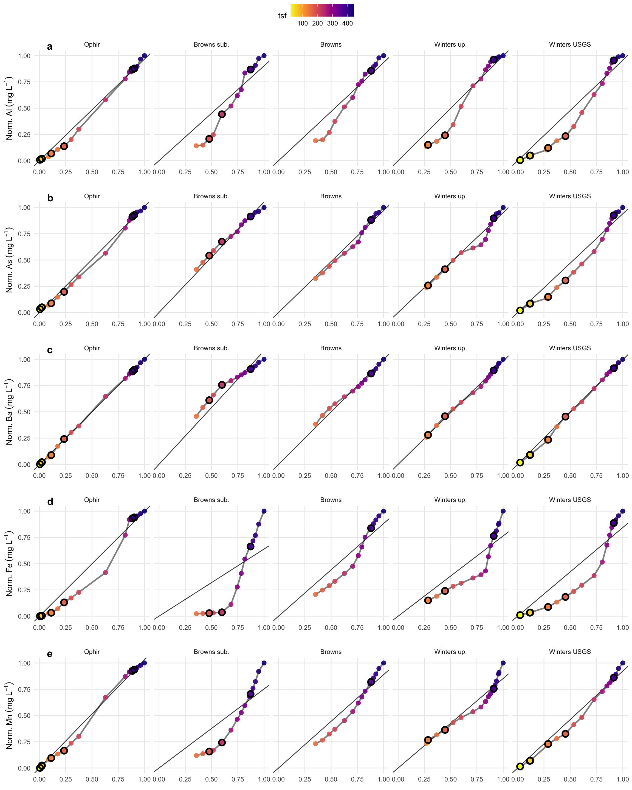

ERDC Davis Fire MS L-Q analysis
================
Kelly Loria
2026-02-17

- [============================================================================](#section)
- [I. Characterize hydroclimate
  condtions](#i-characterize-hydroclimate-condtions)
  - [============================================================================](#section-1)
  - [Create variable that corresponds with PPT flow
    increase](#create-variable-that-corresponds-with-ppt-flow-increase)
- [Figure 2:](#figure-2)
  - [Runoff and sampling timing as streamflow, sample dates, and
    ppt](#runoff-and-sampling-timing-as-streamflow-sample-dates-and-ppt)
  - [Look at run off largest events:](#look-at-run-off-largest-events)
  - [============================================================================](#section-2)
- [II. MS basin differences in solute
  concetrations](#ii-ms-basin-differences-in-solute-concetrations)
  - [============================================================================](#section-3)
- [2. Basin water quality
  differences](#2-basin-water-quality-differences)
- [Figure 3:](#figure-3)
  - [============================================================================](#section-4)
- [III. Double mass curves: Calculate interval-based
  loads](#iii-double-mass-curves-calculate-interval-based-loads)
  - [============================================================================](#section-5)
  - [=========](#section-6)
  - [=========](#section-7)
  - [Flow + storm flags (unchanged logic, but
    isolated)](#flow--storm-flags-unchanged-logic-but-isolated)
  - [Core: interval loads + cumulative loads for all
    analytes](#core-interval-loads--cumulative-loads-for-all-analytes)
  - [Fxn to fit DMC models for any
    analyte](#fxn-to-fit-dmc-models-for-any-analyte)
  - [Inference](#inference)
  - [Plotting fxn for DMC](#plotting-fxn-for-dmc)
  - [Fxn for DMC residuals
    (cumulative)](#fxn-for-dmc-residuals-cumulative)
  - [Breakpoint detection (Davies + segmented) by
    site](#breakpoint-detection-davies--segmented-by-site)
  - [Fxn for companion plot (C residuals + breakpoint markers +
    storms)](#fxn-for-companion-plot-c-residuals--breakpoint-markers--storms)
  - [quick water yield calculation for just water year
    2025](#quick-water-yield-calculation-for-just-water-year-2025)
- [TSS](#tss)
- [DOC dynamics](#doc-dynamics)
- [TDN dynamics](#tdn-dynamics)
  - [PO4 dynamics](#po4-dynamics)
  - [Al dynamics](#al-dynamics)
  - [As dynamics](#as-dynamics)
  - [B dynamics](#b-dynamics)
  - [Ba dynamics](#ba-dynamics)
  - [Ca dynamics](#ca-dynamics)
  - [Cr dynamics](#cr-dynamics)
  - [Fe dynamics](#fe-dynamics)
  - [Mn dynamics](#mn-dynamics)
  - [Pb dynamics](#pb-dynamics)
  - [Sr dynamics](#sr-dynamics)
  - [B dynamics](#b-dynamics-1)
  - [Zn dynamics](#zn-dynamics)

<style type="text/css">
body, td {font-size: 12px;}
code.r{font-size: 8px;}
pre {font-size: 10px}
</style>

### ============================================================================

## I. Characterize hydroclimate condtions

### ============================================================================

- How do sampling events reflect baseflow or runoff?

- When did the largest transport events happen in each site?

### Create variable that corresponds with PPT flow increase

Based on

1.  Flow for any given day is elevated: (\>μ(previous 7
    days)+1⋅σ(previous 7 days))

2.  Rain happened on that day or the prior day

``` r
library(dplyr)
library(slider)

head(new_df_hydro)
```

    ##     site       date       flow   Name ppt..mm. lag_C_PPT
    ## 1 browns 2024-09-01 0.01888417 browns       NA        NA
    ## 2 browns 2024-09-02 0.01781396 browns       NA        NA
    ## 3 browns 2024-09-03 0.01792508 browns       NA        NA
    ## 4 browns 2024-09-04 0.01905485 browns       NA        NA
    ## 5 browns 2024-09-05 0.01826480 browns       NA        NA
    ## 6 browns 2024-09-06 0.01822308 browns       NA        NA

``` r
### infill missing flow:
new_df_hydro <- new_df_hydro %>%
  arrange(site, date) %>%
  group_by(site) %>%
  mutate(
    flow_filled = na.approx(flow, x = date, na.rm = FALSE)) %>%
  ungroup()


N <- 3 # Set pre-event window length in days

df2 <- new_df_hydro %>%
  arrange(site, date) %>%
  group_by(site) %>%
  mutate(
    # use the filled flow for stability; swap to `flow` if needed
    Q = flow_filled,

    # Rolling stats of PRIOR N days (exclude current day by sliding then lagging)
    mean_preN = lag(slide_dbl(Q, ~mean(.x, na.rm = TRUE), .before = N-1, .complete = TRUE)),
    sd_preN   = lag(slide_dbl(Q, ~sd(.x,   na.rm = TRUE), .before = N-1, .complete = TRUE)),

    # condition (2): ppt today OR yesterday > 0
    ppt_recent = (ppt..mm. > 0) | (lag(lag_C_PPT, default = 0) > 0),

    # condition (1): flow elevated at least 1 SD above mean of prior N days
    Q_thresh = mean_preN + sd_preN,
    elevated =(Q >= Q_thresh),

    runoff = if_else(ppt_recent & elevated, "yes", "no"),

    dQ = Q - lag(Q),
    runoff_dQ = if_else(runoff == "yes", dQ, NA_real_)
  ) %>%
  ungroup()


df21 <- df2 %>%
 arrange(site, date) %>%
  group_by(site) %>%
  mutate(
    runoff_flag = dplyr::coalesce(runoff == "yes", FALSE),

    event_start = runoff_flag & !lag(runoff_flag, default = FALSE),
    event_id    = if_else(runoff_flag, cumsum(event_start), 0L),
    event_end   = runoff_flag & !lead(runoff_flag, default = FALSE)
  ) %>%
  group_by(site, event_id) %>%
  mutate(
    event_start_date = if_else(event_id > 0L, min(date), as.Date(NA)),
    event_end_date   = if_else(event_id > 0L, max(date), as.Date(NA)),
    day_in_event     = if_else(event_id > 0L, row_number(), NA_integer_)
  ) %>%
  ungroup()
```

    ## # A tibble: 139 × 9
    ##    site   event_id_lf event_start_date event_end_date duration_days peak_flow
    ##    <chr>        <int> <date>           <date>                 <int>     <dbl>
    ##  1 browns           7 2024-10-17       2024-10-18                 2    0.0279
    ##  2 browns           9 2024-10-28       2024-10-30                 3    0.0335
    ##  3 browns          10 2024-11-12       2024-11-15                 4    0.0396
    ##  4 browns          11 2024-11-21       2024-11-23                 3    0.0428
    ##  5 browns          13 2024-12-14       2024-12-14                 1    0.0359
    ##  6 browns          14 2024-12-17       2024-12-17                 1    0.0389
    ##  7 browns          15 2024-12-22       2024-12-22                 1    0.0410
    ##  8 browns          16 2024-12-29       2024-12-30                 2    0.0419
    ##  9 browns          20 2025-02-01       2025-02-03                 3    0.0509
    ## 10 browns          21 2025-02-05       2025-02-05                 1    0.0582
    ## # ℹ 129 more rows
    ## # ℹ 3 more variables: peak_flow_date <date>, total_ppt_mm <dbl>,
    ## #   peak_ppt_mm <dbl>

## Figure 2:

### Runoff and sampling timing as streamflow, sample dates, and ppt



### Look at run off largest events:

#### A. Biggest peak exceedance

#### B. Biggest peak flow

    ## # A tibble: 5 × 9
    ##   site       event_id_lf event_start_date event_end_date duration_days peak_flow
    ##   <chr>            <int> <date>           <date>                 <int>     <dbl>
    ## 1 browns              21 2025-02-05       2025-02-05                 1    0.0582
    ## 2 browns_sub          36 2025-05-13       2025-05-14                 2    0.0515
    ## 3 ophir               32 2025-04-30       2025-05-04                 5    0.627 
    ## 4 winters_up          21 2025-02-05       2025-02-05                 1    0.0554
    ## 5 winters_u…          21 2025-02-05       2025-02-05                 1    0.0309
    ## # ℹ 3 more variables: peak_flow_date <date>, total_ppt_mm <dbl>,
    ## #   peak_ppt_mm <dbl>

### ============================================================================

## II. MS basin differences in solute concetrations

### ============================================================================

## 2. Basin water quality differences

``` r
library(dplyr)
library(ggplot2)
library(forcats)
library(rlang)

wq_boxplot <- function(data, y, y_lab,
                       x = burn_area,
                       site = site_lab,
                       fill = site_lab,
                       color = tsf,
                       hline = NULL,
                       filter_expr = NULL,
                       site_colors = NULL,
                       add_anova = TRUE,
                       anova_label_digits = 2,
                       anova_by_x = FALSE,
                       dodge_width = 0.75) {
  
  yq <- enquo(y); xq <- enquo(x); siteq <- enquo(site); fillq <- enquo(fill); colorq <- enquo(color)
  
  # names as strings (for base-model formulas)
  y_name    <- as_name(yq)
  x_name    <- as_name(xq)
  site_name <- as_name(siteq)
  
  pdat <- data
  if (!is.null(filter_expr)) pdat <- pdat %>% filter(!!enquo(filter_expr))
  
  # helper: p formatting - MODIFIED for 2 sig figs
  fmt_p <- function(p) {
    if (is.na(p)) return("p = NA")
    if (p < 0.001) return("p < 0.001")  # Changed: return statement for clarity
    if (p >= 0.001) return(paste0("p = ", signif(p, 2)))  # Changed: 2 sig figs instead of 3
  }
  
  make_anova_text <- function(dat) {
    dat <- dat %>%
      filter(!is.na(.data[[y_name]]), !is.na(.data[[site_name]])) %>%
      mutate(.y_num = as.numeric(.data[[y_name]]),
             .site  = as.factor(.data[[site_name]]))
    
    if (nrow(dat) < 3 || dplyr::n_distinct(dat$.site) < 2) return(NULL)
    
    fit <- aov(reformulate(".site", response = ".y_num"), data = dat)
    sm  <- summary(fit)[[1]]
    
    Fv  <- sm[["F value"]][1]
    df1 <- sm[["Df"]][1]
    df2 <- sm[["Df"]][2]
    pv  <- sm[["Pr(>F)"]][1]
    
    # CHANGE 2: Only return text if p < 0.09
    if (!is.na(pv) && pv >= 0.09) return(NULL)
    
    # CHANGE 1: Use "reach" instead of site_name
    paste0(
      "ANOVA (reach)\n",
      "F(", df1, ", ", df2, ") = ", round(Fv, anova_label_digits), "\n",
      fmt_p(pv)
    )
  }
  
  # compute label text
  anova_text <- NULL
  if (add_anova) {
    if (!anova_by_x) {
      anova_text <- make_anova_text(pdat)
    } else {
      res <- pdat %>%
        group_by(!!xq) %>%
        group_modify(~{
          txt <- make_anova_text(.x)
          
          # pull p to choose smallest p
          .x2 <- .x %>%
            filter(!is.na(.data[[y_name]]), !is.na(.data[[site_name]])) %>%
            mutate(.y_num = as.numeric(.data[[y_name]]),
                   .site  = as.factor(.data[[site_name]]))
          
          if (nrow(.x2) < 3 || dplyr::n_distinct(.x2$.site) < 2) {
            tibble(p = NA_real_, label = txt)
          } else {
            fit <- aov(reformulate(".site", response = ".y_num"), data = .x2)
            pv <- summary(fit)[[1]][["Pr(>F)"]][1]
            
            # CHANGE 2: Set label to NULL if p >= 0.09
            if (!is.na(pv) && pv >= 0.09) {
              tibble(p = pv, label = as.character(NA))
            } else {
              tibble(p = pv, label = txt)
            }
          }
        }) %>%
        ungroup()
      
      # choose smallest p (strongest evidence)
      if (all(is.na(res$p)) || all(is.na(res$label))) {
        anova_text <- NULL
      } else {
        # Filter out NA labels before selecting minimum p
        valid_res <- res %>% filter(!is.na(label))
        if (nrow(valid_res) > 0) {
          anova_text <- valid_res$label[which.min(valid_res$p)]
        } else {
          anova_text <- NULL
        }
      }
    }
  }
  
  # ---- Plot ----
  dodge <- position_dodge(width = dodge_width)
  
  p <- ggplot(pdat, aes(x = factor(!!xq), y = !!yq)) +
    geom_boxplot(
      aes(fill = !!fillq, group = interaction(!!xq, !!fillq)),
      alpha = 0.95,
      position = dodge
    ) +
     labs(y = y_lab, x = "Burn %", fill= "Reach") +
    theme_minimal()
  
  if (!is.null(site_colors)) p <- p + scale_fill_manual(values = site_colors,
                                                        breaks = names(site_strip_labs),
                                                        labels = site_strip_labs)
  if (!is.null(hline)) p <- p + geom_hline(yintercept = hline, linetype = "dashed")
  
  if (!is.null(anova_text)) {
    p <- p + annotate(
      "text",
      x = Inf, y = Inf,
      label = anova_text,
      hjust = 1.05, vjust = 1.1,
      size = 3
    )
  }
  
  p
}
```

## Figure 3:

#### Boxplot of solutes


### ============================================================================

## III. Double mass curves: Calculate interval-based loads

### ============================================================================

#### For each chemistry sample, calculate:

##### 1. Cumulative discharge from start to that sample date

##### 2. Load for that interval = concentration × discharge volume in interval

##### 3. Cumulative load over time

### =========

#### STEP 1: Prepare discharge data (daily values) + DOC loads

### =========

#### One-time setup: parameter tables + helpers

### Flow + storm flags (unchanged logic, but isolated)

``` r
prep_flow <- function(new_df_hydro, flow_start = as.Date("2024-10-01")) {
  new_df_hydro %>%
    filter(date >= flow_start) %>%
    mutate(sec_per_day = 86400) %>%
    arrange(site, date) %>%
    group_by(site) %>%
    mutate(
      Q_daily_liters = replace_na(flow_filled, 0) * 1000 * sec_per_day,
      Q_c_liters     = cumsum(Q_daily_liters),
      ppt_daily_cum  = cumsum(ppt..mm.)
    ) %>%
    ungroup()
}

#### YOU ARE HERE 

# 
# prep_storm_flags <- function(event_summary,test_keys) {
#   event_summary %>%
#     dplyr::select(site, event_id_lf, event_start_date, event_end_date, duration_days) %>%
#     dplyr::filter(!is.na(event_start_date), !is.na(event_end_date)) %>%
#     dplyr::arrange(site, event_start_date) %>%
#     dplyr::distinct(site, event_id_lf, event_start_date, event_end_date, .keep_all = TRUE)
# 
#   test_keys %>%
#     dplyr::select(site, date) %>%
#     inner_join(prep_storm_flags, by = c("site", "date")) %>%
#     transmute(site, date, storm = "storm") %>%
#     distinct()
# }

prep_storm_flags <- function(event_summary, test_keys) {

  storms <- event_summary %>%
    dplyr::select(site, event_id_lf, event_start_date, event_end_date, duration_days) %>%
    dplyr::filter(!is.na(event_start_date), !is.na(event_end_date)) %>%
    dplyr::arrange(site, event_start_date) %>%
    dplyr::distinct(site, event_id_lf, event_start_date, event_end_date, .keep_all = TRUE)

  keys <- test_keys %>%
    dplyr::select(site, date)

  keys %>%
    dplyr::inner_join(storms, by = "site") %>%              # match by site first
    dplyr::filter(date >= event_start_date, date <= event_end_date) %>%  # then interval
    dplyr::transmute(site, date, storm = "storm") %>%
    dplyr::distinct()
}
```

### Core: interval loads + cumulative loads for all analytes

``` r
prep_chem_loads_long <- function(test_dat, flow_df, storm_df, analytes_tbl,
                                 chem_start = as.Date("2024-09-30")) {

  chem_long <- test_dat %>%
    filter(date >= chem_start) %>%
    dplyr::select(site, date, all_of(analytes_tbl$col)) %>%
    pivot_longer(cols = all_of(analytes_tbl$col), names_to = "col", values_to = "conc_raw") %>%
    filter(!is.na(conc_raw)) %>%                       # keep actual chem samples
    left_join(analytes_tbl, by = "col") %>%
    mutate(concgL = conc_raw * togL)

  chem_long %>%
    left_join(flow_df %>% dplyr::select(site, date, Q_c_liters), by = c("site", "date")) %>%
    left_join(storm_df, by = c("site", "date")) %>%
    mutate(site_OL = label_site(site)) %>%
    arrange(site_OL, analyte, date) %>%
    group_by(site_OL, analyte) %>%
    mutate(
      Q_interval_liters = Q_c_liters - lag(Q_c_liters, default = 0),
      load_intervalg  = concgL * Q_interval_liters,
      load_cumg       = cumsum(replace_na(load_intervalg, 0))
    ) %>%
    ungroup()
}
```

### Fxn to fit DMC models for any analyte

``` r
fit_dmc <- function(dmc_long, analyte_name = "DOC") {
  df <- dmc_long %>%
    filter(analyte == analyte_name) %>%
    group_by(site_OL) %>%
    mutate(
      load_c_norm = load_cumg / max(load_cumg, na.rm = TRUE),
      Q_c_norm    = Q_c_liters  / max(Q_c_liters,  na.rm = TRUE)
    ) %>%
    ungroup()

  models <- df %>%
    filter(!is.na(load_c_norm), !is.na(Q_c_norm)) %>%
    group_by(site_OL) %>%
    nest() %>%
    mutate(
      n_samples = map_int(data, nrow),
      model     = map(data, ~ lm(load_c_norm ~ 0 + Q_c_norm, data = .x)),
      tidy      = map(model, ~ broom::tidy(.x, conf.int = TRUE)),
      augmented = map2(model, data, ~ broom::augment(.x, data = .y))
    ) %>%
    unnest(tidy) %>%
    filter(term == "Q_c_norm") %>%
    transmute(site_OL, n_samples,
              slope = estimate, std_error = std.error,
              lwr = conf.low, upr = conf.high,
              p.value, data, model, augmented)

  list(df = df, models = models)
}
```

### Inference

``` r
infer_slopes_vs1 <- function(models_tbl) {
  models_tbl %>%
    mutate(
      t_stat = (slope - 1) / std_error,
      df = n_samples - 1,
      p_vs_1 = 2 * pt(abs(t_stat), df, lower.tail = FALSE),
      interpretation = case_when(
        slope > 1 & p_vs_1 < 0.05 ~ "Enrichment: load ↑ faster than discharge",
        slope < 1 & p_vs_1 < 0.05 ~ "Dilution: discharge ↑ faster than load",
        p_vs_1 >= 0.05 ~ "Proportional: ∝",
        TRUE ~ "Check data"
      )
    ) %>%
    dplyr::select(site_OL, n_samples, slope, std_error, lwr, upr, p.value, p_vs_1, interpretation)
}
```

### Plotting fxn for DMC

``` r
site_strip_labs <- c(
  A_ophir        = "Ophir",
  C_browns_sub   = "Browns sub.",
  D_browns       = "Browns",
  E_winters_up   = "Winters up.",
  F_winters_usgs = "Winters USGS"
)

plot_dmc <- function(df_norm, models_tbl, value_label = "N.C. load", 
                     flow_label ="flow lab",
                     color_var = "tsf") {

  ggplot(df_norm, aes(Q_c_norm, load_c_norm)) +
        geom_abline(data = models_tbl, aes(slope = slope, intercept = 0),
                linewidth = 0.5, alpha = 0.8) +
    geom_path(alpha = 0.5, linewidth = 1) +
    geom_point(aes(color = .data[[color_var]]), size = 2.5, alpha = 0.9) +
    geom_point(
      data = df_norm %>% filter(storm == "storm"),
      shape = 21, fill = NA, color = "black", stroke = 1.5, size = 3
    ) +
    scale_color_viridis_c(option = "plasma", direction = -1) +
    facet_wrap(~ site_OL, nrow = 1,
                   labeller = labeller(site_OL = as_labeller(site_strip_labs))) +
    coord_equal(xlim = c(0, 1), ylim = c(0, 1)) +
    labs(x = flow_label, y = value_label) +
        theme_minimal() +

    theme(legend.position = "bottom", panel.grid.minor = element_blank())
}
```

### Fxn for DMC residuals (cumulative)

``` r
calc_cumul_resid <- function(df_norm, models_tbl) {
  # Join each site's fitted model back onto its normalized data
  # models_tbl must contain: site_OL, model (lm)
  df_norm %>%
    left_join(models_tbl %>% dplyr::select(site_OL, model), by = "site_OL") %>%
    group_by(site_OL) %>%
    arrange(date, .by_group = TRUE) %>%
    mutate(
      fit   = predict(model[[1]], newdata = cur_data()),
      resid = load_c_norm - fit,
      cumul_resid = cumsum(replace_na(resid, 0))
    ) %>%
    ungroup() %>%
    dplyr::select(-model)
}
```

### Breakpoint detection (Davies + segmented) by site

``` r
detect_breakpoints_site <- function(data, min_n = 10, alpha = 0.05) {
  # data must include: date, Q_c_norm, load_c_norm
  # returns a one-row tibble

  if (!requireNamespace("segmented", quietly = TRUE)) {
    return(tibble::tibble(
      breakpoint = NA_real_, breakpoint_date = as.Date(NA),
      slope_1 = NA_real_, slope_2 = NA_real_, delta_slope = NA_real_,
      davies_p = NA_real_, note = "Package 'segmented' not installed"
    ))
  }

  tryCatch({
    if (nrow(data) < min_n) {
      return(tibble::tibble(
        breakpoint = NA_real_, breakpoint_date = as.Date(NA),
        slope_1 = NA_real_, slope_2 = NA_real_, delta_slope = NA_real_,
        davies_p = NA_real_, note = "Insufficient data"
      ))
    }

    linear_fit <- lm(load_c_norm ~ Q_c_norm, data = data)

    # Davies test for a change in slope
    dav <- segmented::davies.test(linear_fit, ~ Q_c_norm)

    if (!is.null(dav$p.value) && dav$p.value < alpha) {
      seg_fit <- segmented::segmented(linear_fit, seg.Z = ~ Q_c_norm, npsi = 1)

      bp_val <- tryCatch(
        as.numeric(summary(seg_fit)$psi[, "Est."]),
        error = function(e) NA_real_
      )

      # date closest to the estimated breakpoint in Q space
      data_sorted <- data[order(data$Q_c_norm), ]
      bp_date <- data_sorted$date[which.min(abs(data_sorted$Q_c_norm - bp_val))]

      slopes <- segmented::slope(seg_fit)$Q_c_norm

      tibble::tibble(
        breakpoint = bp_val,
        breakpoint_date = bp_date,
        slope_1 = slopes[1, 1],
        slope_2 = slopes[2, 1],
        delta_slope = slopes[2, 1] - slopes[1, 1],
        davies_p = dav$p.value,
        note = "Significant breakpoint detected"
      )
    } else {
      tibble::tibble(
        breakpoint = NA_real_, breakpoint_date = as.Date(NA),
        slope_1 = unname(coef(linear_fit)[["Q_c_norm"]]),
        slope_2 = NA_real_, delta_slope = NA_real_,
        davies_p = dav$p.value,
        note = "No significant breakpoint"
      )
    }
  }, error = function(e) {
    tibble::tibble(
      breakpoint = NA_real_, breakpoint_date = as.Date(NA),
      slope_1 = NA_real_, slope_2 = NA_real_, delta_slope = NA_real_,
      davies_p = NA_real_, note = paste("Error:", e$message)
    )
  })
}

breakpoint_analysis_by_site <- function(df_norm, min_n = 10, alpha = 0.05) {
  df_norm %>%
    filter(!is.na(load_c_norm), !is.na(Q_c_norm)) %>%
    group_by(site_OL) %>%
    tidyr::nest() %>%
    mutate(breaks = purrr::map(data, detect_breakpoints_site, min_n = min_n, alpha = alpha)) %>%
    tidyr::unnest_wider(breaks)
}
```

### Fxn for companion plot (C residuals + breakpoint markers + storms)

``` r
plot_cumul_resid <- function(resid_df,
                             bp_tbl = NULL,
                             start_date = as.Date("2024-10-01"),
                             site_colors = NULL,
                             ylab = "Cum. residuals (load ~ Q)",
                             show_legend = FALSE) {

  plot_df <- resid_df %>% filter(date > start_date)

  if (!is.null(bp_tbl)) {
    bp_pts <- bp_tbl %>%
      filter(!is.na(breakpoint_date)) %>%
      dplyr::select(site_OL, breakpoint_date) %>%
      distinct() %>%
      left_join(
        plot_df %>% dplyr::select(site_OL, date, cumul_resid),
        by = c("site_OL" = "site_OL", "breakpoint_date" = "date")
      )
  } else {
    bp_pts <- tibble::tibble(
      site_OL = character(),
      breakpoint_date = as.Date(character()),
      cumul_resid = numeric()
    )
  }

  p <- ggplot(plot_df, aes(x = date, y = cumul_resid)) +
    geom_line(aes(color = site_OL), linewidth = 1.1) +
    geom_point(aes(color = site_OL), size = 3) +
    geom_point(
      data = bp_pts %>% filter(breakpoint_date > start_date),
      aes(x = breakpoint_date, y = cumul_resid, color = site_OL),
      shape = 23, stroke = 1.5, fill = NA, size = 4
    ) +
    { if ("storm" %in% names(plot_df))
        geom_point(
          data = plot_df %>% filter(storm == "storm"),
          aes(x = date, y = cumul_resid),
          shape = 21, fill = NA, color = "black",
          stroke = 1.5, size = 3
        ) } +
    geom_hline(yintercept = 0, linetype = "dashed") +
    labs(x = NULL, y = ylab) +
    theme_bw() +
    scale_x_date(date_breaks = "2 month", date_labels = "%b-%y") +
    theme(legend.position = if (show_legend) "right" else "none")

  if (!is.null(site_colors)) {
    p <- p + scale_color_manual(values = site_colors)
  }

  p
}
```

``` r
# 1) Prep once
davis_flow <- prep_flow(new_df_hydro, flow_start = as.Date("2024-09-30"))
storm <- prep_storm_flags(event_summary, test_keys)

# optional: flow summary
davis_flow %>%
  group_by(site) %>%
  summarise(
    max_Q_c_liters = max(Q_c_liters, na.rm = TRUE),
    max_ppt_daily_cum = max(ppt_daily_cum, na.rm = TRUE),
    .groups = "drop"
  )
```

    ## # A tibble: 5 × 3
    ##   site         max_Q_c_liters max_ppt_daily_cum
    ##   <chr>                 <dbl>             <dbl>
    ## 1 browns          1343421091.              853.
    ## 2 browns_sub      1675946219.              853.
    ## 3 ophir           5566001875.             1023.
    ## 4 winters_up       877519366.              875.
    ## 5 winters_usgs     493066981.              875.

``` r
# 2) Loads for all analytes (one call)
dmc_long <- prep_chem_loads_long(merged_df%>%filter(site!="davis"), davis_flow, storm, analytes)

# 3) Add tsf once (if ref_date exists in env)
dmc_long <- dmc_long %>%
  mutate(tsf = as.integer(difftime(date, ref_date, units = "days")))
```

### quick water yield calculation for just water year 2025

``` r
library(dplyr)

yield_m3 <- davis_flow %>%
  filter(date >= as.Date("2024-10-01"),
         date <= as.Date("2025-09-30")) %>%
  group_by(site) %>%
  summarise(
    total_liters = sum(Q_daily_liters, na.rm = TRUE),
    total_m3 = total_liters / 1000
  ) %>%

  mutate(
    total_m3_sci = formatC(total_m3, format = "e", digits = 2)
  ) %>%
  arrange(site)

yield_m3
```

    ## # A tibble: 5 × 4
    ##   site         total_liters total_m3 total_m3_sci
    ##   <chr>               <dbl>    <dbl> <chr>       
    ## 1 browns         994061600.  994062. 9.94e+05    
    ## 2 browns_sub    1299534423. 1299534. 1.30e+06    
    ## 3 ophir         4316433824. 4316434. 4.32e+06    
    ## 4 winters_up     626468615.  626469. 6.26e+05    
    ## 5 winters_usgs   354683074.  354683. 3.55e+05

## TSS

``` r
TSS_fit   <- fit_dmc(dmc_long, "TSS")
models_TSS <- TSS_fit$models
davis_TSS  <- TSS_fit$df

inference_TSS <- infer_slopes_vs1(models_TSS)
inference_TSS
```

    ## # A tibble: 5 × 9
    ## # Groups:   site_OL [5]
    ##   site_OL  n_samples slope std_error   lwr   upr  p.value  p_vs_1 interpretation
    ##   <chr>        <int> <dbl>     <dbl> <dbl> <dbl>    <dbl>   <dbl> <chr>         
    ## 1 A_ophir         23 1.07     0.0255 1.02  1.12  1.69e-22 1.21e-2 Enrichment: l…
    ## 2 C_brown…        14 0.554    0.101  0.337 0.772 1.01e- 4 6.83e-4 Dilution: dis…
    ## 3 D_browns        14 0.860    0.0564 0.738 0.982 1.15e- 9 2.72e-2 Dilution: dis…
    ## 4 E_winte…        17 0.801    0.0638 0.666 0.936 1.06e- 9 6.55e-3 Dilution: dis…
    ## 5 F_winte…        23 0.864    0.0458 0.769 0.959 4.48e-15 7.08e-3 Dilution: dis…

``` r
TSS_resid <- calc_cumul_resid(TSS_fit$df, TSS_fit$models)
bp_TSS <- breakpoint_analysis_by_site(TSS_fit$df)
bp_TSS
```

    ## # A tibble: 5 × 9
    ## # Groups:   site_OL [5]
    ##   site_OL        data     breakpoint breakpoint_date slope_1 slope_2 delta_slope
    ##   <chr>          <list>        <dbl> <date>            <dbl>   <dbl>       <dbl>
    ## 1 A_ophir        <tibble>     NA     NA                1.10    NA          NA   
    ## 2 C_browns_sub   <tibble>      0.850 2025-09-24        0.703    5.65        4.95
    ## 3 D_browns       <tibble>     NA     NA                1.52    NA          NA   
    ## 4 E_winters_up   <tibble>      0.559 2025-04-02        0.260    2.09        1.83
    ## 5 F_winters_usgs <tibble>      0.558 2025-04-02        0.188    1.98        1.80
    ## # ℹ 2 more variables: davies_p <dbl>, note <chr>

## DOC dynamics

``` r
DOC_fit   <- fit_dmc(dmc_long, "DOC")
models_DOC <- DOC_fit$models
davis_DOC  <- DOC_fit$df

inference_DOC <- infer_slopes_vs1(models_DOC)
inference_DOC
```

    ## # A tibble: 5 × 9
    ## # Groups:   site_OL [5]
    ##   site_OL  n_samples slope std_error   lwr   upr  p.value  p_vs_1 interpretation
    ##   <chr>        <int> <dbl>     <dbl> <dbl> <dbl>    <dbl>   <dbl> <chr>         
    ## 1 A_ophir         24 1.02    0.00611 1.00  1.03  6.16e-37 1.69e-2 Enrichment: l…
    ## 2 C_brown…        15 1.05    0.0153  1.02  1.09  3.93e-19 3.98e-3 Enrichment: l…
    ## 3 D_browns        15 0.967   0.00792 0.950 0.984 1.34e-22 1.03e-3 Dilution: dis…
    ## 4 E_winte…        18 0.947   0.0120  0.922 0.973 3.12e-23 4.03e-4 Dilution: dis…
    ## 5 F_winte…        23 0.995   0.00859 0.977 1.01  3.83e-32 5.32e-1 Proportional:…

``` r
DOC_resid <- calc_cumul_resid(DOC_fit$df, DOC_fit$models)
bp_DOC <- breakpoint_analysis_by_site(DOC_fit$df)
bp_DOC
```

    ## # A tibble: 5 × 9
    ## # Groups:   site_OL [5]
    ##   site_OL        data     breakpoint breakpoint_date slope_1 slope_2 delta_slope
    ##   <chr>          <list>        <dbl> <date>            <dbl>   <dbl>       <dbl>
    ## 1 A_ophir        <tibble>      0.235 2025-03-12        1.07    0.964      -0.111
    ## 2 C_browns_sub   <tibble>     NA     NA                0.853  NA          NA    
    ## 3 D_browns       <tibble>      0.870 2025-09-24        1.000   1.40        0.403
    ## 4 E_winters_up   <tibble>      0.832 2025-07-14        0.922   1.65        0.726
    ## 5 F_winters_usgs <tibble>      0.236 2025-01-22        0.631   1.10        0.469
    ## # ℹ 2 more variables: davies_p <dbl>, note <chr>

## TDN dynamics

``` r
TDN_fit   <- fit_dmc(dmc_long, "TDN")
models_TDN <- TDN_fit$models
davis_TDN  <- TDN_fit$df

inference_TDN <- infer_slopes_vs1(models_TDN)
inference_TDN
```

    ## # A tibble: 5 × 9
    ## # Groups:   site_OL [5]
    ##   site_OL  n_samples slope std_error   lwr   upr  p.value  p_vs_1 interpretation
    ##   <chr>        <int> <dbl>     <dbl> <dbl> <dbl>    <dbl>   <dbl> <chr>         
    ## 1 A_ophir         24 1.05     0.0115 1.02   1.07 6.67e-31 3.48e-4 Enrichment: l…
    ## 2 C_brown…        15 1.06     0.0155 1.03   1.10 4.51e-19 1.36e-3 Enrichment: l…
    ## 3 D_browns        15 0.951    0.0410 0.863  1.04 1.43e-12 2.52e-1 Proportional:…
    ## 4 E_winte…        18 0.956    0.0240 0.906  1.01 3.12e-18 8.61e-2 Proportional:…
    ## 5 F_winte…        23 0.999    0.0210 0.955  1.04 1.16e-23 9.49e-1 Proportional:…

``` r
TDN_resid <- calc_cumul_resid(TDN_fit$df, TDN_fit$models)
bp_TDN <- breakpoint_analysis_by_site(TDN_fit$df)
bp_TDN
```

    ## # A tibble: 5 × 9
    ## # Groups:   site_OL [5]
    ##   site_OL        data     breakpoint breakpoint_date slope_1 slope_2 delta_slope
    ##   <chr>          <list>        <dbl> <date>            <dbl>   <dbl>       <dbl>
    ## 1 A_ophir        <tibble>      0.233 2025-03-12        0.675   1.13        0.460
    ## 2 C_browns_sub   <tibble>      0.756 2025-07-14        1.41    0.526      -0.882
    ## 3 D_browns       <tibble>     NA     NA                1.48   NA          NA    
    ## 4 E_winters_up   <tibble>     NA     NA                1.23   NA          NA    
    ## 5 F_winters_usgs <tibble>      0.351 2025-02-19        0.509   1.32        0.809
    ## # ℹ 2 more variables: davies_p <dbl>, note <chr>

### PO4 dynamics

``` r
PO4_fit   <- fit_dmc(dmc_long, "PO4_P")
models_PO4 <- PO4_fit$models
davis_PO4  <- PO4_fit$df

inference_PO4 <- infer_slopes_vs1(models_PO4)
inference_PO4
```

    ## # A tibble: 5 × 9
    ## # Groups:   site_OL [5]
    ##   site_OL   n_samples slope std_error   lwr   upr  p.value p_vs_1 interpretation
    ##   <chr>         <int> <dbl>     <dbl> <dbl> <dbl>    <dbl>  <dbl> <chr>         
    ## 1 A_ophir          21 0.992   0.00893 0.973  1.01 2.15e-29 0.381  Proportional:…
    ## 2 C_browns…        12 1.10    0.0387  1.01   1.18 1.19e-11 0.0260 Enrichment: l…
    ## 3 D_browns         10 0.954   0.0462  0.849  1.06 6.84e- 9 0.342  Proportional:…
    ## 4 E_winter…        15 0.990   0.0195  0.948  1.03 2.74e-17 0.623  Proportional:…
    ## 5 F_winter…        20 0.988   0.0123  0.962  1.01 1.61e-25 0.346  Proportional:…

``` r
PO4_resid <- calc_cumul_resid(PO4_fit$df, PO4_fit$models)
bp_PO4 <- breakpoint_analysis_by_site(PO4_fit$df)
bp_PO4
```

    ## # A tibble: 5 × 9
    ## # Groups:   site_OL [5]
    ##   site_OL        data     breakpoint breakpoint_date slope_1 slope_2 delta_slope
    ##   <chr>          <list>        <dbl> <date>            <dbl>   <dbl>       <dbl>
    ## 1 A_ophir        <tibble>      0.261 2025-03-12        0.710   1.08        0.366
    ## 2 C_browns_sub   <tibble>      0.536 2025-04-16        2.04    0.431      -1.61 
    ## 3 D_browns       <tibble>     NA     NA                1.28   NA          NA    
    ## 4 E_winters_up   <tibble>      0.821 2025-06-17        0.640   1.56        0.919
    ## 5 F_winters_usgs <tibble>      0.600 2025-04-16        0.814   1.26        0.445
    ## # ℹ 2 more variables: davies_p <dbl>, note <chr>

### Al dynamics

``` r
Al_fit   <- fit_dmc(dmc_long, "Al")
models_Al <- Al_fit$models
davis_Al  <- Al_fit$df

inference_Al <- infer_slopes_vs1(models_Al)
inference_Al
```

    ## # A tibble: 5 × 9
    ## # Groups:   site_OL [5]
    ##   site_OL   n_samples slope std_error   lwr   upr  p.value p_vs_1 interpretation
    ##   <chr>         <int> <dbl>     <dbl> <dbl> <dbl>    <dbl>  <dbl> <chr>         
    ## 1 A_ophir          24 0.967    0.0125 0.941 0.993 2.59e-29 0.0149 Dilution: dis…
    ## 2 C_browns…        15 0.902    0.0470 0.802 1.00  1.88e-11 0.0570 Proportional:…
    ## 3 D_browns         15 0.934    0.0336 0.862 1.01  1.17e-13 0.0710 Proportional:…
    ## 4 E_winter…        18 0.996    0.0305 0.932 1.06  8.77e-17 0.901  Proportional:…
    ## 5 F_winter…        23 0.956    0.0321 0.890 1.02  2.75e-19 0.186  Proportional:…

``` r
Al_resid <- calc_cumul_resid(Al_fit$df, Al_fit$models)
bp_Al <- breakpoint_analysis_by_site(Al_fit$df)
bp_Al
```

    ## # A tibble: 5 × 9
    ## # Groups:   site_OL [5]
    ##   site_OL        data     breakpoint breakpoint_date slope_1 slope_2 delta_slope
    ##   <chr>          <list>        <dbl> <date>            <dbl>   <dbl>       <dbl>
    ## 1 A_ophir        <tibble>      0.240 2025-03-12        0.561    1.13       0.566
    ## 2 C_browns_sub   <tibble>     NA     NA                1.51    NA         NA    
    ## 3 D_browns       <tibble>     NA     NA                1.38    NA         NA    
    ## 4 E_winters_up   <tibble>     NA     NA                1.34    NA         NA    
    ## 5 F_winters_usgs <tibble>      0.443 2025-03-12        0.474    1.54       1.07 
    ## # ℹ 2 more variables: davies_p <dbl>, note <chr>

### As dynamics

``` r
As_fit   <- fit_dmc(dmc_long, "As")
models_As <- As_fit$models
davis_As  <- As_fit$df

inference_As <- infer_slopes_vs1(models_As)
inference_As
```

    ## # A tibble: 5 × 9
    ## # Groups:   site_OL [5]
    ##   site_OL  n_samples slope std_error   lwr   upr  p.value  p_vs_1 interpretation
    ##   <chr>        <int> <dbl>     <dbl> <dbl> <dbl>    <dbl>   <dbl> <chr>         
    ## 1 A_ophir         24 1.01    0.00976 0.989 1.03  3.41e-32 3.66e-1 Proportional:…
    ## 2 C_brown…        15 1.05    0.0105  1.03  1.07  2.16e-21 2.21e-4 Enrichment: l…
    ## 3 D_browns        15 0.971   0.0122  0.944 0.997 5.40e-20 3.00e-2 Dilution: dis…
    ## 4 E_winte…        18 0.951   0.0143  0.921 0.981 5.58e-22 3.20e-3 Dilution: dis…
    ## 5 F_winte…        23 0.939   0.0243  0.889 0.990 9.94e-22 2.03e-2 Dilution: dis…

``` r
As_resid <- calc_cumul_resid(As_fit$df, As_fit$models)
bp_As <- breakpoint_analysis_by_site(As_fit$df)
bp_As
```

    ## # A tibble: 5 × 9
    ## # Groups:   site_OL [5]
    ##   site_OL        data     breakpoint breakpoint_date slope_1 slope_2 delta_slope
    ##   <chr>          <list>        <dbl> <date>            <dbl>   <dbl>       <dbl>
    ## 1 A_ophir        <tibble>      0.464 2025-04-16        0.790    1.21       0.419
    ## 2 C_browns_sub   <tibble>     NA     NA                0.925   NA         NA    
    ## 3 D_browns       <tibble>      0.706 2025-06-17        0.878    1.33       0.451
    ## 4 E_winters_up   <tibble>      0.810 2025-06-17        0.819    1.74       0.921
    ## 5 F_winters_usgs <tibble>      0.570 2025-04-02        0.659    1.54       0.877
    ## # ℹ 2 more variables: davies_p <dbl>, note <chr>

### B dynamics

``` r
B_fit   <- fit_dmc(dmc_long, "B")
models_B <- B_fit$models
davis_B  <- B_fit$df

inference_B <- infer_slopes_vs1(models_B)
inference_B
```

    ## # A tibble: 5 × 9
    ## # Groups:   site_OL [5]
    ##   site_OL  n_samples slope std_error   lwr   upr  p.value  p_vs_1 interpretation
    ##   <chr>        <int> <dbl>     <dbl> <dbl> <dbl>    <dbl>   <dbl> <chr>         
    ## 1 A_ophir         24 1.11     0.0563 0.989 1.22  7.27e-16 0.0744  Proportional:…
    ## 2 C_brown…        15 0.984    0.0153 0.951 1.02  1.05e-18 0.304   Proportional:…
    ## 3 D_browns        15 0.951    0.0173 0.913 0.988 9.56e-18 0.0127  Dilution: dis…
    ## 4 E_winte…        18 1.10     0.0507 0.991 1.20  8.05e-14 0.0703  Proportional:…
    ## 5 F_winte…        23 1.12     0.0424 1.03  1.21  3.56e-18 0.00858 Enrichment: l…

``` r
B_resid <- calc_cumul_resid(B_fit$df, B_fit$models)
bp_B <- breakpoint_analysis_by_site(B_fit$df)
bp_B
```

    ## # A tibble: 5 × 9
    ## # Groups:   site_OL [5]
    ##   site_OL        data     breakpoint breakpoint_date slope_1 slope_2 delta_slope
    ##   <chr>          <list>        <dbl> <date>            <dbl>   <dbl>       <dbl>
    ## 1 A_ophir        <tibble>      0.275 2025-04-02        2.48    0.356      -2.12 
    ## 2 C_browns_sub   <tibble>     NA     NA                0.874  NA          NA    
    ## 3 D_browns       <tibble>      0.759 2025-07-14        0.605   1.37        0.766
    ## 4 E_winters_up   <tibble>     NA     NA                0.475  NA          NA    
    ## 5 F_winters_usgs <tibble>      0.322 2025-02-02        2.10    0.502      -1.60 
    ## # ℹ 2 more variables: davies_p <dbl>, note <chr>

### Ba dynamics

``` r
Ba_fit   <- fit_dmc(dmc_long, "Ba")
models_Ba <- Ba_fit$models
davis_Ba  <- Ba_fit$df

inference_Ba <- infer_slopes_vs1(models_Ba)
inference_Ba
```

    ## # A tibble: 5 × 9
    ## # Groups:   site_OL [5]
    ##   site_OL  n_samples slope std_error   lwr   upr  p.value  p_vs_1 interpretation
    ##   <chr>        <int> <dbl>     <dbl> <dbl> <dbl>    <dbl>   <dbl> <chr>         
    ## 1 A_ophir         24 1.00    0.00266 0.995 1.01  4.34e-45 0.746   Proportional:…
    ## 2 C_brown…        15 1.08    0.0234  1.03  1.13  1.08e-16 0.00411 Enrichment: l…
    ## 3 D_browns        15 0.997   0.00889 0.978 1.02  4.39e-22 0.746   Proportional:…
    ## 4 E_winte…        18 0.983   0.00480 0.972 0.993 2.81e-30 0.00205 Dilution: dis…
    ## 5 F_winte…        23 0.995   0.00638 0.982 1.01  5.49e-35 0.430   Proportional:…

``` r
Ba_resid <- calc_cumul_resid(Ba_fit$df, Ba_fit$models)
bp_Ba <- breakpoint_analysis_by_site(Ba_fit$df)
bp_Ba
```

    ## # A tibble: 5 × 9
    ## # Groups:   site_OL [5]
    ##   site_OL        data     breakpoint breakpoint_date slope_1 slope_2 delta_slope
    ##   <chr>          <list>        <dbl> <date>            <dbl>   <dbl>       <dbl>
    ## 1 A_ophir        <tibble>     NA     NA                1.01   NA          NA    
    ## 2 C_browns_sub   <tibble>      0.570 2025-05-14        1.24    0.614      -0.625
    ## 3 D_browns       <tibble>      0.837 2025-08-19        0.842   1.14        0.299
    ## 4 E_winters_up   <tibble>      0.832 2025-07-14        0.926   1.25        0.328
    ## 5 F_winters_usgs <tibble>      0.180 2024-11-23        0.779   1.06        0.281
    ## # ℹ 2 more variables: davies_p <dbl>, note <chr>

### Ca dynamics

``` r
Ca_fit   <- fit_dmc(dmc_long, "Ca")
models_Ca <- Ca_fit$models
davis_Ca  <- Ca_fit$df

inference_Ca <- infer_slopes_vs1(models_Ca)
inference_Ca
```

    ## # A tibble: 5 × 9
    ## # Groups:   site_OL [5]
    ##   site_OL  n_samples slope std_error   lwr   upr  p.value  p_vs_1 interpretation
    ##   <chr>        <int> <dbl>     <dbl> <dbl> <dbl>    <dbl>   <dbl> <chr>         
    ## 1 A_ophir         24 1.02    0.00725 1.00  1.03  2.99e-35 1.55e-2 Enrichment: l…
    ## 2 C_brown…        15 1.02    0.00519 1.01  1.03  1.77e-25 4.57e-3 Enrichment: l…
    ## 3 D_browns        15 0.977   0.00587 0.964 0.989 1.77e-24 1.33e-3 Dilution: dis…
    ## 4 E_winte…        18 0.936   0.0119  0.911 0.962 3.36e-23 5.51e-5 Dilution: dis…
    ## 5 F_winte…        23 0.962   0.0130  0.935 0.989 6.85e-28 7.87e-3 Dilution: dis…

``` r
Ca_resid <- calc_cumul_resid(Ca_fit$df, Ca_fit$models)
bp_Ca <- breakpoint_analysis_by_site(Ca_fit$df)
bp_Ca
```

    ## # A tibble: 5 × 9
    ## # Groups:   site_OL [5]
    ##   site_OL        data     breakpoint breakpoint_date slope_1 slope_2 delta_slope
    ##   <chr>          <list>        <dbl> <date>            <dbl>   <dbl>       <dbl>
    ## 1 A_ophir        <tibble>      0.128 2025-02-02        0.680   1.08        0.404
    ## 2 C_browns_sub   <tibble>      0.599 2025-05-14        1.21    0.910      -0.302
    ## 3 D_browns       <tibble>      0.774 2025-07-14        0.909   1.22        0.311
    ## 4 E_winters_up   <tibble>      0.799 2025-06-17        0.867   1.58        0.713
    ## 5 F_winters_usgs <tibble>      0.333 2025-02-19        0.677   1.16        0.479
    ## # ℹ 2 more variables: davies_p <dbl>, note <chr>

### Cr dynamics

``` r
Cr_fit   <- fit_dmc(dmc_long, "Cr")
models_Cr <- Cr_fit$models
davis_Cr  <- Cr_fit$df

inference_Cr <- infer_slopes_vs1(models_Cr)
inference_Cr
```

    ## # A tibble: 5 × 9
    ## # Groups:   site_OL [5]
    ##   site_OL n_samples slope std_error   lwr   upr  p.value   p_vs_1 interpretation
    ##   <chr>       <int> <dbl>     <dbl> <dbl> <dbl>    <dbl>    <dbl> <chr>         
    ## 1 A_ophir        24 1.01    0.00548 1.000 1.02  5.58e-38 5.70e- 2 Proportional:…
    ## 2 C_brow…        15 0.548   0.0442  0.453 0.642 6.09e- 9 6.93e- 8 Dilution: dis…
    ## 3 D_brow…        15 0.977   0.00579 0.965 0.990 1.44e-24 1.54e- 3 Dilution: dis…
    ## 4 E_wint…        18 0.262   0.0578  0.140 0.384 2.96e- 4 3.83e-10 Dilution: dis…
    ## 5 F_wint…        23 0.505   0.0360  0.430 0.580 1.91e-12 2.85e-12 Dilution: dis…

``` r
Cr_resid <- calc_cumul_resid(Cr_fit$df, Cr_fit$models)
bp_Cr <- breakpoint_analysis_by_site(Cr_fit$df)
bp_Cr
```

    ## # A tibble: 5 × 9
    ## # Groups:   site_OL [5]
    ##   site_OL        data     breakpoint breakpoint_date slope_1 slope_2 delta_slope
    ##   <chr>          <list>        <dbl> <date>            <dbl>   <dbl>       <dbl>
    ## 1 A_ophir        <tibble>     NA     NA                0.991   NA         NA    
    ## 2 C_browns_sub   <tibble>      0.947 2025-11-19        0.485   10.2        9.70 
    ## 3 D_browns       <tibble>      0.818 2025-08-19        0.957    1.25       0.298
    ## 4 E_winters_up   <tibble>      0.959 2025-11-19        0.216   20.0       19.8  
    ## 5 F_winters_usgs <tibble>      0.956 2025-11-19        0.470   12.8       12.4  
    ## # ℹ 2 more variables: davies_p <dbl>, note <chr>

### Fe dynamics

``` r
Fe_fit   <- fit_dmc(dmc_long, "Fe")
models_Fe <- Fe_fit$models
davis_Fe  <- Fe_fit$df

inference_Fe <- infer_slopes_vs1(models_Fe)
inference_Fe
```

    ## # A tibble: 5 × 9
    ## # Groups:   site_OL [5]
    ##   site_OL  n_samples slope std_error   lwr   upr  p.value  p_vs_1 interpretation
    ##   <chr>        <int> <dbl>     <dbl> <dbl> <dbl>    <dbl>   <dbl> <chr>         
    ## 1 A_ophir         24 0.998    0.0257 0.945 1.05  1.85e-22 9.31e-1 Proportional:…
    ## 2 C_brown…        15 0.639    0.0830 0.461 0.817 2.11e- 6 6.69e-4 Dilution: dis…
    ## 3 D_browns        15 0.882    0.0372 0.802 0.962 1.05e-12 6.69e-3 Dilution: dis…
    ## 4 E_winte…        18 0.764    0.0414 0.677 0.852 1.12e-12 2.66e-5 Dilution: dis…
    ## 5 F_winte…        23 0.843    0.0436 0.753 0.934 2.73e-15 1.64e-3 Dilution: dis…

``` r
Fe_resid <- calc_cumul_resid(Fe_fit$df, Fe_fit$models)
bp_Fe <- breakpoint_analysis_by_site(Fe_fit$df)
bp_Fe
```

    ## # A tibble: 5 × 9
    ## # Groups:   site_OL [5]
    ##   site_OL        data     breakpoint breakpoint_date slope_1 slope_2 delta_slope
    ##   <chr>          <list>        <dbl> <date>            <dbl>   <dbl>       <dbl>
    ## 1 A_ophir        <tibble>      0.516 2025-05-14       0.594     1.64        1.04
    ## 2 C_browns_sub   <tibble>      0.653 2025-06-17       0.0558    2.83        2.77
    ## 3 D_browns       <tibble>      0.668 2025-06-17       0.725     1.85        1.12
    ## 4 E_winters_up   <tibble>      0.810 2025-06-17       0.491     3.23        2.74
    ## 5 F_winters_usgs <tibble>      0.694 2025-05-14       0.453     2.51        2.06
    ## # ℹ 2 more variables: davies_p <dbl>, note <chr>

### Mn dynamics

``` r
Mn_fit   <- fit_dmc(dmc_long, "Mn")
models_Mn <- Mn_fit$models
davis_Mn  <- Mn_fit$df

inference_Mn <- infer_slopes_vs1(models_Mn)
inference_Mn
```

    ## # A tibble: 5 × 9
    ## # Groups:   site_OL [5]
    ##   site_OL  n_samples slope std_error   lwr   upr  p.value  p_vs_1 interpretation
    ##   <chr>        <int> <dbl>     <dbl> <dbl> <dbl>    <dbl>   <dbl> <chr>         
    ## 1 A_ophir         24 1.03     0.0113 1.01  1.05  5.88e-31 1.28e-2 Enrichment: l…
    ## 2 C_brown…        15 0.752    0.0547 0.635 0.870 1.58e- 9 4.74e-4 Dilution: dis…
    ## 3 D_browns        15 0.889    0.0280 0.829 0.949 1.93e-14 1.39e-3 Dilution: dis…
    ## 4 E_winte…        18 0.852    0.0190 0.812 0.892 4.12e-19 5.21e-7 Dilution: dis…
    ## 5 F_winte…        23 0.923    0.0145 0.893 0.953 1.89e-26 2.30e-5 Dilution: dis…

``` r
Mn_resid <- calc_cumul_resid(Mn_fit$df, Mn_fit$models)
bp_Mn <- breakpoint_analysis_by_site(Mn_fit$df)
bp_Mn
```

    ## # A tibble: 5 × 9
    ## # Groups:   site_OL [5]
    ##   site_OL        data     breakpoint breakpoint_date slope_1 slope_2 delta_slope
    ##   <chr>          <list>        <dbl> <date>            <dbl>   <dbl>       <dbl>
    ## 1 A_ophir        <tibble>      0.242 2025-03-12        0.740    1.15       0.407
    ## 2 C_browns_sub   <tibble>      0.644 2025-06-17        0.489    2.09       1.60 
    ## 3 D_browns       <tibble>      0.671 2025-06-17        0.815    1.61       0.794
    ## 4 E_winters_up   <tibble>      0.870 2025-08-19        0.690    2.64       1.95 
    ## 5 F_winters_usgs <tibble>      0.573 2025-04-16        0.776    1.28       0.499
    ## # ℹ 2 more variables: davies_p <dbl>, note <chr>

### Pb dynamics

``` r
Pb_fit   <- fit_dmc(dmc_long, "Pb")
models_Pb <- Pb_fit$models
davis_Pb  <- Pb_fit$df

inference_Pb <- infer_slopes_vs1(models_Pb)
inference_Pb
```

    ## # A tibble: 5 × 9
    ## # Groups:   site_OL [5]
    ##   site_OL n_samples slope std_error   lwr   upr   p.value  p_vs_1 interpretation
    ##   <chr>       <int> <dbl>     <dbl> <dbl> <dbl>     <dbl>   <dbl> <chr>         
    ## 1 A_ophir        24 1      3.76e-17 1      1    0         1   e+0 Proportional:…
    ## 2 C_brow…        15 1      4.96e-17 1      1    1.21e-221 5.24e-4 Enrichment: l…
    ## 3 D_brow…        15 1      5.87e-17 1      1    1.29e-220 2.03e-3 Enrichment: l…
    ## 4 E_wint…        18 0.985  1.18e- 2 0.960  1.01 1.15e- 23 2.11e-1 Proportional:…
    ## 5 F_wint…        23 1      3.54e-17 1      1    0         4.82e-3 Dilution: dis…

``` r
Pb_resid <- calc_cumul_resid(Pb_fit$df, Pb_fit$models)
bp_Pb <- breakpoint_analysis_by_site(Pb_fit$df)
bp_Pb
```

    ## # A tibble: 5 × 9
    ## # Groups:   site_OL [5]
    ##   site_OL        data     breakpoint breakpoint_date slope_1 slope_2 delta_slope
    ##   <chr>          <list>        <dbl> <date>            <dbl>   <dbl>       <dbl>
    ## 1 A_ophir        <tibble>      0.815 2025-06-17        1        1          0    
    ## 2 C_browns_sub   <tibble>      0.800 2025-08-01        1        1          0    
    ## 3 D_browns       <tibble>     NA     NA                1       NA         NA    
    ## 4 E_winters_up   <tibble>      0.673 2025-05-14        0.891    1.31       0.421
    ## 5 F_winters_usgs <tibble>      0.920 2025-10-20        1        1          0    
    ## # ℹ 2 more variables: davies_p <dbl>, note <chr>

### Sr dynamics

``` r
Sr_fit   <- fit_dmc(dmc_long, "Sr")
models_Sr <- Sr_fit$models
davis_Sr  <- Sr_fit$df

inference_Sr <- infer_slopes_vs1(models_Sr)
inference_Sr
```

    ## # A tibble: 5 × 9
    ## # Groups:   site_OL [5]
    ##   site_OL  n_samples slope std_error   lwr   upr  p.value  p_vs_1 interpretation
    ##   <chr>        <int> <dbl>     <dbl> <dbl> <dbl>    <dbl>   <dbl> <chr>         
    ## 1 A_ophir         24 0.982   0.00318 0.976 0.989 4.02e-43 1.26e-5 Dilution: dis…
    ## 2 C_brown…        15 1.04    0.0138  1.01  1.07  1.12e-19 1.18e-2 Enrichment: l…
    ## 3 D_browns        15 0.984   0.00655 0.969 0.998 7.46e-24 2.47e-2 Dilution: dis…
    ## 4 E_winte…        18 0.976   0.00552 0.964 0.988 3.34e-29 4.29e-4 Dilution: dis…
    ## 5 F_winte…        23 0.974   0.00504 0.964 0.985 4.86e-37 3.81e-5 Dilution: dis…

``` r
Sr_resid <- calc_cumul_resid(Sr_fit$df, Sr_fit$models)
bp_Sr <- breakpoint_analysis_by_site(Sr_fit$df)
bp_Sr
```

    ## # A tibble: 5 × 9
    ## # Groups:   site_OL [5]
    ##   site_OL        data     breakpoint breakpoint_date slope_1 slope_2 delta_slope
    ##   <chr>          <list>        <dbl> <date>            <dbl>   <dbl>       <dbl>
    ## 1 A_ophir        <tibble>      0.893 2025-10-03        0.981   1.21        0.230
    ## 2 C_browns_sub   <tibble>      0.578 2025-05-14        1.14    0.762      -0.376
    ## 3 D_browns       <tibble>      0.829 2025-08-19        0.863   1.21        0.352
    ## 4 E_winters_up   <tibble>      0.854 2025-08-01        0.903   1.31        0.404
    ## 5 F_winters_usgs <tibble>      0.276 2025-01-22        0.863   1.03        0.167
    ## # ℹ 2 more variables: davies_p <dbl>, note <chr>

### B dynamics

``` r
B_fit   <- fit_dmc(dmc_long, "B")
models_B <- B_fit$models
davis_B  <- B_fit$df

inference_B <- infer_slopes_vs1(models_B)
inference_B
```

    ## # A tibble: 5 × 9
    ## # Groups:   site_OL [5]
    ##   site_OL  n_samples slope std_error   lwr   upr  p.value  p_vs_1 interpretation
    ##   <chr>        <int> <dbl>     <dbl> <dbl> <dbl>    <dbl>   <dbl> <chr>         
    ## 1 A_ophir         24 1.11     0.0563 0.989 1.22  7.27e-16 0.0744  Proportional:…
    ## 2 C_brown…        15 0.984    0.0153 0.951 1.02  1.05e-18 0.304   Proportional:…
    ## 3 D_browns        15 0.951    0.0173 0.913 0.988 9.56e-18 0.0127  Dilution: dis…
    ## 4 E_winte…        18 1.10     0.0507 0.991 1.20  8.05e-14 0.0703  Proportional:…
    ## 5 F_winte…        23 1.12     0.0424 1.03  1.21  3.56e-18 0.00858 Enrichment: l…

``` r
B_resid <- calc_cumul_resid(B_fit$df, B_fit$models)
bp_B <- breakpoint_analysis_by_site(B_fit$df)
bp_B
```

    ## # A tibble: 5 × 9
    ## # Groups:   site_OL [5]
    ##   site_OL        data     breakpoint breakpoint_date slope_1 slope_2 delta_slope
    ##   <chr>          <list>        <dbl> <date>            <dbl>   <dbl>       <dbl>
    ## 1 A_ophir        <tibble>      0.275 2025-04-02        2.48    0.356      -2.12 
    ## 2 C_browns_sub   <tibble>     NA     NA                0.874  NA          NA    
    ## 3 D_browns       <tibble>      0.759 2025-07-14        0.605   1.37        0.766
    ## 4 E_winters_up   <tibble>     NA     NA                0.475  NA          NA    
    ## 5 F_winters_usgs <tibble>      0.322 2025-02-02        2.10    0.502      -1.60 
    ## # ℹ 2 more variables: davies_p <dbl>, note <chr>

### Zn dynamics

``` r
Zn_fit   <- fit_dmc(dmc_long, "Zn")
models_Zn <- Zn_fit$models
davis_Zn  <- Zn_fit$df

inZnrence_Zn <- infer_slopes_vs1(models_Zn)
inZnrence_Zn
```

    ## # A tibble: 5 × 9
    ## # Groups:   site_OL [5]
    ##   site_OL  n_samples slope std_error   lwr   upr  p.value  p_vs_1 interpretation
    ##   <chr>        <int> <dbl>     <dbl> <dbl> <dbl>    <dbl>   <dbl> <chr>         
    ## 1 A_ophir         24 1.00     0.0175 0.968 1.04  2.56e-26 8.14e-1 Proportional:…
    ## 2 C_brown…        15 0.909    0.0198 0.866 0.951 1.19e-16 4.05e-4 Dilution: dis…
    ## 3 D_browns        15 0.839    0.0323 0.770 0.908 2.96e-13 2.01e-4 Dilution: dis…
    ## 4 E_winte…        18 0.757    0.0660 0.617 0.896 2.03e- 9 1.84e-3 Dilution: dis…
    ## 5 F_winte…        23 0.894    0.0309 0.830 0.958 5.11e-19 2.44e-3 Dilution: dis…

``` r
Zn_resid <- calc_cumul_resid(Zn_fit$df, Zn_fit$models)
bp_Zn <- breakpoint_analysis_by_site(Zn_fit$df)
bp_Zn
```

    ## # A tibble: 5 × 9
    ## # Groups:   site_OL [5]
    ##   site_OL        data     breakpoint breakpoint_date slope_1 slope_2 delta_slope
    ##   <chr>          <list>        <dbl> <date>            <dbl>   <dbl>       <dbl>
    ## 1 A_ophir        <tibble>      0.475 2025-04-16        0.624    1.38       0.760
    ## 2 C_browns_sub   <tibble>      0.862 2025-09-24        0.830    2.12       1.29 
    ## 3 D_browns       <tibble>      0.858 2025-09-24        0.847    2.81       1.96 
    ## 4 E_winters_up   <tibble>      0.678 2025-05-14        0.267    2.72       2.45 
    ## 5 F_winters_usgs <tibble>      0.430 2025-03-12        0.355    1.44       1.08 
    ## # ℹ 2 more variables: davies_p <dbl>, note <chr>

#### 



#### 


#### 



#### 


End of script.
