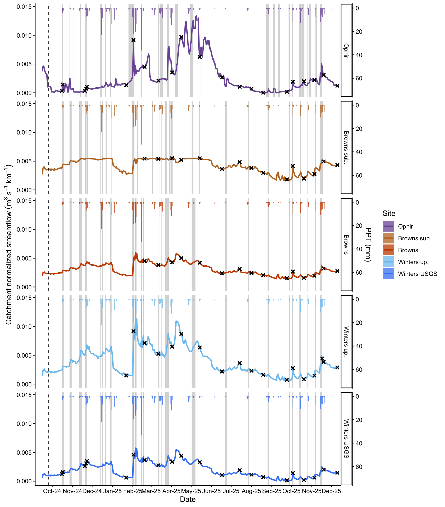
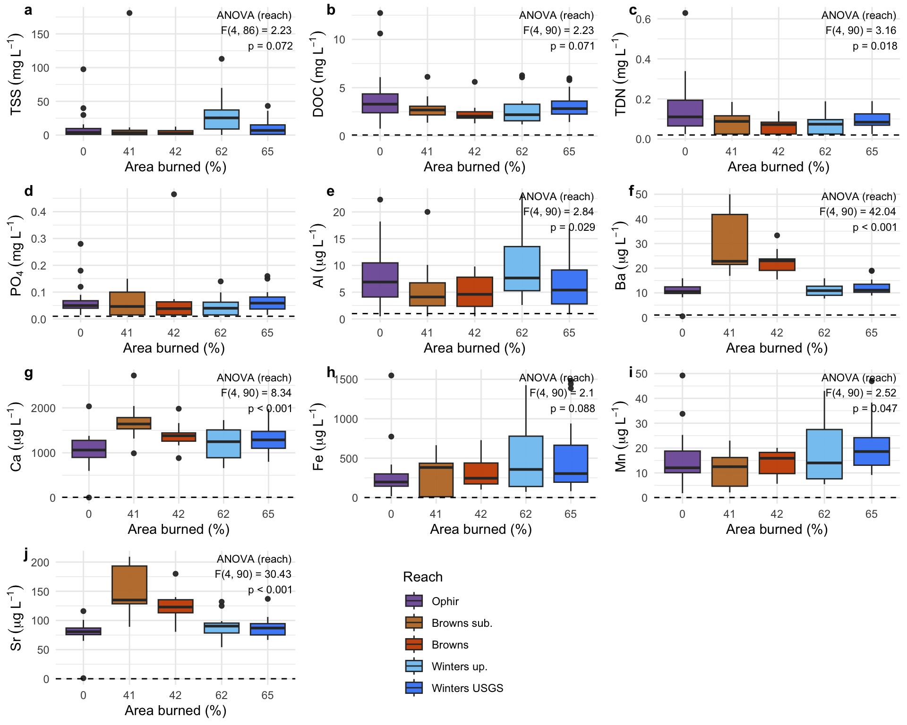
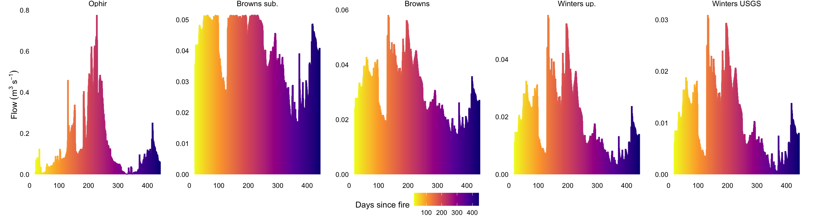
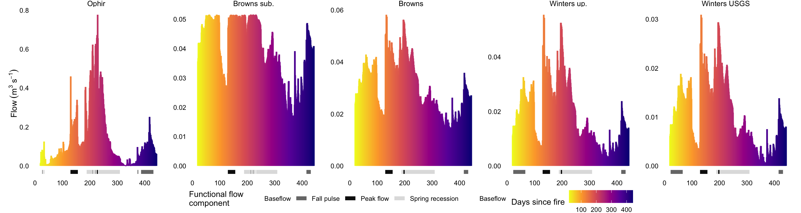
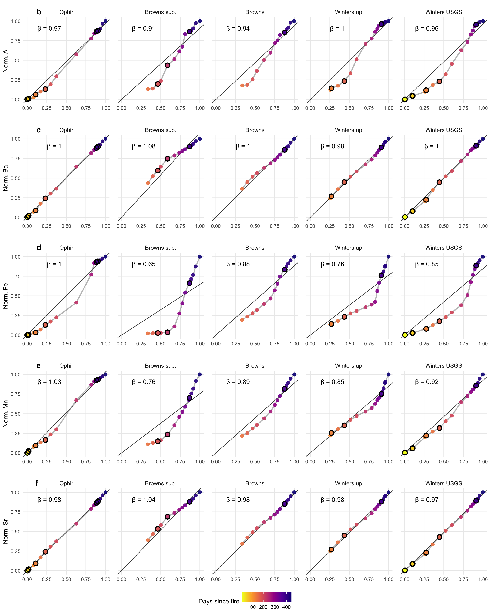

ERDC Davis Fire MS L-Q analysis
================
Kelly Loria
2026-04-06

- [=======================================================](#section)
- [I. Characterize hydroclimate
  condtions](#i-characterize-hydroclimate-condtions)
  - [=======================================================](#section-1)
  - [Create variable that corresponds with PPT flow
    increase](#create-variable-that-corresponds-with-ppt-flow-increase)
- [Figure 2:](#figure-2)
  - [Runoff and sampling timing as streamflow, sample dates, and
    ppt](#runoff-and-sampling-timing-as-streamflow-sample-dates-and-ppt)
  - [Look at run off largest events:](#look-at-run-off-largest-events)
  - [Find the date of the highest flow at each site
    ?](#find-the-date-of-the-highest-flow-at-each-site-)
  - [baseflow transition?](#baseflow-transition)
  - [=======================================================](#section-2)
- [II. MS basin differences in solute
  concetrations](#ii-ms-basin-differences-in-solute-concetrations)
  - [=======================================================](#section-3)
- [2. Basin water quality
  differences](#2-basin-water-quality-differences)
- [Figure 3:](#figure-3)
  - [=======================================================](#section-4)
- [III. Double mass curves: Calculate interval-based
  loads](#iii-double-mass-curves-calculate-interval-based-loads)
  - [=======================================================](#section-5)
  - [=========](#section-6)
  - [=========](#section-7)
  - [Flow + storm flags (unchanged logic, but
    isolated)](#flow--storm-flags-unchanged-logic-but-isolated)
  - [Core: interval loads + cumulative loads for all
    analytes](#core-interval-loads--cumulative-loads-for-all-analytes)
  - [Fxn to fit DMC models for any
    analyte](#fxn-to-fit-dmc-models-for-any-analyte)
  - [Inference](#inference)
  - [Plotting fxn for DMC](#plotting-fxn-for-dmc)
  - [Fxn for DMC residuals
    (cumulative)](#fxn-for-dmc-residuals-cumulative)
  - [Breakpoint detection (Davies + segmented) by
    site](#breakpoint-detection-davies--segmented-by-site)
  - [Fxn for companion plot (C residuals + breakpoint markers +
    storms)](#fxn-for-companion-plot-c-residuals--breakpoint-markers--storms)
  - [quick water yield calculation for just water year
    2025](#quick-water-yield-calculation-for-just-water-year-2025)
- [TSS](#tss)
- [DOC dynamics](#doc-dynamics)
- [TDN dynamics](#tdn-dynamics)
  - [PO4 dynamics](#po4-dynamics)
  - [Al dynamics](#al-dynamics)
  - [As dynamics](#as-dynamics)
  - [B dynamics](#b-dynamics)
  - [Ba dynamics](#ba-dynamics)
  - [Ca dynamics](#ca-dynamics)
  - [Cr dynamics](#cr-dynamics)
  - [Fe dynamics](#fe-dynamics)
  - [Mn dynamics](#mn-dynamics)
  - [Pb dynamics](#pb-dynamics)
  - [Sr dynamics](#sr-dynamics)
  - [B dynamics](#b-dynamics-1)
  - [Zn dynamics](#zn-dynamics)
  - [](#section-9)

<style type="text/css">
body, td {font-size: 12px;}
code.r{font-size: 8px;}
pre {font-size: 10px}
</style>

### =======================================================

## I. Characterize hydroclimate condtions

### =======================================================

- How do sampling events reflect baseflow or runoff?

- When did the largest transport events happen in each site?

### Create variable that corresponds with PPT flow increase

Based on

1.  Flow for any given day is elevated: (\>μ(previous 7
    days)+1⋅σ(previous 7 days))

2.  Rain happened on that day or the prior day

``` r
library(dplyr)
library(slider)

head(new_df_hydro)
```

    ##     site       date       flow   Name ppt..mm. lag_C_PPT
    ## 1 browns 2024-09-01 0.01888417 browns       NA        NA
    ## 2 browns 2024-09-02 0.01781396 browns       NA        NA
    ## 3 browns 2024-09-03 0.01792508 browns       NA        NA
    ## 4 browns 2024-09-04 0.01905485 browns       NA        NA
    ## 5 browns 2024-09-05 0.01826480 browns       NA        NA
    ## 6 browns 2024-09-06 0.01822308 browns       NA        NA

``` r
### infill missing flow:
new_df_hydro <- new_df_hydro %>%
  arrange(site, date) %>%
  group_by(site) %>%
  mutate(
    flow_filled = (flow)) %>%
  ungroup()
```

``` r
N <- 3 # Set pre-event window length in days

df2 <- new_df_hydro %>%
  arrange(site, date) %>%
  group_by(site) %>%
  mutate(
    # use the filled flow for stability; swap to `flow` if needed
    Q = flow_filled,

    # Rolling stats of PRIOR N days (exclude current day by sliding then lagging)
    mean_preN = lag(slide_dbl(Q, ~mean(.x, na.rm = TRUE), .before = N-1, .complete = TRUE)),
    sd_preN   = lag(slide_dbl(Q, ~sd(.x,   na.rm = TRUE), .before = N-1, .complete = TRUE)),

    # condition (2): ppt today OR yesterday > 0
    ppt_recent = (ppt..mm. > 0) | (lag(lag_C_PPT, default = 0) > 0),

    # condition (1): flow elevated at least 1 SD above mean of prior N days
    Q_thresh = mean_preN + sd_preN,
    elevated =(Q >= Q_thresh),

    runoff = if_else(ppt_recent & elevated, "yes", "no"),

    dQ = Q - lag(Q),
    runoff_dQ = if_else(runoff == "yes", dQ, NA_real_)
  ) %>%
  ungroup()


df21 <- df2 %>%
 arrange(site, date) %>%
  group_by(site) %>%
  mutate(
    runoff_flag = dplyr::coalesce(runoff == "yes", FALSE),

    event_start = runoff_flag & !lag(runoff_flag, default = FALSE),
    event_id    = if_else(runoff_flag, cumsum(event_start), 0L),
    event_end   = runoff_flag & !lead(runoff_flag, default = FALSE)
  ) %>%
  group_by(site, event_id) %>%
  mutate(
    event_start_date = if_else(event_id > 0L, min(date), as.Date(NA)),
    event_end_date   = if_else(event_id > 0L, max(date), as.Date(NA)),
    day_in_event     = if_else(event_id > 0L, row_number(), NA_integer_)
  ) %>%
  ungroup()
```

    ## # A tibble: 139 × 9
    ##    site   event_id_lf event_start_date event_end_date duration_days peak_flow
    ##    <chr>        <int> <date>           <date>                 <int>     <dbl>
    ##  1 browns           7 2024-10-17       2024-10-18                 2    0.0279
    ##  2 browns           9 2024-10-28       2024-10-30                 3    0.0335
    ##  3 browns          10 2024-11-12       2024-11-15                 4    0.0396
    ##  4 browns          11 2024-11-21       2024-11-23                 3    0.0428
    ##  5 browns          13 2024-12-14       2024-12-14                 1    0.0359
    ##  6 browns          14 2024-12-17       2024-12-17                 1    0.0389
    ##  7 browns          15 2024-12-22       2024-12-22                 1    0.0410
    ##  8 browns          16 2024-12-29       2024-12-30                 2    0.0419
    ##  9 browns          20 2025-02-01       2025-02-03                 3    0.0509
    ## 10 browns          21 2025-02-05       2025-02-05                 1    0.0582
    ## # ℹ 129 more rows
    ## # ℹ 3 more variables: peak_flow_date <date>, total_ppt_mm <dbl>,
    ## #   peak_ppt_mm <dbl>

## Figure 2:

### Runoff and sampling timing as streamflow, sample dates, and ppt



### Look at run off largest events:

    ## # A tibble: 5 × 9
    ##   site       event_id_lf event_start_date event_end_date duration_days peak_flow
    ##   <chr>            <int> <date>           <date>                 <int>     <dbl>
    ## 1 browns              21 2025-02-05       2025-02-05                 1    0.0582
    ## 2 browns_sub          36 2025-05-13       2025-05-14                 2    0.0515
    ## 3 ophir               32 2025-04-30       2025-05-04                 5    0.627 
    ## 4 winters_up          21 2025-02-05       2025-02-05                 1    0.0554
    ## 5 winters_u…          21 2025-02-05       2025-02-05                 1    0.0309
    ## # ℹ 3 more variables: peak_flow_date <date>, total_ppt_mm <dbl>,
    ## #   peak_ppt_mm <dbl>

### Find the date of the highest flow at each site ?

    ## # A tibble: 5 × 3
    ##   site         date       flow_filled
    ##   <chr>        <date>           <dbl>
    ## 1 browns       2025-02-05      0.0582
    ## 2 browns_sub   2025-04-26      0.0515
    ## 3 ophir        2025-05-11      0.776 
    ## 4 winters_up   2025-02-05      0.0554
    ## 5 winters_usgs 2025-02-05      0.0309

### baseflow transition?

    ## # A tibble: 5 × 6
    ##   site         WaterYear date        jday       Q       dQ
    ##   <chr>            <dbl> <date>     <dbl>   <dbl>    <dbl>
    ## 1 browns            2025 2025-06-02   153 0.0277  -0.00399
    ## 2 browns_sub        2025 2025-07-16   197 0.0375  -0.00593
    ## 3 ophir             2025 2025-05-13   133 0.376   -0.280  
    ## 4 winters_up        2025 2025-06-02   153 0.0145  -0.00409
    ## 5 winters_usgs      2025 2025-06-02   153 0.00835 -0.00255

### =======================================================

## II. MS basin differences in solute concetrations

### =======================================================

## 2. Basin water quality differences

``` r
library(dplyr)
library(ggplot2)
library(forcats)
library(rlang)

wq_boxplot <- function(data, y, y_lab,
                       x = burn_area,
                       site = site_lab,
                       fill = site_lab,
                       color = tsf,
                       hline = NULL,
                       filter_expr = NULL,
                       site_colors = NULL,
                       add_anova = TRUE,
                       anova_label_digits = 2,
                       anova_by_x = FALSE,
                       dodge_width = 0.75) {
  
  yq <- enquo(y); xq <- enquo(x); siteq <- enquo(site); fillq <- enquo(fill); colorq <- enquo(color)
  
  # names as strings (for base-model formulas)
  y_name    <- as_name(yq)
  x_name    <- as_name(xq)
  site_name <- as_name(siteq)
  
  pdat <- data
  if (!is.null(filter_expr)) pdat <- pdat %>% filter(!!enquo(filter_expr))
  
  # helper: p formatting - MODIFIED for 2 sig figs
  fmt_p <- function(p) {
    if (is.na(p)) return("p = NA")
    if (p < 0.001) return("p < 0.001")  # Changed: return statement for clarity
    if (p >= 0.001) return(paste0("p = ", signif(p, 2)))  # Changed: 2 sig figs instead of 3
  }
  
  make_anova_text <- function(dat) {
    dat <- dat %>%
      filter(!is.na(.data[[y_name]]), !is.na(.data[[site_name]])) %>%
      mutate(.y_num = as.numeric(.data[[y_name]]),
             .site  = as.factor(.data[[site_name]]))
    
    if (nrow(dat) < 3 || dplyr::n_distinct(dat$.site) < 2) return(NULL)
    
    fit <- aov(reformulate(".site", response = ".y_num"), data = dat)
    sm  <- summary(fit)[[1]]
    
    Fv  <- sm[["F value"]][1]
    df1 <- sm[["Df"]][1]
    df2 <- sm[["Df"]][2]
    pv  <- sm[["Pr(>F)"]][1]
    
    # CHANGE 2: Only return text if p < 0.09
    if (!is.na(pv) && pv >= 0.09) return(NULL)
    
    # CHANGE 1: Use "reach" instead of site_name
    paste0(
      "ANOVA (reach)\n",
      "F(", df1, ", ", df2, ") = ", round(Fv, anova_label_digits), "\n",
      fmt_p(pv)
    )
  }
  
  # compute label text
  anova_text <- NULL
  if (add_anova) {
    if (!anova_by_x) {
      anova_text <- make_anova_text(pdat)
    } else {
      res <- pdat %>%
        group_by(!!xq) %>%
        group_modify(~{
          txt <- make_anova_text(.x)
          
          # pull p to choose smallest p
          .x2 <- .x %>%
            filter(!is.na(.data[[y_name]]), !is.na(.data[[site_name]])) %>%
            mutate(.y_num = as.numeric(.data[[y_name]]),
                   .site  = as.factor(.data[[site_name]]))
          
          if (nrow(.x2) < 3 || dplyr::n_distinct(.x2$.site) < 2) {
            tibble(p = NA_real_, label = txt)
          } else {
            fit <- aov(reformulate(".site", response = ".y_num"), data = .x2)
            pv <- summary(fit)[[1]][["Pr(>F)"]][1]
            
            # CHANGE 2: Set label to NULL if p >= 0.09
            if (!is.na(pv) && pv >= 0.09) {
              tibble(p = pv, label = as.character(NA))
            } else {
              tibble(p = pv, label = txt)
            }
          }
        }) %>%
        ungroup()
      
      # choose smallest p (strongest evidence)
      if (all(is.na(res$p)) || all(is.na(res$label))) {
        anova_text <- NULL
      } else {
        # Filter out NA labels before selecting minimum p
        valid_res <- res %>% filter(!is.na(label))
        if (nrow(valid_res) > 0) {
          anova_text <- valid_res$label[which.min(valid_res$p)]
        } else {
          anova_text <- NULL
        }
      }
    }
  }
  
  # ---- Plot ----
  dodge <- position_dodge(width = dodge_width)
  
  p <- ggplot(pdat, aes(x = factor(!!xq), y = !!yq)) +
    geom_boxplot(
      aes(fill = !!fillq, group = interaction(!!xq, !!fillq)),
      alpha = 0.95,
      position = dodge
    ) +
     labs(y = y_lab, x = "Area burned (%)", fill= "Reach") +
    theme_minimal()
  
  if (!is.null(site_colors)) p <- p + scale_fill_manual(values = site_colors,
                                                        breaks = names(site_strip_labs),
                                                        labels = site_strip_labs)
  if (!is.null(hline)) p <- p + geom_hline(yintercept = hline, linetype = "dashed")
  
  if (!is.null(anova_text)) {
    p <- p + annotate(
      "text",
      x = Inf, y = Inf,
      label = anova_text,
      hjust = 1.05, vjust = 1.1,
      size = 3
    )
  }
  
  p
}
```

## Figure 3:

#### Boxplot of solutes



### =======================================================

## III. Double mass curves: Calculate interval-based loads

### =======================================================

#### For each chemistry sample, calculate:

##### 1. Cumulative discharge from start to that sample date

$$
Q_{\text{cum}}(t_k) = \sum_{t=1}^{t_k} Q_{\text{daily}}(t)
$$

##### 2. Load for that interval = concentration × discharge volume in interval

Q is daily discharge in liters per day and t is time in days for sample
event k. Calculate the discharge volume between the sample interval

$$
\Delta Q_k = Q_{\text{cum}}(t_k) - Q_{\text{cum}}(t_{k-1})
$$

##### 3. Cumulative solute load over time

Convert the solute concentration in grams per liter for each
solute.Calculate the interval load mass (L) for each solute, between the
sampling events. Where concentrations (C) at one interval are
representative of the intervening daily values:

$$
\Delta L_k = C_k \cdot \Delta Q_k
$$

##### 4. Cumulative load over time

Calculate cumulative solute mass for a given time in the sampling record
(Lcum):

$$
L_{\text{cum}}(t_k) = \sum_{i=1}^{k} \Delta L_i
$$

##### 5. Normalized cumulative solute load

Normalize cumulative solute load at each interval (Lnorm) for the
maximum cumulative solute load from the sampling period.

$$
L_{\text{norm}}(t) = \frac{L_{\text{cum}}(t)}{\max_t L_{\text{cum}}(t)}
$$

##### 6. Normalized cumulative water flux

Normalize cumulative the discharge at each interval (Qnorm)

$$
Q_{\text{norm}}(t) = \frac{Q_{\text{cum}}(t)}{\max_t Q_{\text{cum}}(t)}
$$

### =========

#### STEP 1: Prepare discharge data (daily values) + DOC loads

### =========

#### One-time setup: parameter tables + helpers

### Flow + storm flags (unchanged logic, but isolated)

``` r
prep_flow <- function(new_df_hydro, flow_start = as.Date("2024-10-15"), flow_end = as.Date("2025-12-11")) {
  new_df_hydro %>%
    filter(date >= flow_start & date <= flow_end) %>%
    mutate(sec_per_day = 86400) %>%
    arrange(site, date) %>%
    group_by(site) %>%
    mutate(
      Q_daily_liters = replace_na(flow_filled, 0) * 1000 * sec_per_day,
      Q_c_liters     = cumsum(Q_daily_liters),
      ppt_daily_cum  = cumsum(ppt..mm.)
    ) %>%
    ungroup()
}

prep_storm_flags <- function(event_summary, test_keys) {

  storms <- event_summary %>%
    dplyr::select(site, event_id_lf, event_start_date, event_end_date, duration_days) %>%
    dplyr::filter(!is.na(event_start_date), !is.na(event_end_date)) %>%
    dplyr::arrange(site, event_start_date) %>%
    dplyr::distinct(site, event_id_lf, event_start_date, event_end_date, .keep_all = TRUE)

  keys <- test_keys %>%
    dplyr::select(site, date)

  keys %>%
    dplyr::inner_join(storms, by = "site") %>%              # match by site first
    dplyr::filter(date >= event_start_date, date <= event_end_date) %>%  # then interval
    dplyr::transmute(site, date, storm = "storm") %>%
    dplyr::distinct()
}
```

### Core: interval loads + cumulative loads for all analytes

``` r
prep_chem_loads_long <- function(test_dat, flow_df, storm_df, analytes_tbl,
                                 chem_start = as.Date("2024-09-30")) {

  chem_long <- test_dat %>%
    filter(date >= chem_start) %>%
    dplyr::select(site, date, all_of(analytes_tbl$col)) %>%
    pivot_longer(cols = all_of(analytes_tbl$col), names_to = "col", values_to = "conc_raw") %>%
    filter(!is.na(conc_raw)) %>%                       # keep actual chem samples
    left_join(analytes_tbl, by = "col") %>%
    mutate(concgL = conc_raw * togL)

  chem_long %>%
    left_join(flow_df %>% dplyr::select(site, date, Q_c_liters), by = c("site", "date")) %>%
    left_join(storm_df, by = c("site", "date")) %>%
    mutate(site_OL = label_site(site)) %>%
    arrange(site_OL, analyte, date) %>%
    group_by(site_OL, analyte) %>%
    mutate(
      Q_interval_liters = Q_c_liters - lag(Q_c_liters, default = 0),
      load_intervalg  = concgL * Q_interval_liters,
      load_cumg       = cumsum(replace_na(load_intervalg, 0))
    ) %>%
    ungroup()
}
```

### Fxn to fit DMC models for any analyte

``` r
fit_dmc <- function(dmc_long, analyte_name = "DOC") {
  df <- dmc_long %>%
    filter(analyte == analyte_name) %>%
    group_by(site_OL) %>%
    mutate(
      load_c_norm = load_cumg / max(load_cumg, na.rm = TRUE),
      Q_c_norm    = Q_c_liters  / max(Q_c_liters,  na.rm = TRUE)
    ) %>%
    ungroup()

  models <- df %>%
    filter(!is.na(load_c_norm), !is.na(Q_c_norm)) %>%
    group_by(site_OL) %>%
    nest() %>%
    mutate(
      n_samples = map_int(data, nrow),
      model     = map(data, ~ lm(load_c_norm ~ 0 + Q_c_norm, data = .x)),
      tidy      = map(model, ~ broom::tidy(.x, conf.int = TRUE)),
      augmented = map2(model, data, ~ broom::augment(.x, data = .y))
    ) %>%
    unnest(tidy) %>%
    filter(term == "Q_c_norm") %>%
    transmute(site_OL, n_samples,
              slope = estimate, std_error = std.error,
              lwr = conf.low, upr = conf.high,
              p.value, data, model, augmented)

  list(df = df, models = models)
}
```

### Inference

``` r
infer_slopes_vs1 <- function(models_tbl) {
  models_tbl %>%
    mutate(
      t_stat = (slope - 1) / std_error,
      df = n_samples - 1,
      p_vs_1 = 2 * pt(abs(t_stat), df, lower.tail = FALSE),
      interpretation = case_when(
        slope > 1 & p_vs_1 < 0.05 ~ "Enrichment: load ↑ faster than discharge",
        slope < 1 & p_vs_1 < 0.05 ~ "Dilution: discharge ↑ faster than load",
        p_vs_1 >= 0.05 ~ "Proportional: ∝",
        TRUE ~ "Check data"
      )
    ) %>%
    dplyr::select(site_OL, n_samples, slope, std_error, lwr, upr, p.value, p_vs_1, interpretation)
}
```

### Plotting fxn for DMC

``` r
site_strip_labs <- c(
  A_ophir        = "Ophir",
  C_browns_sub   = "Browns sub.",
  D_browns       = "Browns",
  E_winters_up   = "Winters up.",
  F_winters_usgs = "Winters USGS"
)


plot_dmc <- function(df_norm, models_tbl, value_label = "N.C. load", 
                     flow_label = "flow lab",
                     color_var = "tsf") {

  df_norm <- df_norm %>% dplyr::ungroup()

  models_tbl <- models_tbl %>%
    dplyr::ungroup() %>%
    dplyr::mutate(slope_label = paste0("β = ", round(slope, 2)))

  ggplot(df_norm, aes(Q_c_norm, load_c_norm)) +
    geom_abline(
      data = models_tbl,
      aes(slope = slope, intercept = 0),
      linewidth = 0.5, alpha = 0.8
    ) +
    geom_path(alpha = 0.5, linewidth = 1, color = "grey50") +
    geom_point(aes(color = .data[[color_var]]), size = 2.5, alpha = 0.9) +
    geom_point(
      data = df_norm %>% filter(storm == "storm"),
      shape = 21, fill = NA, color = "black", stroke = 1.3, size = 3
    ) +
    geom_text(
      data = models_tbl,
      aes(x = 0.45, y = 0.85, label = slope_label),
      hjust = 1.05, vjust = -0.5,
      size = 4,
      inherit.aes = FALSE
    ) +
    scale_color_viridis_c(
      option = "plasma",
      direction = -1,
      name = "Days since fire"
    ) +
    facet_wrap(
      ~ site_OL, nrow = 1,
      labeller = labeller(site_OL = as_labeller(site_strip_labs))
    ) +
    coord_equal(xlim = c(0, 1), ylim = c(0, 1)) +
    labs(x = flow_label, y = value_label) +
    theme_minimal() +
    theme(
      legend.position = "bottom",
      panel.grid.minor = element_blank(),
      strip.background = element_blank(),
      strip.text = element_text(size = 10),
      panel.spacing = unit(1, "lines"),
      plot.margin = margin(2, 5.5, 2, 5.5)
    )
}
```

### Fxn for DMC residuals (cumulative)

``` r
calc_cumul_resid <- function(df_norm, models_tbl) {
  # Join each site's fitted model back onto its normalized data
  # models_tbl must contain: site_OL, model (lm)
  df_norm %>%
    left_join(models_tbl %>% dplyr::select(site_OL, model), by = "site_OL") %>%
    group_by(site_OL) %>%
    arrange(date, .by_group = TRUE) %>%
    mutate(
      fit   = predict(model[[1]], newdata = cur_data()),
      resid = load_c_norm - fit,
      cumul_resid = cumsum(replace_na(resid, 0))
    ) %>%
    ungroup() %>%
    dplyr::select(-model)
}
```

### Breakpoint detection (Davies + segmented) by site

``` r
detect_breakpoints_site <- function(data, min_n = 10, alpha = 0.05) {
  # data must include: date, Q_c_norm, load_c_norm
  # returns a one-row tibble

  if (!requireNamespace("segmented", quietly = TRUE)) {
    return(tibble::tibble(
      breakpoint = NA_real_, breakpoint_date = as.Date(NA),
      slope_1 = NA_real_, slope_2 = NA_real_, delta_slope = NA_real_,
      davies_p = NA_real_, note = "Package 'segmented' not installed"
    ))
  }

  tryCatch({
    if (nrow(data) < min_n) {
      return(tibble::tibble(
        breakpoint = NA_real_, breakpoint_date = as.Date(NA),
        slope_1 = NA_real_, slope_2 = NA_real_, delta_slope = NA_real_,
        davies_p = NA_real_, note = "Insufficient data"
      ))
    }

    linear_fit <- lm(load_c_norm ~ Q_c_norm, data = data)

    # Davies test for a change in slope
    dav <- segmented::davies.test(linear_fit, ~ Q_c_norm)

    if (!is.null(dav$p.value) && dav$p.value < alpha) {
      seg_fit <- segmented::segmented(linear_fit, seg.Z = ~ Q_c_norm, npsi = 1)

      bp_val <- tryCatch(
        as.numeric(summary(seg_fit)$psi[, "Est."]),
        error = function(e) NA_real_
      )

      # date closest to the estimated breakpoint in Q space
      data_sorted <- data[order(data$Q_c_norm), ]
      bp_date <- data_sorted$date[which.min(abs(data_sorted$Q_c_norm - bp_val))]

      slopes <- segmented::slope(seg_fit)$Q_c_norm

      tibble::tibble(
        breakpoint = bp_val,
        breakpoint_date = bp_date,
        slope_1 = slopes[1, 1],
        slope_2 = slopes[2, 1],
        delta_slope = slopes[2, 1] - slopes[1, 1],
        davies_p = dav$p.value,
        note = "Significant breakpoint detected"
      )
    } else {
      tibble::tibble(
        breakpoint = NA_real_, breakpoint_date = as.Date(NA),
        slope_1 = unname(coef(linear_fit)[["Q_c_norm"]]),
        slope_2 = NA_real_, delta_slope = NA_real_,
        davies_p = dav$p.value,
        note = "No significant breakpoint"
      )
    }
  }, error = function(e) {
    tibble::tibble(
      breakpoint = NA_real_, breakpoint_date = as.Date(NA),
      slope_1 = NA_real_, slope_2 = NA_real_, delta_slope = NA_real_,
      davies_p = NA_real_, note = paste("Error:", e$message)
    )
  })
}

breakpoint_analysis_by_site <- function(df_norm, min_n = 10, alpha = 0.05) {
  df_norm %>%
    filter(!is.na(load_c_norm), !is.na(Q_c_norm)) %>%
    group_by(site_OL) %>%
    tidyr::nest() %>%
    mutate(breaks = purrr::map(data, detect_breakpoints_site, min_n = min_n, alpha = alpha)) %>%
    tidyr::unnest_wider(breaks)
}
```

### Fxn for companion plot (C residuals + breakpoint markers + storms)

``` r
plot_cumul_resid <- function(resid_df,
                             bp_tbl = NULL,
                             start_date = as.Date("2024-10-01"),
                             site_colors = NULL,
                             ylab = "Cum. residuals (load ~ Q)",
                             show_legend = FALSE) {

  plot_df <- resid_df %>% filter(date > start_date)

  if (!is.null(bp_tbl)) {
    bp_pts <- bp_tbl %>%
      filter(!is.na(breakpoint_date)) %>%
      dplyr::select(site_OL, breakpoint_date) %>%
      distinct() %>%
      left_join(
        plot_df %>% dplyr::select(site_OL, date, cumul_resid),
        by = c("site_OL" = "site_OL", "breakpoint_date" = "date")
      )
  } else {
    bp_pts <- tibble::tibble(
      site_OL = character(),
      breakpoint_date = as.Date(character()),
      cumul_resid = numeric()
    )
  }

  p <- ggplot(plot_df, aes(x = date, y = cumul_resid)) +
    geom_line(aes(color = site_OL), linewidth = 1.1) +
    geom_point(aes(color = site_OL), size = 3) +
    geom_point(
      data = bp_pts %>% filter(breakpoint_date > start_date),
      aes(x = breakpoint_date, y = cumul_resid, color = site_OL),
      shape = 23, stroke = 1.5, fill = NA, size = 4
    ) +
    { if ("storm" %in% names(plot_df))
        geom_point(
          data = plot_df %>% filter(storm == "storm"),
          aes(x = date, y = cumul_resid),
          shape = 21, fill = NA, color = "black",
          stroke = 1.5, size = 3
        ) } +
    geom_hline(yintercept = 0, linetype = "dashed") +
    labs(x = NULL, y = ylab) +
    theme_bw() +
    scale_x_date(date_breaks = "2 month", date_labels = "%b-%y") +
    theme(legend.position = if (show_legend) "right" else "none")

  if (!is.null(site_colors)) {
    p <- p + scale_color_manual(values = site_colors)
  }

  p
}
```

``` r
# 1) Prep once
davis_flow <- prep_flow(new_df_hydro, flow_start = as.Date("2024-10-15"), flow_end = as.Date("2025-12-11"))
storm <- prep_storm_flags(event_summary, test_keys)

# optional: flow summary
davis_flow %>%
  group_by(site) %>%
  summarise(
    max_Q_c_liters = max(Q_c_liters, na.rm = TRUE),
    max_ppt_daily_cum = max(ppt_daily_cum, na.rm = TRUE),
    .groups = "drop"
  )
```

    ## # A tibble: 5 × 3
    ##   site         max_Q_c_liters max_ppt_daily_cum
    ##   <chr>                 <dbl>             <dbl>
    ## 1 browns          1108804641.              772.
    ## 2 browns_sub      1461072463.              772.
    ## 3 ophir           4882639974.              933.
    ## 4 winters_up       679303299.              793.
    ## 5 winters_usgs     382550118.              793.

``` r
# 2) Loads for all analytes (one call)
dmc_long <- prep_chem_loads_long(merged_df%>%filter(site!="davis"), davis_flow, storm, analytes)

# 3) Add tsf once (if ref_date exists in env)
dmc_long <- dmc_long %>%
  mutate(tsf = as.integer(difftime(date, ref_date, units = "days")))
```

### quick water yield calculation for just water year 2025

``` r
library(dplyr)

yield_m3 <- davis_flow %>%
  filter(date >= as.Date("2024-10-15"),
         date <= as.Date("2025-12-12")) %>%
  group_by(site) %>%
  summarise(
    total_liters = sum(Q_daily_liters, na.rm = TRUE),
    total_m3 = total_liters / 1000
  ) %>%

  mutate(
    total_m3_sci = formatC(total_m3, format = "e", digits = 2)
  ) %>%
  arrange(site)

yield_m3
```

    ## # A tibble: 5 × 4
    ##   site         total_liters total_m3 total_m3_sci
    ##   <chr>               <dbl>    <dbl> <chr>       
    ## 1 browns        1108804641. 1108805. 1.11e+06    
    ## 2 browns_sub    1461072463. 1461072. 1.46e+06    
    ## 3 ophir         4882639974. 4882640. 4.88e+06    
    ## 4 winters_up     679303299.  679303. 6.79e+05    
    ## 5 winters_usgs   382550118.  382550. 3.83e+05

## TSS

``` r
TSS_fit   <- fit_dmc(dmc_long, "TSS")
models_TSS <- TSS_fit$models
davis_TSS  <- TSS_fit$df

inference_TSS <- infer_slopes_vs1(models_TSS)
inference_TSS
```

    ## # A tibble: 5 × 9
    ## # Groups:   site_OL [5]
    ##   site_OL  n_samples slope std_error   lwr   upr  p.value  p_vs_1 interpretation
    ##   <chr>        <int> <dbl>     <dbl> <dbl> <dbl>    <dbl>   <dbl> <chr>         
    ## 1 A_ophir         23 1.07     0.0258 1.02  1.12  2.23e-22 1.33e-2 Enrichment: l…
    ## 2 C_brown…        14 0.561    0.100  0.344 0.778 8.77e- 5 7.63e-4 Dilution: dis…
    ## 3 D_browns        14 0.864    0.0560 0.743 0.985 9.77e-10 3.05e-2 Dilution: dis…
    ## 4 E_winte…        17 0.806    0.0626 0.674 0.939 7.31e-10 6.99e-3 Dilution: dis…
    ## 5 F_winte…        23 0.845    0.0521 0.737 0.953 1.01e-13 7.00e-3 Dilution: dis…

``` r
TSS_resid <- calc_cumul_resid(TSS_fit$df, TSS_fit$models)
bp_TSS <- breakpoint_analysis_by_site(TSS_fit$df)
bp_TSS
```

    ## # A tibble: 5 × 9
    ## # Groups:   site_OL [5]
    ##   site_OL        data     breakpoint breakpoint_date slope_1 slope_2 delta_slope
    ##   <chr>          <list>        <dbl> <date>            <dbl>   <dbl>       <dbl>
    ## 1 A_ophir        <tibble>     NA     NA                1.10    NA          NA   
    ## 2 C_browns_sub   <tibble>      0.846 2025-09-24        0.683    5.49        4.81
    ## 3 D_browns       <tibble>     NA     NA                1.49    NA          NA   
    ## 4 E_winters_up   <tibble>      0.550 2025-04-02        0.255    2.04        1.79
    ## 5 F_winters_usgs <tibble>      0.549 2025-04-02        0.196    2.06        1.87
    ## # ℹ 2 more variables: davies_p <dbl>, note <chr>

## DOC dynamics

``` r
DOC_fit   <- fit_dmc(dmc_long, "DOC")
models_DOC <- DOC_fit$models
davis_DOC  <- DOC_fit$df

inference_DOC <- infer_slopes_vs1(models_DOC)
inference_DOC
```

    ## # A tibble: 5 × 9
    ## # Groups:   site_OL [5]
    ##   site_OL  n_samples slope std_error   lwr   upr  p.value  p_vs_1 interpretation
    ##   <chr>        <int> <dbl>     <dbl> <dbl> <dbl>    <dbl>   <dbl> <chr>         
    ## 1 A_ophir         24 1.01    0.00417 1.00  1.02  1.04e-40 5.07e-3 Enrichment: l…
    ## 2 C_brown…        15 1.05    0.0155  1.02  1.09  4.85e-19 4.46e-3 Enrichment: l…
    ## 3 D_browns        15 0.967   0.00803 0.950 0.985 1.61e-22 1.14e-3 Dilution: dis…
    ## 4 E_winte…        18 0.948   0.0120  0.922 0.973 2.91e-23 4.25e-4 Dilution: dis…
    ## 5 F_winte…        23 0.990   0.0105  0.969 1.01  3.20e-30 3.60e-1 Proportional:…

``` r
DOC_resid <- calc_cumul_resid(DOC_fit$df, DOC_fit$models)
bp_DOC <- breakpoint_analysis_by_site(DOC_fit$df)
bp_DOC
```

    ## # A tibble: 5 × 9
    ## # Groups:   site_OL [5]
    ##   site_OL        data     breakpoint breakpoint_date slope_1 slope_2 delta_slope
    ##   <chr>          <list>        <dbl> <date>            <dbl>   <dbl>       <dbl>
    ## 1 A_ophir        <tibble>      0.232 2025-03-12        1.09    0.976      -0.112
    ## 2 C_browns_sub   <tibble>     NA     NA                0.859  NA          NA    
    ## 3 D_browns       <tibble>      0.866 2025-09-24        0.997   1.40        0.401
    ## 4 E_winters_up   <tibble>      0.829 2025-07-14        0.917   1.64        0.722
    ## 5 F_winters_usgs <tibble>      0.222 2025-01-22        0.641   1.12        0.476
    ## # ℹ 2 more variables: davies_p <dbl>, note <chr>

## TDN dynamics

``` r
TDN_fit   <- fit_dmc(dmc_long, "TDN")
models_TDN <- TDN_fit$models
davis_TDN  <- TDN_fit$df

inference_TDN <- infer_slopes_vs1(models_TDN)
inference_TDN
```

    ## # A tibble: 5 × 9
    ## # Groups:   site_OL [5]
    ##   site_OL  n_samples slope std_error   lwr   upr  p.value  p_vs_1 interpretation
    ##   <chr>        <int> <dbl>     <dbl> <dbl> <dbl>    <dbl>   <dbl> <chr>         
    ## 1 A_ophir         24 1.05     0.0118 1.02   1.07 1.20e-30 8.85e-4 Enrichment: l…
    ## 2 C_brown…        15 1.06     0.0161 1.03   1.10 6.75e-19 1.21e-3 Enrichment: l…
    ## 3 D_browns        15 0.955    0.0406 0.868  1.04 1.18e-12 2.91e-1 Proportional:…
    ## 4 E_winte…        18 0.959    0.0234 0.909  1.01 2.02e-18 9.73e-2 Proportional:…
    ## 5 F_winte…        23 0.999    0.0219 0.953  1.04 2.66e-23 9.53e-1 Proportional:…

``` r
TDN_resid <- calc_cumul_resid(TDN_fit$df, TDN_fit$models)
bp_TDN <- breakpoint_analysis_by_site(TDN_fit$df)
bp_TDN
```

    ## # A tibble: 5 × 9
    ## # Groups:   site_OL [5]
    ##   site_OL        data     breakpoint breakpoint_date slope_1 slope_2 delta_slope
    ##   <chr>          <list>        <dbl> <date>            <dbl>   <dbl>       <dbl>
    ## 1 A_ophir        <tibble>      0.230 2025-03-12        0.687   1.16        0.468
    ## 2 C_browns_sub   <tibble>      0.748 2025-07-14        1.41    0.525      -0.881
    ## 3 D_browns       <tibble>     NA     NA                1.46   NA          NA    
    ## 4 E_winters_up   <tibble>     NA     NA                1.22   NA          NA    
    ## 5 F_winters_usgs <tibble>      0.373 2025-02-19        0.566   1.34        0.776
    ## # ℹ 2 more variables: davies_p <dbl>, note <chr>

### PO4 dynamics

``` r
PO4_fit   <- fit_dmc(dmc_long, "PO4_P")
models_PO4 <- PO4_fit$models
davis_PO4  <- PO4_fit$df

inference_PO4 <- infer_slopes_vs1(models_PO4)
inference_PO4
```

    ## # A tibble: 5 × 9
    ## # Groups:   site_OL [5]
    ##   site_OL   n_samples slope std_error   lwr   upr  p.value p_vs_1 interpretation
    ##   <chr>         <int> <dbl>     <dbl> <dbl> <dbl>    <dbl>  <dbl> <chr>         
    ## 1 A_ophir          21 0.988   0.00982 0.968  1.01 1.55e-28 0.239  Proportional:…
    ## 2 C_browns…        12 1.10    0.0401  1.01   1.19 1.75e-11 0.0286 Enrichment: l…
    ## 3 D_browns         10 0.954   0.0471  0.848  1.06 8.14e- 9 0.359  Proportional:…
    ## 4 E_winter…        15 0.988   0.0196  0.946  1.03 3.07e-17 0.557  Proportional:…
    ## 5 F_winter…        20 0.985   0.0132  0.957  1.01 6.32e-25 0.258  Proportional:…

``` r
PO4_resid <- calc_cumul_resid(PO4_fit$df, PO4_fit$models)
bp_PO4 <- breakpoint_analysis_by_site(PO4_fit$df)
bp_PO4
```

    ## # A tibble: 5 × 9
    ## # Groups:   site_OL [5]
    ##   site_OL        data     breakpoint breakpoint_date slope_1 slope_2 delta_slope
    ##   <chr>          <list>        <dbl> <date>            <dbl>   <dbl>       <dbl>
    ## 1 A_ophir        <tibble>      0.259 2025-03-12        0.721   1.09        0.372
    ## 2 C_browns_sub   <tibble>      0.521 2025-04-16        2.06    0.434      -1.62 
    ## 3 D_browns       <tibble>     NA     NA                1.27   NA          NA    
    ## 4 E_winters_up   <tibble>      0.818 2025-06-17        0.644   1.57        0.924
    ## 5 F_winters_usgs <tibble>      0.592 2025-04-16        0.824   1.27        0.450
    ## # ℹ 2 more variables: davies_p <dbl>, note <chr>

### Al dynamics

``` r
Al_fit   <- fit_dmc(dmc_long, "Al")
models_Al <- Al_fit$models
davis_Al  <- Al_fit$df

inference_Al <- infer_slopes_vs1(models_Al)
inference_Al
```

    ## # A tibble: 5 × 9
    ## # Groups:   site_OL [5]
    ##   site_OL   n_samples slope std_error   lwr   upr  p.value p_vs_1 interpretation
    ##   <chr>         <int> <dbl>     <dbl> <dbl> <dbl>    <dbl>  <dbl> <chr>         
    ## 1 A_ophir          24 0.966    0.0131 0.939 0.993 7.36e-29 0.0161 Dilution: dis…
    ## 2 C_browns…        15 0.907    0.0466 0.808 1.01  1.53e-11 0.0669 Proportional:…
    ## 3 D_browns         15 0.938    0.0333 0.866 1.01  1.01e-13 0.0818 Proportional:…
    ## 4 E_winter…        18 0.999    0.0300 0.936 1.06  6.35e-17 0.985  Proportional:…
    ## 5 F_winter…        23 0.961    0.0308 0.897 1.03  1.06e-19 0.223  Proportional:…

``` r
Al_resid <- calc_cumul_resid(Al_fit$df, Al_fit$models)
bp_Al <- breakpoint_analysis_by_site(Al_fit$df)
bp_Al
```

    ## # A tibble: 5 × 9
    ## # Groups:   site_OL [5]
    ##   site_OL        data     breakpoint breakpoint_date slope_1 slope_2 delta_slope
    ##   <chr>          <list>        <dbl> <date>            <dbl>   <dbl>       <dbl>
    ## 1 A_ophir        <tibble>      0.237 2025-03-12        0.563    1.13       0.568
    ## 2 C_browns_sub   <tibble>     NA     NA                1.49    NA         NA    
    ## 3 D_browns       <tibble>     NA     NA                1.36    NA         NA    
    ## 4 E_winters_up   <tibble>     NA     NA                1.33    NA         NA    
    ## 5 F_winters_usgs <tibble>      0.433 2025-03-12        0.467    1.52       1.05 
    ## # ℹ 2 more variables: davies_p <dbl>, note <chr>

### As dynamics

``` r
As_fit   <- fit_dmc(dmc_long, "As")
models_As <- As_fit$models
davis_As  <- As_fit$df

inference_As <- infer_slopes_vs1(models_As)
inference_As
```

    ## # A tibble: 5 × 9
    ## # Groups:   site_OL [5]
    ##   site_OL  n_samples slope std_error   lwr   upr  p.value  p_vs_1 interpretation
    ##   <chr>        <int> <dbl>     <dbl> <dbl> <dbl>    <dbl>   <dbl> <chr>         
    ## 1 A_ophir         24 1.00     0.0112 0.980 1.03  8.49e-31 7.59e-1 Proportional:…
    ## 2 C_brown…        15 1.05     0.0107 1.03  1.08  2.77e-21 2.38e-4 Enrichment: l…
    ## 3 D_browns        15 0.970    0.0125 0.944 0.997 7.69e-20 3.32e-2 Dilution: dis…
    ## 4 E_winte…        18 0.951    0.0146 0.920 0.981 7.65e-22 3.49e-3 Dilution: dis…
    ## 5 F_winte…        23 0.940    0.0246 0.889 0.991 1.26e-21 2.29e-2 Dilution: dis…

``` r
As_resid <- calc_cumul_resid(As_fit$df, As_fit$models)
bp_As <- breakpoint_analysis_by_site(As_fit$df)
bp_As
```

    ## # A tibble: 5 × 9
    ## # Groups:   site_OL [5]
    ##   site_OL        data     breakpoint breakpoint_date slope_1 slope_2 delta_slope
    ##   <chr>          <list>        <dbl> <date>            <dbl>   <dbl>       <dbl>
    ## 1 A_ophir        <tibble>      0.206 2025-03-12        0.626    1.12       0.496
    ## 2 C_browns_sub   <tibble>     NA     NA                0.930   NA         NA    
    ## 3 D_browns       <tibble>      0.698 2025-06-17        0.876    1.33       0.451
    ## 4 E_winters_up   <tibble>      0.806 2025-06-17        0.817    1.74       0.919
    ## 5 F_winters_usgs <tibble>      0.496 2025-04-02        0.601    1.44       0.841
    ## # ℹ 2 more variables: davies_p <dbl>, note <chr>

### B dynamics

``` r
B_fit   <- fit_dmc(dmc_long, "B")
models_B <- B_fit$models
davis_B  <- B_fit$df

inference_B <- infer_slopes_vs1(models_B)
inference_B
```

    ## # A tibble: 5 × 9
    ## # Groups:   site_OL [5]
    ##   site_OL   n_samples slope std_error   lwr   upr  p.value p_vs_1 interpretation
    ##   <chr>         <int> <dbl>     <dbl> <dbl> <dbl>    <dbl>  <dbl> <chr>         
    ## 1 A_ophir          24 1.10     0.0563 0.988 1.22  7.33e-16 0.0761 Proportional:…
    ## 2 C_browns…        15 0.982    0.0158 0.948 1.02  1.63e-18 0.264  Proportional:…
    ## 3 D_browns         15 0.948    0.0178 0.910 0.986 1.50e-17 0.0110 Dilution: dis…
    ## 4 E_winter…        18 1.10     0.0509 0.988 1.20  8.99e-14 0.0790 Proportional:…
    ## 5 F_winter…        23 1.13     0.0446 1.03  1.22  1.00e-17 0.0104 Enrichment: l…

``` r
B_resid <- calc_cumul_resid(B_fit$df, B_fit$models)
bp_B <- breakpoint_analysis_by_site(B_fit$df)
bp_B
```

    ## # A tibble: 5 × 9
    ## # Groups:   site_OL [5]
    ##   site_OL        data     breakpoint breakpoint_date slope_1 slope_2 delta_slope
    ##   <chr>          <list>        <dbl> <date>            <dbl>   <dbl>       <dbl>
    ## 1 A_ophir        <tibble>      0.273 2025-04-02        2.48    0.357      -2.13 
    ## 2 C_browns_sub   <tibble>     NA     NA                0.877  NA          NA    
    ## 3 D_browns       <tibble>      0.752 2025-07-14        0.607   1.38        0.768
    ## 4 E_winters_up   <tibble>     NA     NA                0.487  NA          NA    
    ## 5 F_winters_usgs <tibble>      0.309 2025-02-02        2.08    0.496      -1.58 
    ## # ℹ 2 more variables: davies_p <dbl>, note <chr>

### Ba dynamics

``` r
Ba_fit   <- fit_dmc(dmc_long, "Ba")
models_Ba <- Ba_fit$models
davis_Ba  <- Ba_fit$df

inference_Ba <- infer_slopes_vs1(models_Ba)
inference_Ba
```

    ## # A tibble: 5 × 9
    ## # Groups:   site_OL [5]
    ##   site_OL  n_samples slope std_error   lwr   upr  p.value  p_vs_1 interpretation
    ##   <chr>        <int> <dbl>     <dbl> <dbl> <dbl>    <dbl>   <dbl> <chr>         
    ## 1 A_ophir         24 1.00    0.00242 0.997 1.01  4.74e-46 0.498   Proportional:…
    ## 2 C_brown…        15 1.08    0.0240  1.03  1.13  1.48e-16 0.00463 Enrichment: l…
    ## 3 D_browns        15 0.996   0.00903 0.977 1.02  5.52e-22 0.668   Proportional:…
    ## 4 E_winte…        18 0.982   0.00492 0.972 0.993 4.23e-30 0.00225 Dilution: dis…
    ## 5 F_winte…        23 0.997   0.00586 0.984 1.01  8.19e-36 0.565   Proportional:…

``` r
Ba_resid <- calc_cumul_resid(Ba_fit$df, Ba_fit$models)
bp_Ba <- breakpoint_analysis_by_site(Ba_fit$df)
bp_Ba
```

    ## # A tibble: 5 × 9
    ## # Groups:   site_OL [5]
    ##   site_OL        data     breakpoint breakpoint_date slope_1 slope_2 delta_slope
    ##   <chr>          <list>        <dbl> <date>            <dbl>   <dbl>       <dbl>
    ## 1 A_ophir        <tibble>     NA     NA                1.00   NA          NA    
    ## 2 C_browns_sub   <tibble>      0.557 2025-05-14        1.25    0.619      -0.631
    ## 3 D_browns       <tibble>      0.833 2025-08-19        0.844   1.14        0.300
    ## 4 E_winters_up   <tibble>      0.829 2025-07-14        0.925   1.25        0.328
    ## 5 F_winters_usgs <tibble>      0.164 2024-11-23        0.775   1.05        0.279
    ## # ℹ 2 more variables: davies_p <dbl>, note <chr>

### Ca dynamics

``` r
Ca_fit   <- fit_dmc(dmc_long, "Ca")
models_Ca <- Ca_fit$models
davis_Ca  <- Ca_fit$df

inference_Ca <- infer_slopes_vs1(models_Ca)
inference_Ca
```

    ## # A tibble: 5 × 9
    ## # Groups:   site_OL [5]
    ##   site_OL  n_samples slope std_error   lwr   upr  p.value  p_vs_1 interpretation
    ##   <chr>        <int> <dbl>     <dbl> <dbl> <dbl>    <dbl>   <dbl> <chr>         
    ## 1 A_ophir         24 1.02    0.00682 1.01  1.03  7.07e-36 7.84e-3 Enrichment: l…
    ## 2 C_brown…        15 1.02    0.00540 1.01  1.03  3.09e-25 4.45e-3 Enrichment: l…
    ## 3 D_browns        15 0.976   0.00604 0.963 0.989 2.68e-24 1.48e-3 Dilution: dis…
    ## 4 E_winte…        18 0.936   0.0120  0.911 0.962 3.88e-23 5.81e-5 Dilution: dis…
    ## 5 F_winte…        23 0.963   0.0129  0.936 0.990 6.06e-28 8.82e-3 Dilution: dis…

``` r
Ca_resid <- calc_cumul_resid(Ca_fit$df, Ca_fit$models)
bp_Ca <- breakpoint_analysis_by_site(Ca_fit$df)
bp_Ca
```

    ## # A tibble: 5 × 9
    ## # Groups:   site_OL [5]
    ##   site_OL        data     breakpoint breakpoint_date slope_1 slope_2 delta_slope
    ##   <chr>          <list>        <dbl> <date>            <dbl>   <dbl>       <dbl>
    ## 1 A_ophir        <tibble>      0.125 2025-02-02        0.677   1.08        0.403
    ## 2 C_browns_sub   <tibble>      0.587 2025-05-14        1.21    0.910      -0.302
    ## 3 D_browns       <tibble>      0.768 2025-07-14        0.908   1.22        0.311
    ## 4 E_winters_up   <tibble>      0.795 2025-06-17        0.864   1.57        0.711
    ## 5 F_winters_usgs <tibble>      0.320 2025-02-19        0.675   1.15        0.477
    ## # ℹ 2 more variables: davies_p <dbl>, note <chr>

### Cr dynamics

``` r
Cr_fit   <- fit_dmc(dmc_long, "Cr")
models_Cr <- Cr_fit$models
davis_Cr  <- Cr_fit$df

inference_Cr <- infer_slopes_vs1(models_Cr)
inference_Cr
```

    ## # A tibble: 5 × 9
    ## # Groups:   site_OL [5]
    ##   site_OL n_samples slope std_error   lwr   upr  p.value   p_vs_1 interpretation
    ##   <chr>       <int> <dbl>     <dbl> <dbl> <dbl>    <dbl>    <dbl> <chr>         
    ## 1 A_ophir        24 1.01    0.00434 0.997 1.02  3.00e-40 1.55e- 1 Proportional:…
    ## 2 C_brow…        15 0.542   0.0451  0.446 0.639 9.15e- 9 7.81e- 8 Dilution: dis…
    ## 3 D_brow…        15 0.977   0.00595 0.964 0.990 2.13e-24 1.71e- 3 Dilution: dis…
    ## 4 E_wint…        18 0.260   0.0582  0.138 0.383 3.32e- 4 4.14e-10 Dilution: dis…
    ## 5 F_wint…        23 0.503   0.0364  0.427 0.578 2.51e-12 3.15e-12 Dilution: dis…

``` r
Cr_resid <- calc_cumul_resid(Cr_fit$df, Cr_fit$models)
bp_Cr <- breakpoint_analysis_by_site(Cr_fit$df)
bp_Cr
```

    ## # A tibble: 5 × 9
    ## # Groups:   site_OL [5]
    ##   site_OL        data     breakpoint breakpoint_date slope_1 slope_2 delta_slope
    ##   <chr>          <list>        <dbl> <date>            <dbl>   <dbl>       <dbl>
    ## 1 A_ophir        <tibble>     NA     NA                1.01    NA         NA    
    ## 2 C_browns_sub   <tibble>      0.945 2025-11-19        0.478   10.0        9.56 
    ## 3 D_browns       <tibble>      0.813 2025-08-19        0.956    1.25       0.297
    ## 4 E_winters_up   <tibble>      0.958 2025-11-19        0.212   19.7       19.5  
    ## 5 F_winters_usgs <tibble>      0.955 2025-11-19        0.465   12.7       12.2  
    ## # ℹ 2 more variables: davies_p <dbl>, note <chr>

### Fe dynamics

``` r
Fe_fit   <- fit_dmc(dmc_long, "Fe")
models_Fe <- Fe_fit$models
davis_Fe  <- Fe_fit$df

inference_Fe <- infer_slopes_vs1(models_Fe)
inference_Fe
```

    ## # A tibble: 5 × 9
    ## # Groups:   site_OL [5]
    ##   site_OL  n_samples slope std_error   lwr   upr  p.value  p_vs_1 interpretation
    ##   <chr>        <int> <dbl>     <dbl> <dbl> <dbl>    <dbl>   <dbl> <chr>         
    ## 1 A_ophir         24 0.999    0.0254 0.946 1.05  1.35e-22 9.61e-1 Proportional:…
    ## 2 C_brown…        15 0.646    0.0824 0.470 0.823 1.72e- 6 7.46e-4 Dilution: dis…
    ## 3 D_browns        15 0.883    0.0374 0.803 0.963 1.10e-12 7.48e-3 Dilution: dis…
    ## 4 E_winte…        18 0.764    0.0418 0.675 0.852 1.31e-12 2.86e-5 Dilution: dis…
    ## 5 F_winte…        23 0.846    0.0435 0.756 0.936 2.35e-15 1.83e-3 Dilution: dis…

``` r
Fe_resid <- calc_cumul_resid(Fe_fit$df, Fe_fit$models)
bp_Fe <- breakpoint_analysis_by_site(Fe_fit$df)
bp_Fe
```

    ## # A tibble: 5 × 9
    ## # Groups:   site_OL [5]
    ##   site_OL        data     breakpoint breakpoint_date slope_1 slope_2 delta_slope
    ##   <chr>          <list>        <dbl> <date>            <dbl>   <dbl>       <dbl>
    ## 1 A_ophir        <tibble>      0.514 2025-05-14       0.592     1.63        1.04
    ## 2 C_browns_sub   <tibble>      0.643 2025-06-17       0.0543    2.75        2.69
    ## 3 D_browns       <tibble>      0.659 2025-06-17       0.717     1.83        1.11
    ## 4 E_winters_up   <tibble>      0.807 2025-06-17       0.486     3.20        2.72
    ## 5 F_winters_usgs <tibble>      0.688 2025-05-14       0.448     2.49        2.04
    ## # ℹ 2 more variables: davies_p <dbl>, note <chr>

### Mn dynamics

``` r
Mn_fit   <- fit_dmc(dmc_long, "Mn")
models_Mn <- Mn_fit$models
davis_Mn  <- Mn_fit$df

inference_Mn <- infer_slopes_vs1(models_Mn)
inference_Mn
```

    ## # A tibble: 5 × 9
    ## # Groups:   site_OL [5]
    ##   site_OL  n_samples slope std_error   lwr   upr  p.value  p_vs_1 interpretation
    ##   <chr>        <int> <dbl>     <dbl> <dbl> <dbl>    <dbl>   <dbl> <chr>         
    ## 1 A_ophir         24 1.03     0.0110 1.01  1.05  3.34e-31 9.26e-3 Enrichment: l…
    ## 2 C_brown…        15 0.756    0.0546 0.639 0.873 1.47e- 9 5.22e-4 Dilution: dis…
    ## 3 D_browns        15 0.889    0.0282 0.829 0.950 2.08e-14 1.52e-3 Dilution: dis…
    ## 4 E_winte…        18 0.850    0.0194 0.809 0.891 6.30e-19 5.60e-7 Dilution: dis…
    ## 5 F_winte…        23 0.924    0.0141 0.895 0.953 9.59e-27 2.02e-5 Dilution: dis…

``` r
Mn_resid <- calc_cumul_resid(Mn_fit$df, Mn_fit$models)
bp_Mn <- breakpoint_analysis_by_site(Mn_fit$df)
bp_Mn
```

    ## # A tibble: 5 × 9
    ## # Groups:   site_OL [5]
    ##   site_OL        data     breakpoint breakpoint_date slope_1 slope_2 delta_slope
    ##   <chr>          <list>        <dbl> <date>            <dbl>   <dbl>       <dbl>
    ## 1 A_ophir        <tibble>      0.239 2025-03-12        0.738    1.14       0.406
    ## 2 C_browns_sub   <tibble>      0.633 2025-06-17        0.479    2.05       1.57 
    ## 3 D_browns       <tibble>      0.662 2025-06-17        0.807    1.59       0.787
    ## 4 E_winters_up   <tibble>      0.868 2025-08-19        0.689    2.64       1.95 
    ## 5 F_winters_usgs <tibble>      0.565 2025-04-16        0.770    1.27       0.496
    ## # ℹ 2 more variables: davies_p <dbl>, note <chr>

### Pb dynamics

``` r
Pb_fit   <- fit_dmc(dmc_long, "Pb")
models_Pb <- Pb_fit$models
davis_Pb  <- Pb_fit$df

inference_Pb <- infer_slopes_vs1(models_Pb)
inference_Pb
```

    ## # A tibble: 5 × 9
    ## # Groups:   site_OL [5]
    ##   site_OL n_samples slope std_error   lwr   upr   p.value  p_vs_1 interpretation
    ##   <chr>       <int> <dbl>     <dbl> <dbl> <dbl>     <dbl>   <dbl> <chr>         
    ## 1 A_ophir        24 1      1.88e-17 1      1    0         1   e+0 Proportional:…
    ## 2 C_brow…        15 1      4.41e-17 1      1    2.33e-222 2.46e-2 Dilution: dis…
    ## 3 D_brow…        15 1      3.72e-17 1      1    2.18e-223 9.92e-3 Dilution: dis…
    ## 4 E_wint…        18 0.985  1.19e- 2 0.960  1.01 1.39e- 23 2.29e-1 Proportional:…
    ## 5 F_wint…        23 1      4.67e-17 1      1    0         9.45e-5 Enrichment: l…

``` r
Pb_resid <- calc_cumul_resid(Pb_fit$df, Pb_fit$models)
bp_Pb <- breakpoint_analysis_by_site(Pb_fit$df)
bp_Pb
```

    ## # A tibble: 5 × 9
    ## # Groups:   site_OL [5]
    ##   site_OL        data     breakpoint breakpoint_date slope_1 slope_2 delta_slope
    ##   <chr>          <list>        <dbl> <date>            <dbl>   <dbl>       <dbl>
    ## 1 A_ophir        <tibble>      0.641 2025-05-14        1        1          0    
    ## 2 C_browns_sub   <tibble>     NA     NA                1       NA         NA    
    ## 3 D_browns       <tibble>     NA     NA                1       NA         NA    
    ## 4 E_winters_up   <tibble>      0.667 2025-05-14        0.889    1.31       0.420
    ## 5 F_winters_usgs <tibble>      0.684 2025-05-14        1        1          0    
    ## # ℹ 2 more variables: davies_p <dbl>, note <chr>

### Sr dynamics

``` r
Sr_fit   <- fit_dmc(dmc_long, "Sr")
models_Sr <- Sr_fit$models
davis_Sr  <- Sr_fit$df

inference_Sr <- infer_slopes_vs1(models_Sr)
inference_Sr
```

    ## # A tibble: 5 × 9
    ## # Groups:   site_OL [5]
    ##   site_OL  n_samples slope std_error   lwr   upr  p.value  p_vs_1 interpretation
    ##   <chr>        <int> <dbl>     <dbl> <dbl> <dbl>    <dbl>   <dbl> <chr>         
    ## 1 A_ophir         24 0.983   0.00303 0.977 0.989 1.36e-43 1.26e-5 Dilution: dis…
    ## 2 C_brown…        15 1.04    0.0141  1.01  1.07  1.51e-19 1.35e-2 Enrichment: l…
    ## 3 D_browns        15 0.983   0.00671 0.968 0.997 1.05e-23 2.09e-2 Dilution: dis…
    ## 4 E_winte…        18 0.975   0.00564 0.963 0.987 4.97e-29 4.23e-4 Dilution: dis…
    ## 5 F_winte…        23 0.974   0.00502 0.964 0.985 4.50e-37 3.87e-5 Dilution: dis…

``` r
Sr_resid <- calc_cumul_resid(Sr_fit$df, Sr_fit$models)
bp_Sr <- breakpoint_analysis_by_site(Sr_fit$df)
bp_Sr
```

    ## # A tibble: 5 × 9
    ## # Groups:   site_OL [5]
    ##   site_OL        data     breakpoint breakpoint_date slope_1 slope_2 delta_slope
    ##   <chr>          <list>        <dbl> <date>            <dbl>   <dbl>       <dbl>
    ## 1 A_ophir        <tibble>      0.892 2025-10-03        0.978   1.21        0.229
    ## 2 C_browns_sub   <tibble>      0.565 2025-05-14        1.14    0.766      -0.378
    ## 3 D_browns       <tibble>      0.825 2025-08-19        0.863   1.22        0.352
    ## 4 E_winters_up   <tibble>      0.851 2025-08-01        0.903   1.31        0.403
    ## 5 F_winters_usgs <tibble>      0.262 2025-01-22        0.861   1.03        0.167
    ## # ℹ 2 more variables: davies_p <dbl>, note <chr>

### B dynamics

``` r
B_fit   <- fit_dmc(dmc_long, "B")
models_B <- B_fit$models
davis_B  <- B_fit$df

inference_B <- infer_slopes_vs1(models_B)
inference_B
```

    ## # A tibble: 5 × 9
    ## # Groups:   site_OL [5]
    ##   site_OL   n_samples slope std_error   lwr   upr  p.value p_vs_1 interpretation
    ##   <chr>         <int> <dbl>     <dbl> <dbl> <dbl>    <dbl>  <dbl> <chr>         
    ## 1 A_ophir          24 1.10     0.0563 0.988 1.22  7.33e-16 0.0761 Proportional:…
    ## 2 C_browns…        15 0.982    0.0158 0.948 1.02  1.63e-18 0.264  Proportional:…
    ## 3 D_browns         15 0.948    0.0178 0.910 0.986 1.50e-17 0.0110 Dilution: dis…
    ## 4 E_winter…        18 1.10     0.0509 0.988 1.20  8.99e-14 0.0790 Proportional:…
    ## 5 F_winter…        23 1.13     0.0446 1.03  1.22  1.00e-17 0.0104 Enrichment: l…

``` r
B_resid <- calc_cumul_resid(B_fit$df, B_fit$models)
bp_B <- breakpoint_analysis_by_site(B_fit$df)
bp_B
```

    ## # A tibble: 5 × 9
    ## # Groups:   site_OL [5]
    ##   site_OL        data     breakpoint breakpoint_date slope_1 slope_2 delta_slope
    ##   <chr>          <list>        <dbl> <date>            <dbl>   <dbl>       <dbl>
    ## 1 A_ophir        <tibble>      0.273 2025-04-02        2.48    0.357      -2.13 
    ## 2 C_browns_sub   <tibble>     NA     NA                0.877  NA          NA    
    ## 3 D_browns       <tibble>      0.752 2025-07-14        0.607   1.38        0.768
    ## 4 E_winters_up   <tibble>     NA     NA                0.487  NA          NA    
    ## 5 F_winters_usgs <tibble>      0.309 2025-02-02        2.08    0.496      -1.58 
    ## # ℹ 2 more variables: davies_p <dbl>, note <chr>

### Zn dynamics

``` r
Zn_fit   <- fit_dmc(dmc_long, "Zn")
models_Zn <- Zn_fit$models
davis_Zn  <- Zn_fit$df

inZnrence_Zn <- infer_slopes_vs1(models_Zn)
inZnrence_Zn
```

    ## # A tibble: 5 × 9
    ## # Groups:   site_OL [5]
    ##   site_OL  n_samples slope std_error   lwr   upr  p.value  p_vs_1 interpretation
    ##   <chr>        <int> <dbl>     <dbl> <dbl> <dbl>    <dbl>   <dbl> <chr>         
    ## 1 A_ophir         24 1.00     0.0176 0.967 1.04  2.99e-26 8.30e-1 Proportional:…
    ## 2 C_brown…        15 0.907    0.0205 0.863 0.951 1.87e-16 4.58e-4 Dilution: dis…
    ## 3 D_browns        15 0.839    0.0327 0.768 0.909 3.69e-13 2.22e-4 Dilution: dis…
    ## 4 E_winte…        18 0.760    0.0657 0.622 0.899 1.74e- 9 1.98e-3 Dilution: dis…
    ## 5 F_winte…        23 0.890    0.0330 0.821 0.958 2.32e-18 2.91e-3 Dilution: dis…

``` r
Zn_resid <- calc_cumul_resid(Zn_fit$df, Zn_fit$models)
bp_Zn <- breakpoint_analysis_by_site(Zn_fit$df)
bp_Zn
```

    ## # A tibble: 5 × 9
    ## # Groups:   site_OL [5]
    ##   site_OL        data     breakpoint breakpoint_date slope_1 slope_2 delta_slope
    ##   <chr>          <list>        <dbl> <date>            <dbl>   <dbl>       <dbl>
    ## 1 A_ophir        <tibble>      0.474 2025-04-16        0.625    1.39       0.762
    ## 2 C_browns_sub   <tibble>      0.857 2025-09-24        0.826    2.11       1.28 
    ## 3 D_browns       <tibble>      0.855 2025-09-24        0.839    2.78       1.94 
    ## 4 E_winters_up   <tibble>      0.671 2025-05-14        0.262    2.67       2.41 
    ## 5 F_winters_usgs <tibble>      0.419 2025-03-12        0.358    1.45       1.09 
    ## # ℹ 2 more variables: davies_p <dbl>, note <chr>

#### 

draft of rotated flow histogram

### 



#### 



#### 



End of script.
