ERDC Davis Solute Stats
================
Kelly Loria
2026-04-06

- [Data Summary](#data-summary)
- [Exploratory Analysis](#exploratory-analysis)
  - [Covariate Relationships](#covariate-relationships)
- [Statistical Models](#statistical-models)
  - [Frequentist Mixed Models
    (Precipitation)](#frequentist-mixed-models-precipitation)
  - [Bayesian Models](#bayesian-models)
- [Combined Results](#combined-results)
- [Session Info](#session-info)
  - [](#section)

<style type="text/css">
body, td {font-size: 12px;}
code.r{font-size: 8px;}
pre {font-size: 10px}
</style>

## Data Summary

For all burned locations.

| Site         | N Samples | Date Range               | Burn Area (%) |
|:-------------|----------:|:-------------------------|--------------:|
| browns       |        15 | 2025-02-19 to 2025-12-10 |            42 |
| browns_sub   |        15 | 2025-02-19 to 2025-12-10 |            41 |
| ophir        |        24 | 2024-10-16 to 2025-12-10 |             0 |
| winters_up   |        18 | 2025-01-22 to 2025-12-10 |            62 |
| winters_usgs |        24 | 2024-10-16 to 2025-12-10 |            65 |

Summary of water quality sampling by site

## Exploratory Analysis

### Covariate Relationships

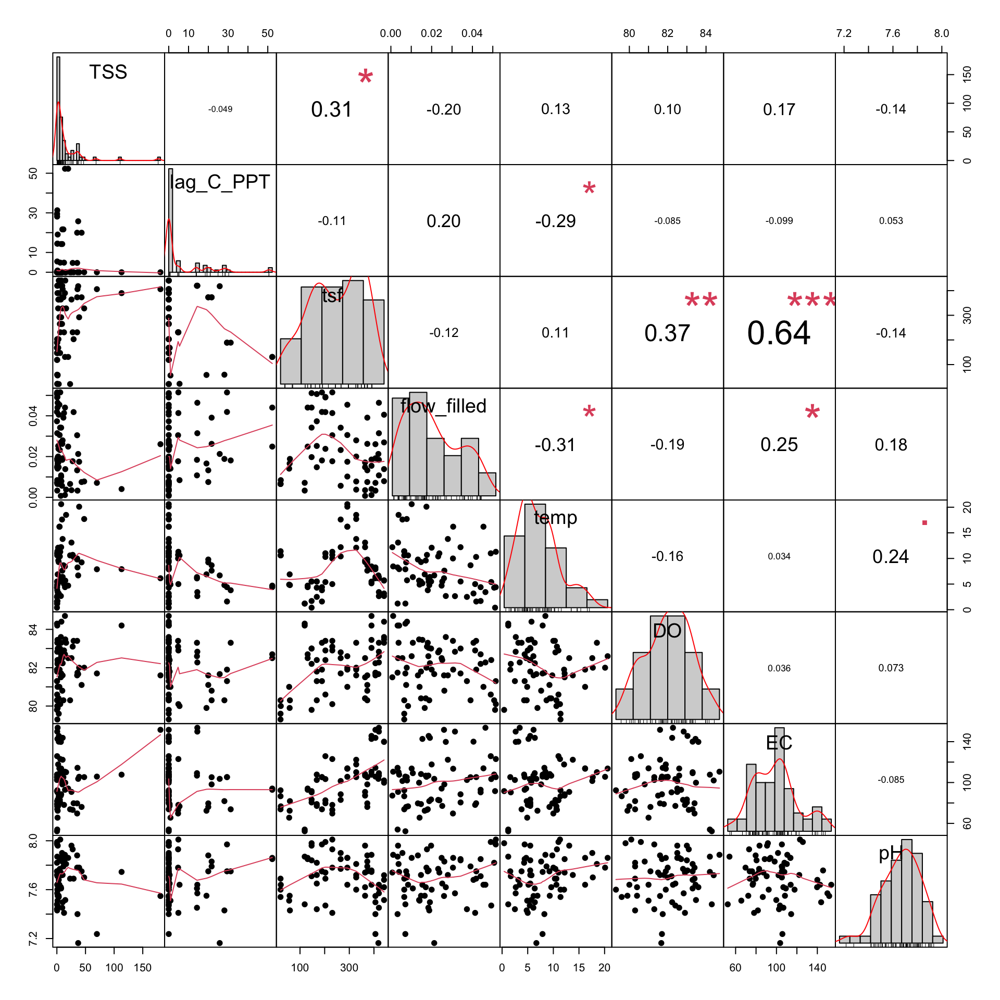

## Statistical Models

### Frequentist Mixed Models (Precipitation)

|           |  df |    AIC |
|:----------|----:|-------:|
| ppt_mod   |   7 | 612.26 |
| ppt_mod.1 |   6 | 616.75 |
| ppt_mod.2 |   7 | 612.23 |
| ppt_mod.3 |   7 | 611.84 |
| ppt_mod.4 |   5 | 625.52 |
| ppt_mod.5 |   6 | 618.08 |

AIC comparison of precipitation models

|  | (Intercept) | scale(lag_C_PPT \* tsf) | scale(lag_C_PPT) | scale(tsf) | scale(flow_filled) | scale(flow_filled \* tsf) | df | logLik | AICc | delta | weight |
|:---|---:|---:|---:|---:|---:|---:|---:|---:|---:|---:|---:|
| ppt_mod.3 | 15.76 | NA | 0.35 | 10.60 | NA | -6.97 | 7 | -298.92 | 613.77 | 0.00 | 0.3570108149 |
| ppt_mod.2 | 15.80 | NA | 0.53 | 6.92 | -6.17 | NA | 7 | -299.12 | 614.16 | 0.40 | 0.2928640050 |
| ppt_mod | 14.93 | -6.17 | 4.41 | 10.77 | NA | NA | 7 | -299.13 | 614.19 | 0.42 | 0.2896802871 |
| ppt_mod.1 | 14.90 | NA | -0.91 | 9.01 | NA | NA | 6 | -302.37 | 618.17 | 4.40 | 0.0395207471 |
| ppt_mod.5 | 16.69 | NA | 0.88 | NA | -10.06 | NA | 6 | -303.04 | 619.50 | 5.73 | 0.0203157142 |
| ppt_mod.4 | 15.54 | NA | -1.70 | NA | NA | NA | 5 | -307.76 | 626.52 | 12.75 | 0.0006084316 |

Model selection based on AICc

**Best model: ppt_mod.2** (TSS ~ PPT + TSF + Flow)

Rationale:

- ΔAICc difference trivial from ppt_mod.2 to the interaction models
  (ppt_mod and ppt_mod.3)

- Interaction unsupported and more complex in ppt_mod

- Strong collinearity (r = −0.871) in ppt_mod

### Bayesian Models

#### Model Setup

#### TSS Model

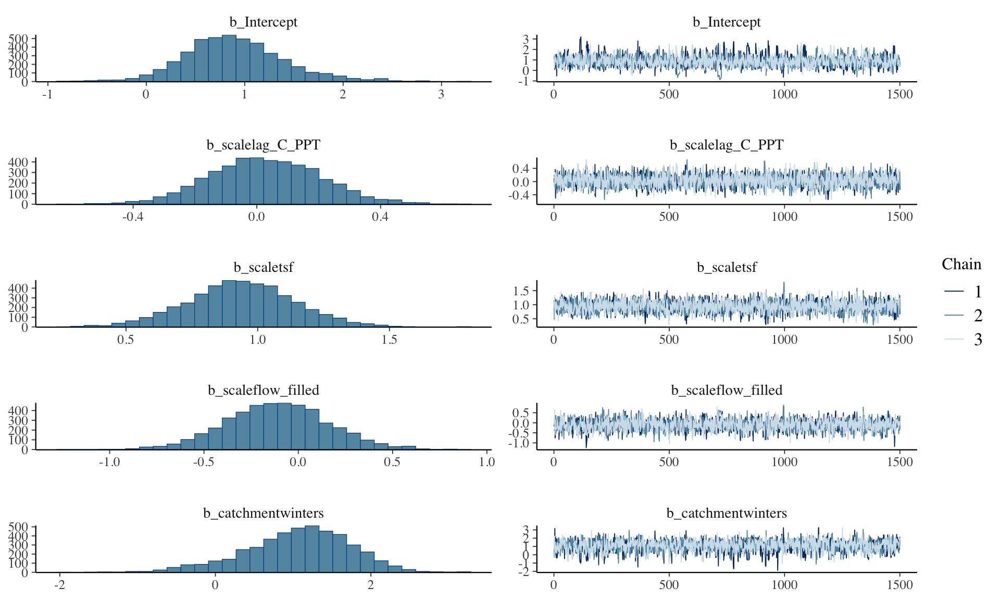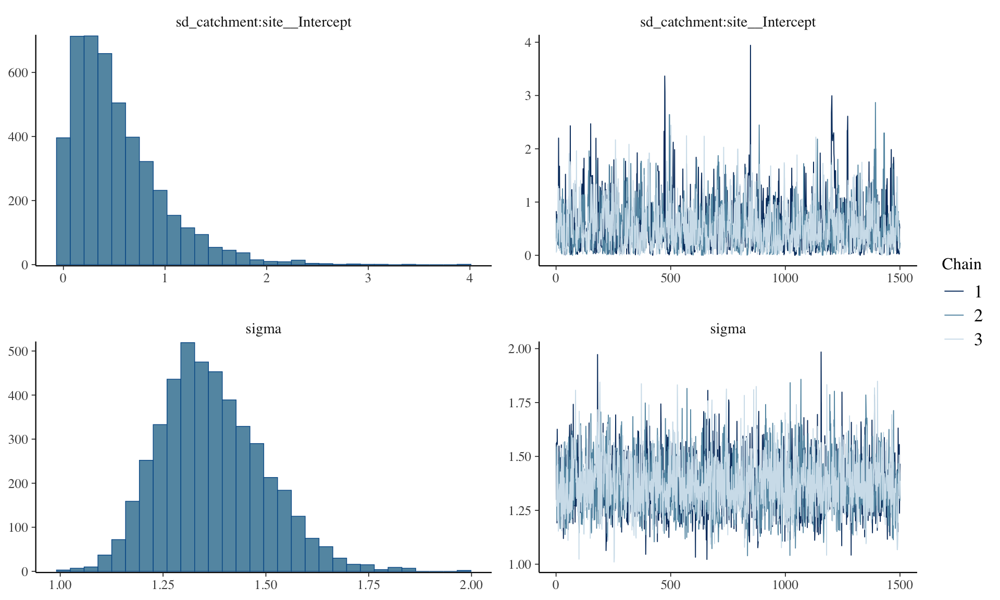

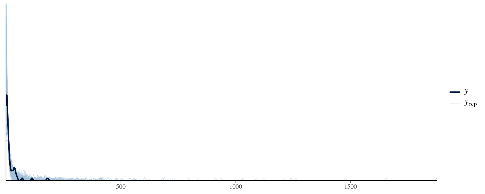

    ##  Family: lognormal 
    ##   Links: mu = identity; sigma = identity 
    ## Formula: TSS ~ scale(lag_C_PPT) + scale(tsf) + scale(flow_filled) + catchment + (1 | catchment:site) 
    ##    Data: data (Number of observations: 66) 
    ##   Draws: 3 chains, each with iter = 3000; warmup = 1500; thin = 1;
    ##          total post-warmup draws = 4500
    ## 
    ## Multilevel Hyperparameters:
    ## ~catchment:site (Number of levels: 4) 
    ##               Estimate Est.Error l-95% CI u-95% CI Rhat Bulk_ESS Tail_ESS
    ## sd(Intercept)     0.53      0.44     0.02     1.68 1.00     1166     1506
    ## 
    ## Regression Coefficients:
    ##                  Estimate Est.Error l-95% CI u-95% CI Rhat Bulk_ESS Tail_ESS
    ## Intercept            0.90      0.51    -0.00     2.05 1.00     1313     1363
    ## scalelag_C_PPT       0.03      0.18    -0.32     0.39 1.00     2752     2544
    ## scaletsf             0.94      0.20     0.54     1.33 1.00     2175     2142
    ## scaleflow_filled    -0.11      0.27    -0.64     0.43 1.00     1773     1852
    ## catchmentwinters     1.06      0.68    -0.43     2.23 1.00     1663     1316
    ## 
    ## Further Distributional Parameters:
    ##       Estimate Est.Error l-95% CI u-95% CI Rhat Bulk_ESS Tail_ESS
    ## sigma     1.37      0.13     1.15     1.64 1.00     2559     2840
    ## 
    ## Draws were sampled using sampling(NUTS). For each parameter, Bulk_ESS
    ## and Tail_ESS are effective sample size measures, and Rhat is the potential
    ## scale reduction factor on split chains (at convergence, Rhat = 1).

    ## 
    ## Computed from 4500 by 66 log-likelihood matrix.
    ## 
    ##          Estimate   SE
    ## elpd_loo   -216.3 15.3
    ## p_loo         7.5  1.5
    ## looic       432.5 30.7
    ## ------
    ## MCSE of elpd_loo is 0.1.
    ## MCSE and ESS estimates assume MCMC draws (r_eff in [0.4, 1.1]).
    ## 
    ## All Pareto k estimates are good (k < 0.7).
    ## See help('pareto-k-diagnostic') for details.

|  | term | estimate | l90 | u90 | estimate_exp | l90_exp | u90_exp | bayes_R2 |
|:---|:---|---:|---:|---:|---:|---:|---:|---:|
| b_Intercept | Intercept | 0.90 | 0.13 | 1.81 | 2.47 | 1.14 | 6.08 | 0.4 |
| b_scalelag_C_PPT | scalelag_C_PPT | 0.03 | -0.26 | 0.32 | 1.03 | 0.77 | 1.38 | 0.4 |
| b_scaletsf | scaletsf | 0.94 | 0.60 | 1.27 | 2.55 | 1.82 | 3.57 | 0.4 |
| b_scaleflow_filled | scaleflow_filled | -0.11 | -0.56 | 0.33 | 0.89 | 0.57 | 1.40 | 0.4 |
| b_catchmentwinters | catchmentwinters | 1.06 | -0.18 | 2.07 | 2.89 | 0.84 | 7.91 | 0.4 |

TSS Model Effects (Log and Exponentiated Scale)

Look at solute with TSS, PPT, and flow

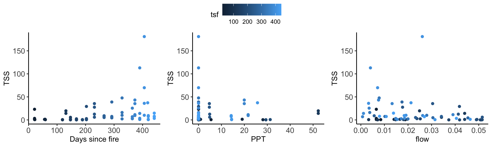

#### DOC Model

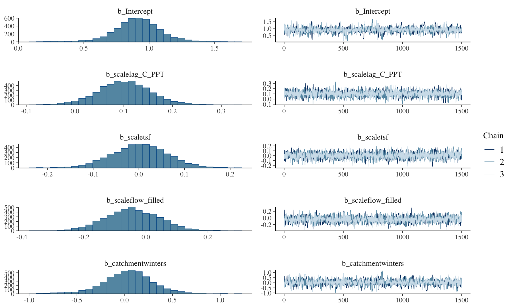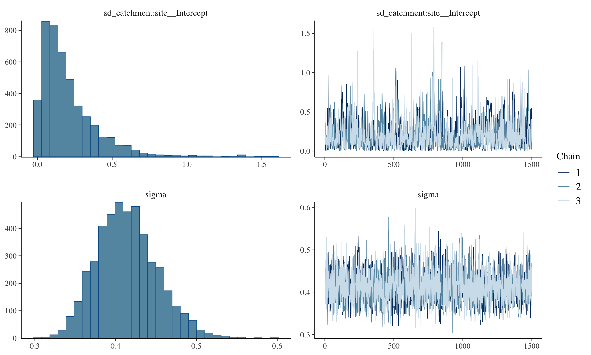

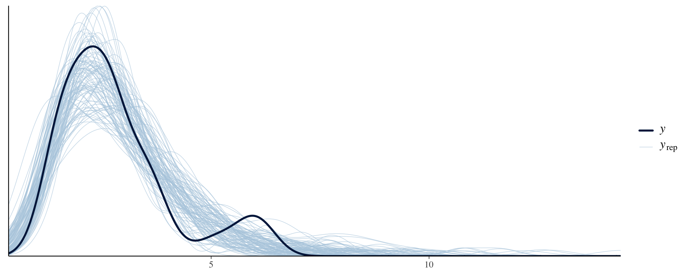

    ##  Family: lognormal 
    ##   Links: mu = identity; sigma = identity 
    ## Formula: DOC_QC ~ scale(lag_C_PPT) + scale(tsf) + scale(flow_filled) + catchment + (1 | catchment:site) 
    ##    Data: data (Number of observations: 69) 
    ##   Draws: 3 chains, each with iter = 3000; warmup = 1500; thin = 1;
    ##          total post-warmup draws = 4500
    ## 
    ## Multilevel Hyperparameters:
    ## ~catchment:site (Number of levels: 4) 
    ##               Estimate Est.Error l-95% CI u-95% CI Rhat Bulk_ESS Tail_ESS
    ## sd(Intercept)     0.21      0.19     0.01     0.66 1.00      718      871
    ## 
    ## Regression Coefficients:
    ##                  Estimate Est.Error l-95% CI u-95% CI Rhat Bulk_ESS Tail_ESS
    ## Intercept            0.91      0.19     0.50     1.29 1.00     1121      844
    ## scalelag_C_PPT       0.10      0.05    -0.01     0.21 1.00     3285     2752
    ## scaletsf             0.00      0.06    -0.12     0.12 1.00     3050     2933
    ## scaleflow_filled    -0.04      0.09    -0.21     0.12 1.00     2561     2576
    ## catchmentwinters     0.04      0.27    -0.54     0.58 1.00     1393     1119
    ## 
    ## Further Distributional Parameters:
    ##       Estimate Est.Error l-95% CI u-95% CI Rhat Bulk_ESS Tail_ESS
    ## sigma     0.41      0.04     0.35     0.49 1.00     3248     2922
    ## 
    ## Draws were sampled using sampling(NUTS). For each parameter, Bulk_ESS
    ## and Tail_ESS are effective sample size measures, and Rhat is the potential
    ## scale reduction factor on split chains (at convergence, Rhat = 1).

    ## 
    ## Computed from 4500 by 69 log-likelihood matrix.
    ## 
    ##          Estimate   SE
    ## elpd_loo   -105.6  7.5
    ## p_loo         7.5  1.2
    ## looic       211.2 15.0
    ## ------
    ## MCSE of elpd_loo is 0.1.
    ## MCSE and ESS estimates assume MCMC draws (r_eff in [0.5, 1.0]).
    ## 
    ## All Pareto k estimates are good (k < 0.7).
    ## See help('pareto-k-diagnostic') for details.

|  | term | estimate | l90 | u90 | estimate_exp | l90_exp | u90_exp | bayes_R2 |
|:---|:---|---:|---:|---:|---:|---:|---:|---:|
| b_Intercept | Intercept | 0.91 | 0.61 | 1.22 | 2.49 | 1.84 | 3.38 | 0.14 |
| b_scalelag_C_PPT | scalelag_C_PPT | 0.10 | 0.01 | 0.19 | 1.11 | 1.01 | 1.21 | 0.14 |
| b_scaletsf | scaletsf | 0.00 | -0.10 | 0.10 | 1.00 | 0.91 | 1.10 | 0.14 |
| b_scaleflow_filled | scaleflow_filled | -0.04 | -0.18 | 0.10 | 0.96 | 0.83 | 1.10 | 0.14 |
| b_catchmentwinters | catchmentwinters | 0.04 | -0.41 | 0.47 | 1.04 | 0.67 | 1.60 | 0.14 |

DOC Model Effects (Log and Exponentiated Scale)

Look at solute with TSF, PPT, and flow

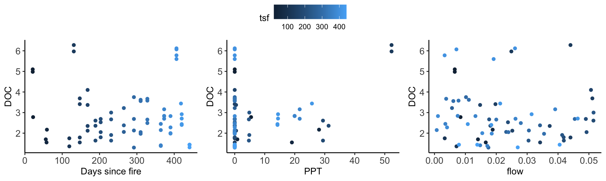

#### TDN Model

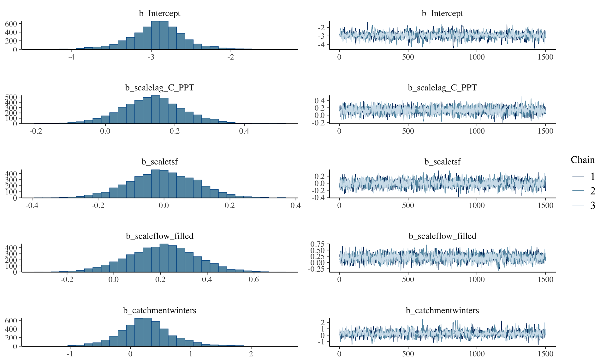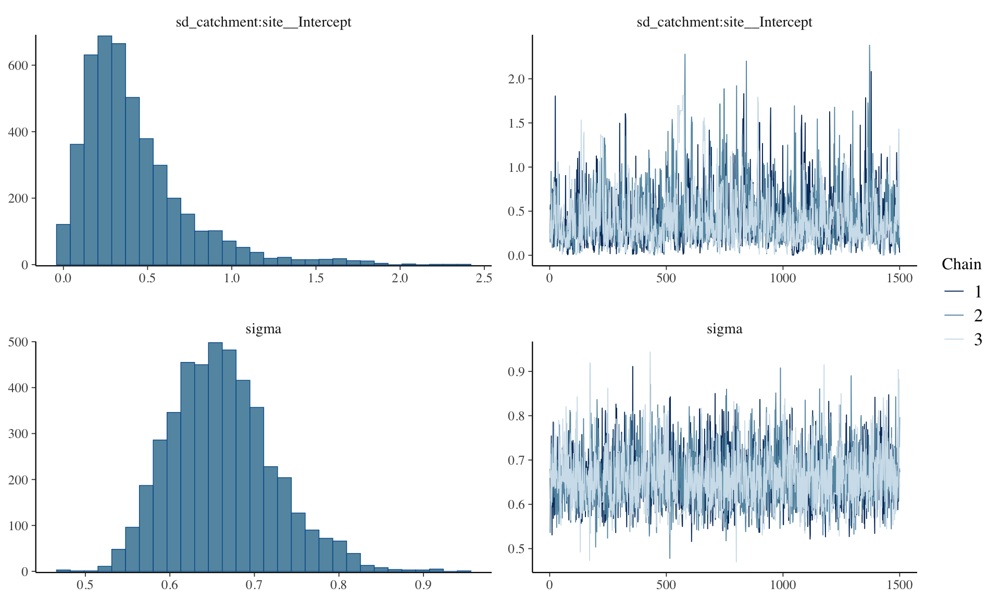

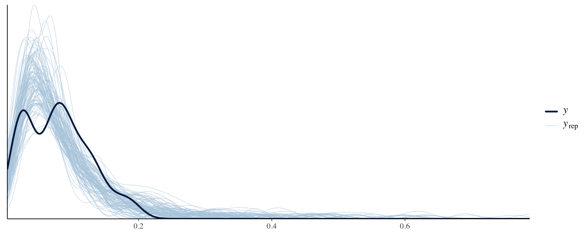

    ##  Family: lognormal 
    ##   Links: mu = identity; sigma = identity 
    ## Formula: TDN_QC ~ scale(lag_C_PPT) + scale(tsf) + scale(flow_filled) + catchment + (1 | catchment:site) 
    ##    Data: data (Number of observations: 69) 
    ##   Draws: 3 chains, each with iter = 3000; warmup = 1500; thin = 1;
    ##          total post-warmup draws = 4500
    ## 
    ## Multilevel Hyperparameters:
    ## ~catchment:site (Number of levels: 4) 
    ##               Estimate Est.Error l-95% CI u-95% CI Rhat Bulk_ESS Tail_ESS
    ## sd(Intercept)     0.42      0.31     0.04     1.30 1.00      697      756
    ## 
    ## Regression Coefficients:
    ##                  Estimate Est.Error l-95% CI u-95% CI Rhat Bulk_ESS Tail_ESS
    ## Intercept           -2.93      0.35    -3.70    -2.22 1.00     1428     1320
    ## scalelag_C_PPT       0.13      0.09    -0.05     0.31 1.00     3222     2367
    ## scaletsf            -0.00      0.10    -0.21     0.19 1.00     1936     1685
    ## scaleflow_filled     0.20      0.15    -0.08     0.48 1.00     2016     2727
    ## catchmentwinters     0.27      0.46    -0.61     1.27 1.00     1453     1420
    ## 
    ## Further Distributional Parameters:
    ##       Estimate Est.Error l-95% CI u-95% CI Rhat Bulk_ESS Tail_ESS
    ## sigma     0.66      0.06     0.56     0.80 1.00     2264     2750
    ## 
    ## Draws were sampled using sampling(NUTS). For each parameter, Bulk_ESS
    ## and Tail_ESS are effective sample size measures, and Rhat is the potential
    ## scale reduction factor on split chains (at convergence, Rhat = 1).

    ## 
    ## Computed from 4500 by 69 log-likelihood matrix.
    ## 
    ##          Estimate   SE
    ## elpd_loo    117.2  6.1
    ## p_loo         6.7  0.8
    ## looic      -234.5 12.2
    ## ------
    ## MCSE of elpd_loo is 0.1.
    ## MCSE and ESS estimates assume MCMC draws (r_eff in [0.4, 1.1]).
    ## 
    ## All Pareto k estimates are good (k < 0.7).
    ## See help('pareto-k-diagnostic') for details.

|  | term | estimate | l90 | u90 | estimate_exp | l90_exp | u90_exp | bayes_R2 |
|:---|:---|---:|---:|---:|---:|---:|---:|---:|
| b_Intercept | Intercept | -2.93 | -3.52 | -2.38 | 0.05 | 0.03 | 0.09 | 0.31 |
| b_scalelag_C_PPT | scalelag_C_PPT | 0.13 | -0.01 | 0.28 | 1.14 | 0.99 | 1.33 | 0.31 |
| b_scaletsf | scaletsf | 0.00 | -0.17 | 0.16 | 1.00 | 0.84 | 1.18 | 0.31 |
| b_scaleflow_filled | scaleflow_filled | 0.20 | -0.04 | 0.44 | 1.23 | 0.96 | 1.55 | 0.31 |
| b_catchmentwinters | catchmentwinters | 0.27 | -0.46 | 1.04 | 1.30 | 0.63 | 2.83 | 0.31 |

TDN Model Effects (Log and Exponentiated Scale)

Look at solute with TSF, PPT, and flow

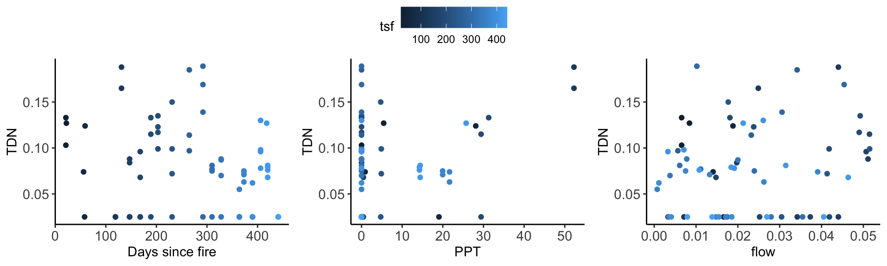

#### PO4.P Model

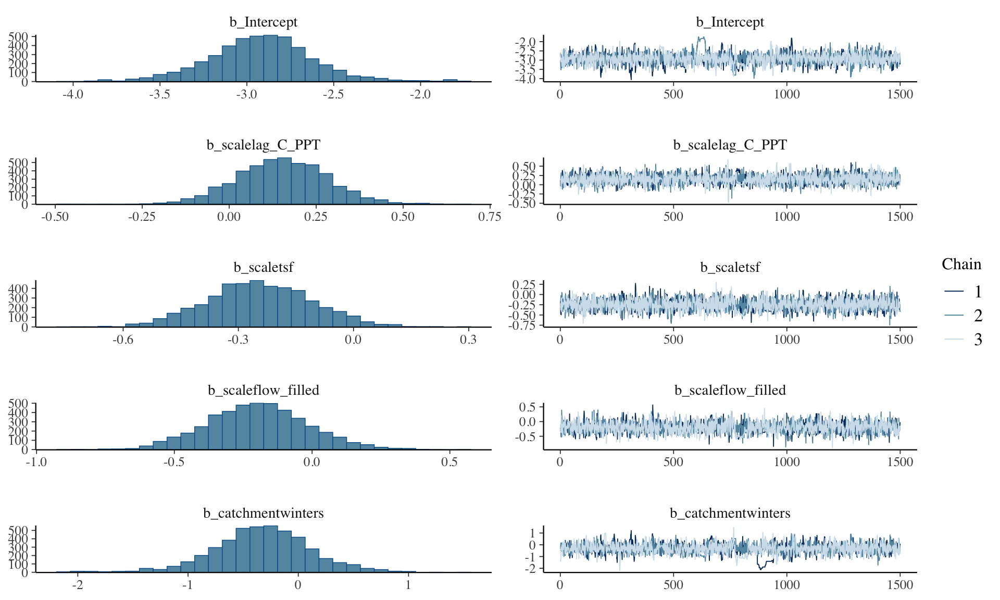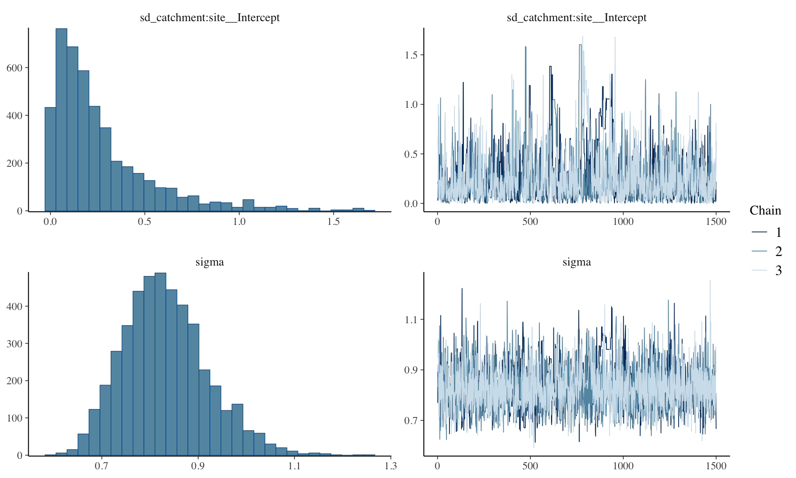

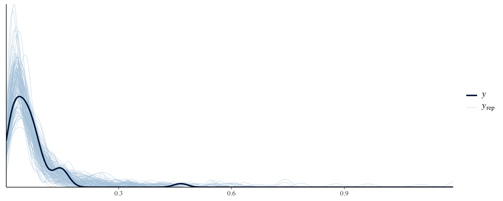

    ##  Family: lognormal 
    ##   Links: mu = identity; sigma = identity 
    ## Formula: PO4.P_QC ~ scale(lag_C_PPT) + scale(tsf) + scale(flow_filled) + catchment + (1 | catchment:site) 
    ##    Data: data (Number of observations: 55) 
    ##   Draws: 3 chains, each with iter = 3000; warmup = 1500; thin = 1;
    ##          total post-warmup draws = 4500
    ## 
    ## Multilevel Hyperparameters:
    ## ~catchment:site (Number of levels: 4) 
    ##               Estimate Est.Error l-95% CI u-95% CI Rhat Bulk_ESS Tail_ESS
    ## sd(Intercept)     0.27      0.27     0.01     1.05 1.00      461      220
    ## 
    ## Regression Coefficients:
    ##                  Estimate Est.Error l-95% CI u-95% CI Rhat Bulk_ESS Tail_ESS
    ## Intercept           -2.92      0.31    -3.52    -2.28 1.00      750      471
    ## scalelag_C_PPT       0.15      0.13    -0.10     0.41 1.00     1889     1863
    ## scaletsf            -0.25      0.14    -0.51     0.02 1.00     1331     1539
    ## scaleflow_filled    -0.20      0.18    -0.54     0.17 1.00     1558      954
    ## catchmentwinters    -0.33      0.45    -1.28     0.54 1.01      470      171
    ## 
    ## Further Distributional Parameters:
    ##       Estimate Est.Error l-95% CI u-95% CI Rhat Bulk_ESS Tail_ESS
    ## sigma     0.83      0.09     0.68     1.03 1.00     1042      511
    ## 
    ## Draws were sampled using sampling(NUTS). For each parameter, Bulk_ESS
    ## and Tail_ESS are effective sample size measures, and Rhat is the potential
    ## scale reduction factor on split chains (at convergence, Rhat = 1).

    ## 
    ## Computed from 4500 by 55 log-likelihood matrix.
    ## 
    ##          Estimate   SE
    ## elpd_loo     99.4  9.1
    ## p_loo         6.4  1.3
    ## looic      -198.9 18.1
    ## ------
    ## MCSE of elpd_loo is 0.1.
    ## MCSE and ESS estimates assume MCMC draws (r_eff in [0.2, 0.9]).
    ## 
    ## All Pareto k estimates are good (k < 0.7).
    ## See help('pareto-k-diagnostic') for details.

|  | term | estimate | l90 | u90 | estimate_exp | l90_exp | u90_exp | bayes_R2 |
|:---|:---|---:|---:|---:|---:|---:|---:|---:|
| b_Intercept | Intercept | -2.92 | -3.42 | -2.43 | 0.05 | 0.03 | 0.09 | 0.13 |
| b_scalelag_C_PPT | scalelag_C_PPT | 0.15 | -0.06 | 0.36 | 1.16 | 0.94 | 1.44 | 0.13 |
| b_scaletsf | scaletsf | -0.25 | -0.47 | -0.02 | 0.78 | 0.62 | 0.98 | 0.13 |
| b_scaleflow_filled | scaleflow_filled | -0.20 | -0.50 | 0.11 | 0.82 | 0.61 | 1.11 | 0.13 |
| b_catchmentwinters | catchmentwinters | -0.33 | -1.05 | 0.40 | 0.72 | 0.35 | 1.49 | 0.13 |

PO4.P Model Effects (Log and Exponentiated Scale)

Look at solute with TSF, PPT, and flow

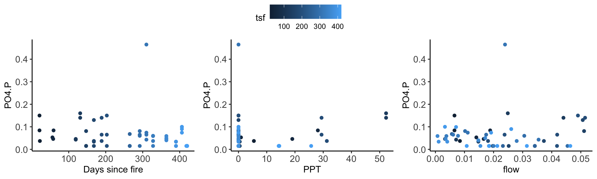

#### Sr Model

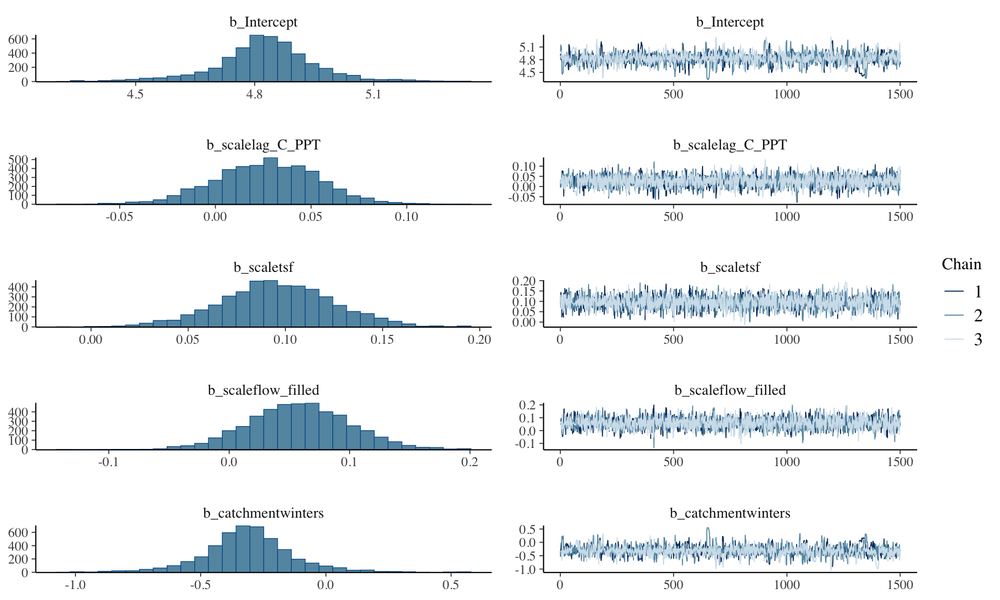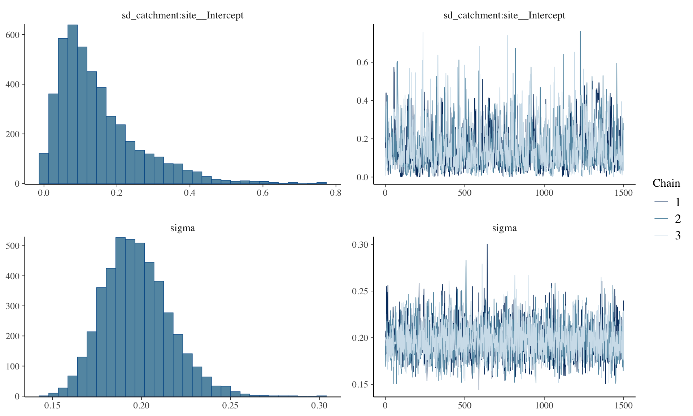

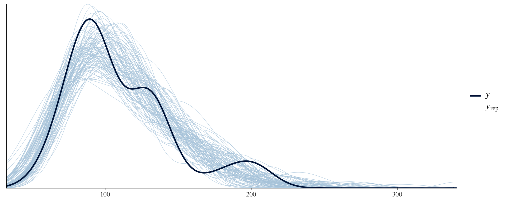

    ##  Family: lognormal 
    ##   Links: mu = identity; sigma = identity 
    ## Formula: Sr_QC ~ scale(lag_C_PPT) + scale(tsf) + scale(flow_filled) + catchment + (1 | catchment:site) 
    ##    Data: data (Number of observations: 69) 
    ##   Draws: 3 chains, each with iter = 3000; warmup = 1500; thin = 1;
    ##          total post-warmup draws = 4500
    ## 
    ## Multilevel Hyperparameters:
    ## ~catchment:site (Number of levels: 4) 
    ##               Estimate Est.Error l-95% CI u-95% CI Rhat Bulk_ESS Tail_ESS
    ## sd(Intercept)     0.15      0.11     0.01     0.43 1.00      796     1210
    ## 
    ## Regression Coefficients:
    ##                  Estimate Est.Error l-95% CI u-95% CI Rhat Bulk_ESS Tail_ESS
    ## Intercept            4.83      0.13     4.53     5.10 1.00     1136      548
    ## scalelag_C_PPT       0.03      0.03    -0.03     0.08 1.00     2572     1871
    ## scaletsf             0.10      0.03     0.04     0.15 1.00     2339     2293
    ## scaleflow_filled     0.06      0.04    -0.02     0.14 1.00     2173     2217
    ## catchmentwinters    -0.31      0.18    -0.69     0.07 1.01     1038      684
    ## 
    ## Further Distributional Parameters:
    ##       Estimate Est.Error l-95% CI u-95% CI Rhat Bulk_ESS Tail_ESS
    ## sigma     0.20      0.02     0.16     0.24 1.00     2715     2317
    ## 
    ## Draws were sampled using sampling(NUTS). For each parameter, Bulk_ESS
    ## and Tail_ESS are effective sample size measures, and Rhat is the potential
    ## scale reduction factor on split chains (at convergence, Rhat = 1).

    ## 
    ## Computed from 4500 by 69 log-likelihood matrix.
    ## 
    ##          Estimate   SE
    ## elpd_loo   -310.6  7.2
    ## p_loo         7.5  1.4
    ## looic       621.2 14.3
    ## ------
    ## MCSE of elpd_loo is 0.1.
    ## MCSE and ESS estimates assume MCMC draws (r_eff in [0.4, 0.9]).
    ## 
    ## All Pareto k estimates are good (k < 0.7).
    ## See help('pareto-k-diagnostic') for details.

|  | term | estimate | l90 | u90 | estimate_exp | l90_exp | u90_exp | bayes_R2 |
|:---|:---|---:|---:|---:|---:|---:|---:|---:|
| b_Intercept | Intercept | 4.83 | 4.60 | 5.03 | 124.83 | 99.17 | 153.37 | 0.56 |
| b_scalelag_C_PPT | scalelag_C_PPT | 0.03 | -0.02 | 0.07 | 1.03 | 0.98 | 1.07 | 0.56 |
| b_scaletsf | scaletsf | 0.10 | 0.05 | 0.14 | 1.10 | 1.05 | 1.16 | 0.56 |
| b_scaleflow_filled | scaleflow_filled | 0.06 | -0.01 | 0.13 | 1.06 | 0.99 | 1.14 | 0.56 |
| b_catchmentwinters | catchmentwinters | -0.31 | -0.60 | 0.00 | 0.73 | 0.55 | 1.00 | 0.56 |

Sr Model Effects (Log and Exponentiated Scale)

Look at solute with TSF, PPT, and flow

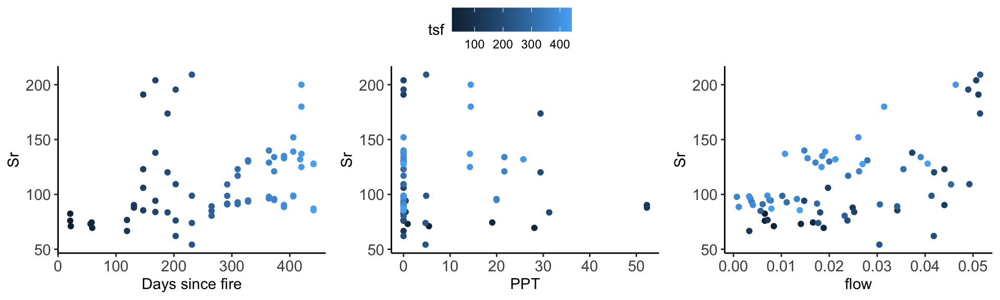

#### Fe Model

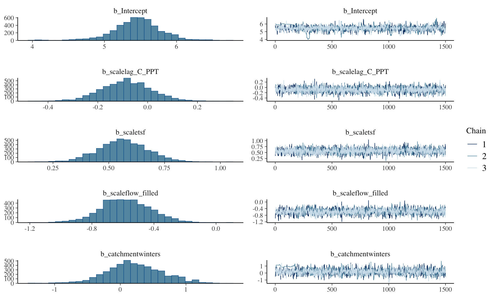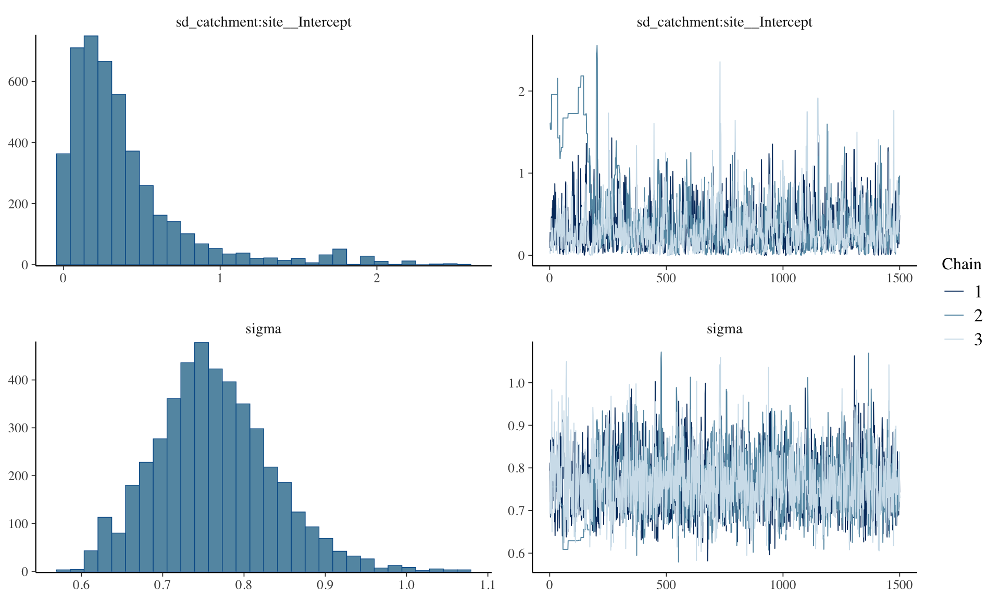

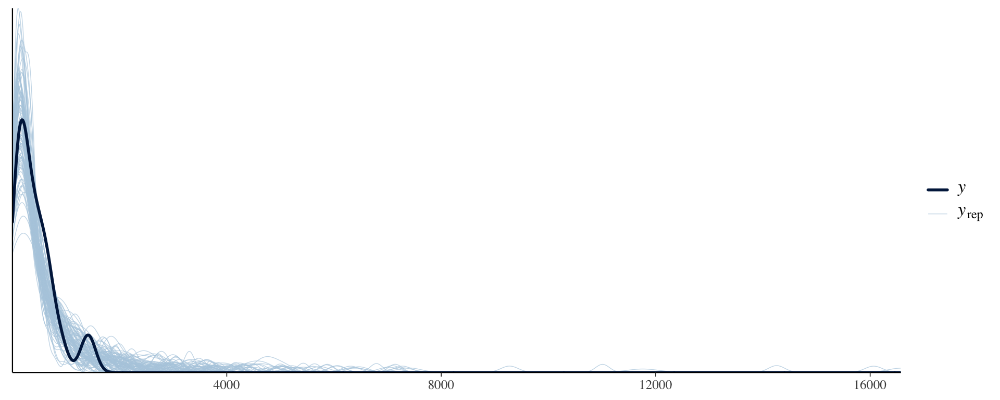

    ##  Family: lognormal 
    ##   Links: mu = identity; sigma = identity 
    ## Formula: Fe_QC ~ scale(lag_C_PPT) + scale(tsf) + scale(flow_filled) + catchment + (1 | catchment:site) 
    ##    Data: data (Number of observations: 69) 
    ##   Draws: 3 chains, each with iter = 3000; warmup = 1500; thin = 1;
    ##          total post-warmup draws = 4500
    ## 
    ## Multilevel Hyperparameters:
    ## ~catchment:site (Number of levels: 4) 
    ##               Estimate Est.Error l-95% CI u-95% CI Rhat Bulk_ESS Tail_ESS
    ## sd(Intercept)     0.38      0.39     0.01     1.71 1.05       43       21
    ## 
    ## Regression Coefficients:
    ##                  Estimate Est.Error l-95% CI u-95% CI Rhat Bulk_ESS Tail_ESS
    ## Intercept            5.45      0.33     4.74     6.05 1.01      269      566
    ## scalelag_C_PPT      -0.09      0.10    -0.28     0.11 1.00     2544     3028
    ## scaletsf             0.56      0.11     0.35     0.78 1.01     2648     2956
    ## scaleflow_filled    -0.58      0.16    -0.89    -0.27 1.00     1301     1815
    ## catchmentwinters     0.22      0.42    -0.58     1.10 1.02      164      331
    ## 
    ## Further Distributional Parameters:
    ##       Estimate Est.Error l-95% CI u-95% CI Rhat Bulk_ESS Tail_ESS
    ## sigma     0.76      0.07     0.63     0.92 1.00      360      131
    ## 
    ## Draws were sampled using sampling(NUTS). For each parameter, Bulk_ESS
    ## and Tail_ESS are effective sample size measures, and Rhat is the potential
    ## scale reduction factor on split chains (at convergence, Rhat = 1).

    ## 
    ## Computed from 4500 by 69 log-likelihood matrix.
    ## 
    ##          Estimate   SE
    ## elpd_loo   -466.9  8.6
    ## p_loo         7.3  1.3
    ## looic       933.9 17.1
    ## ------
    ## MCSE of elpd_loo is 0.1.
    ## MCSE and ESS estimates assume MCMC draws (r_eff in [0.1, 0.8]).
    ## 
    ## All Pareto k estimates are good (k < 0.7).
    ## See help('pareto-k-diagnostic') for details.

|  | term | estimate | l90 | u90 | estimate_exp | l90_exp | u90_exp | bayes_R2 |
|:---|:---|---:|---:|---:|---:|---:|---:|---:|
| b_Intercept | Intercept | 5.45 | 4.91 | 5.97 | 233.78 | 136.24 | 390.62 | 0.59 |
| b_scalelag_C_PPT | scalelag_C_PPT | -0.09 | -0.25 | 0.08 | 0.92 | 0.78 | 1.08 | 0.59 |
| b_scaletsf | scaletsf | 0.56 | 0.38 | 0.74 | 1.76 | 1.47 | 2.10 | 0.59 |
| b_scaleflow_filled | scaleflow_filled | -0.58 | -0.84 | -0.32 | 0.56 | 0.43 | 0.73 | 0.59 |
| b_catchmentwinters | catchmentwinters | 0.22 | -0.42 | 0.95 | 1.25 | 0.66 | 2.59 | 0.59 |

Fe Model Effects (Log and Exponentiated Scale)

Look at solute with TSF, PPT, and flow

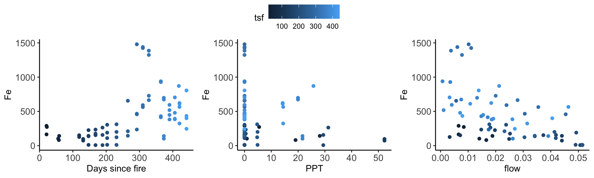

#### Mn Model

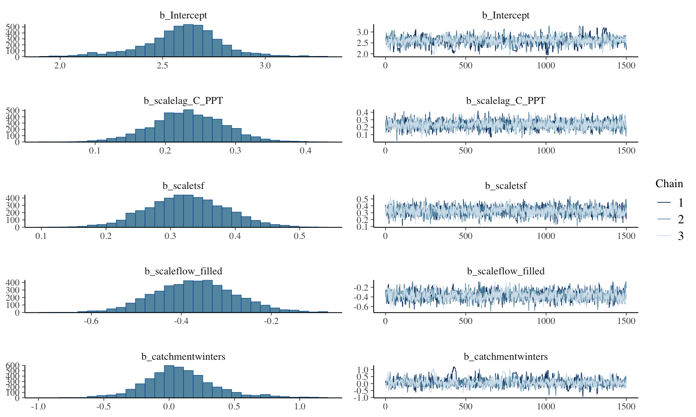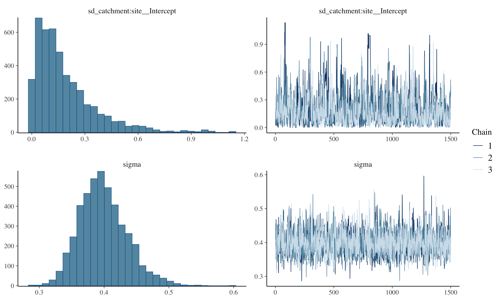

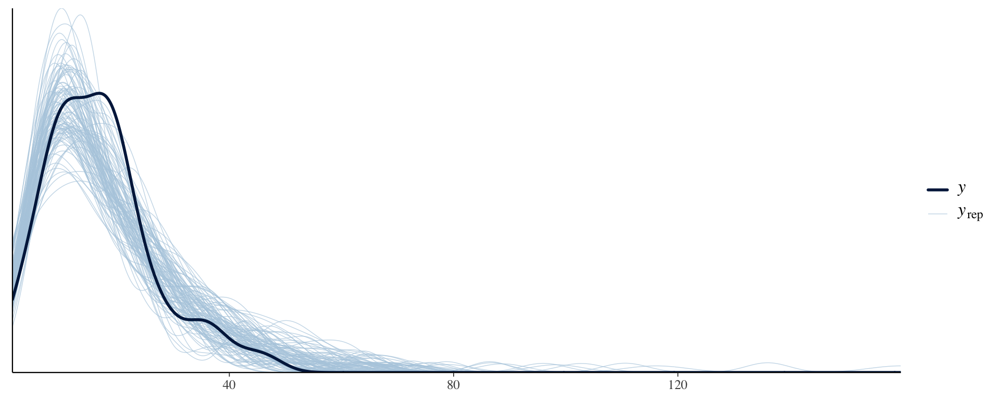

    ##  Family: lognormal 
    ##   Links: mu = identity; sigma = identity 
    ## Formula: Mn_QC ~ scale(lag_C_PPT) + scale(tsf) + scale(flow_filled) + catchment + (1 | catchment:site) 
    ##    Data: data (Number of observations: 69) 
    ##   Draws: 3 chains, each with iter = 3000; warmup = 1500; thin = 1;
    ##          total post-warmup draws = 4500
    ## 
    ## Multilevel Hyperparameters:
    ## ~catchment:site (Number of levels: 4) 
    ##               Estimate Est.Error l-95% CI u-95% CI Rhat Bulk_ESS Tail_ESS
    ## sd(Intercept)     0.19      0.17     0.01     0.63 1.01      652      677
    ## 
    ## Regression Coefficients:
    ##                  Estimate Est.Error l-95% CI u-95% CI Rhat Bulk_ESS Tail_ESS
    ## Intercept            2.60      0.19     2.15     2.98 1.00      754      478
    ## scalelag_C_PPT       0.23      0.05     0.13     0.33 1.00     2616     2668
    ## scaletsf             0.32      0.06     0.21     0.44 1.00     1619     2022
    ## scaleflow_filled    -0.37      0.09    -0.54    -0.19 1.00     1463     1650
    ## catchmentwinters     0.08      0.27    -0.43     0.74 1.00      839      370
    ## 
    ## Further Distributional Parameters:
    ##       Estimate Est.Error l-95% CI u-95% CI Rhat Bulk_ESS Tail_ESS
    ## sigma     0.40      0.04     0.34     0.48 1.00     2220     2085
    ## 
    ## Draws were sampled using sampling(NUTS). For each parameter, Bulk_ESS
    ## and Tail_ESS are effective sample size measures, and Rhat is the potential
    ## scale reduction factor on split chains (at convergence, Rhat = 1).

    ## 
    ## Computed from 4500 by 69 log-likelihood matrix.
    ## 
    ##          Estimate   SE
    ## elpd_loo   -221.2  9.1
    ## p_loo         8.3  2.5
    ## looic       442.5 18.1
    ## ------
    ## MCSE of elpd_loo is 0.1.
    ## MCSE and ESS estimates assume MCMC draws (r_eff in [0.4, 0.9]).
    ## 
    ## All Pareto k estimates are good (k < 0.7).
    ## See help('pareto-k-diagnostic') for details.

|  | term | estimate | l90 | u90 | estimate_exp | l90_exp | u90_exp | bayes_R2 |
|:---|:---|---:|---:|---:|---:|---:|---:|---:|
| b_Intercept | Intercept | 2.60 | 2.25 | 2.89 | 13.46 | 9.47 | 18.06 | 0.68 |
| b_scalelag_C_PPT | scalelag_C_PPT | 0.23 | 0.15 | 0.32 | 1.26 | 1.16 | 1.37 | 0.68 |
| b_scaletsf | scaletsf | 0.32 | 0.23 | 0.43 | 1.38 | 1.26 | 1.53 | 0.68 |
| b_scaleflow_filled | scaleflow_filled | -0.37 | -0.51 | -0.22 | 0.69 | 0.60 | 0.80 | 0.68 |
| b_catchmentwinters | catchmentwinters | 0.08 | -0.32 | 0.57 | 1.09 | 0.73 | 1.77 | 0.68 |

Mn Model Effects (Log and Exponentiated Scale)

Look at solute with TSF, PPT, and flow

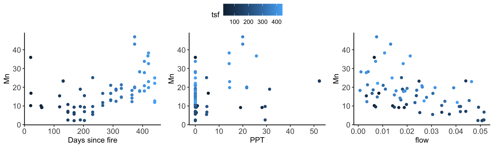

#### Ba Model

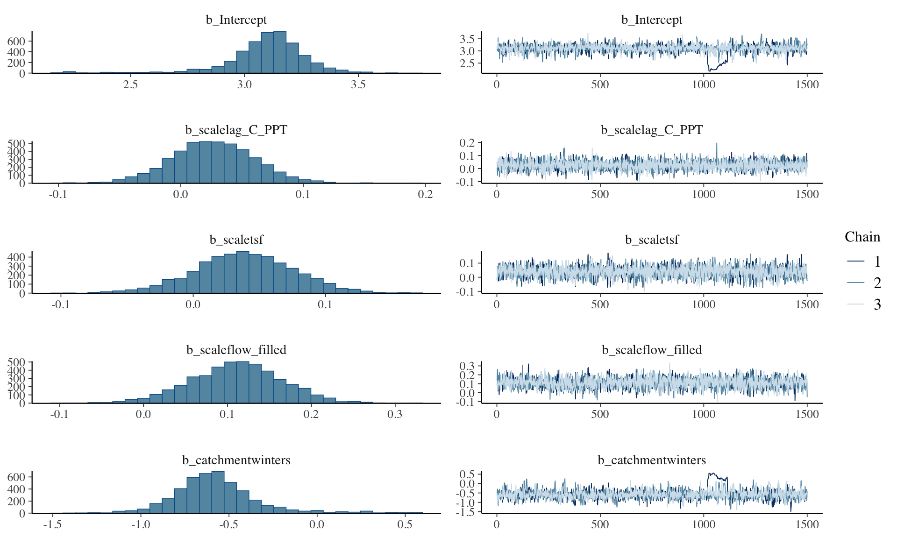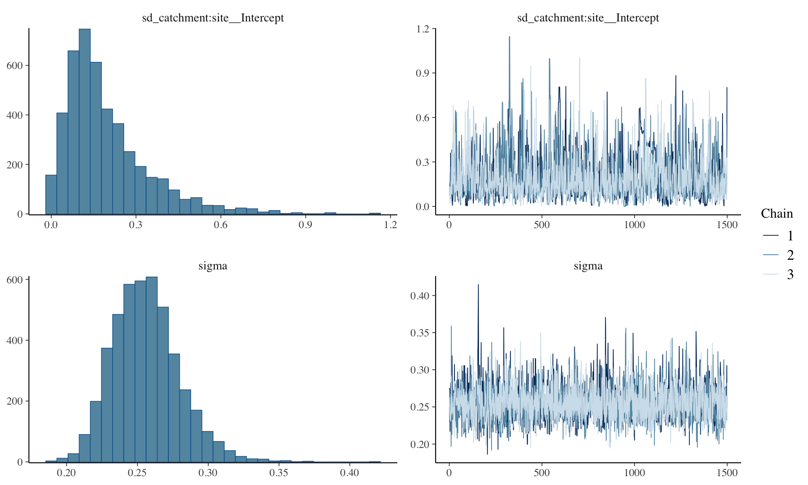

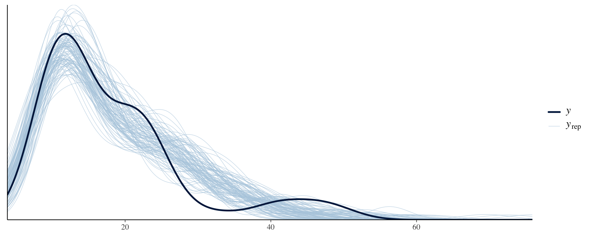

    ##  Family: lognormal 
    ##   Links: mu = identity; sigma = identity 
    ## Formula: Ba_QC ~ scale(lag_C_PPT) + scale(tsf) + scale(flow_filled) + catchment + (1 | catchment:site) 
    ##    Data: data (Number of observations: 69) 
    ##   Draws: 3 chains, each with iter = 3000; warmup = 1500; thin = 1;
    ##          total post-warmup draws = 4500
    ## 
    ## Multilevel Hyperparameters:
    ## ~catchment:site (Number of levels: 4) 
    ##               Estimate Est.Error l-95% CI u-95% CI Rhat Bulk_ESS Tail_ESS
    ## sd(Intercept)     0.20      0.15     0.01     0.60 1.01      490      933
    ## 
    ## Regression Coefficients:
    ##                  Estimate Est.Error l-95% CI u-95% CI Rhat Bulk_ESS Tail_ESS
    ## Intercept            3.10      0.18     2.61     3.40 1.01      357      110
    ## scalelag_C_PPT       0.03      0.03    -0.04     0.09 1.00     2882     2787
    ## scaletsf             0.04      0.04    -0.04     0.11 1.00     2663     2927
    ## scaleflow_filled     0.11      0.05     0.00     0.22 1.00     2789     3066
    ## catchmentwinters    -0.57      0.25    -0.99     0.12 1.01      326      111
    ## 
    ## Further Distributional Parameters:
    ##       Estimate Est.Error l-95% CI u-95% CI Rhat Bulk_ESS Tail_ESS
    ## sigma     0.26      0.02     0.22     0.31 1.00     2531     2776
    ## 
    ## Draws were sampled using sampling(NUTS). For each parameter, Bulk_ESS
    ## and Tail_ESS are effective sample size measures, and Rhat is the potential
    ## scale reduction factor on split chains (at convergence, Rhat = 1).

    ## 
    ## Computed from 4500 by 69 log-likelihood matrix.
    ## 
    ##          Estimate   SE
    ## elpd_loo   -199.0  7.6
    ## p_loo         7.2  1.2
    ## looic       398.1 15.2
    ## ------
    ## MCSE of elpd_loo is 0.1.
    ## MCSE and ESS estimates assume MCMC draws (r_eff in [0.5, 1.0]).
    ## 
    ## All Pareto k estimates are good (k < 0.7).
    ## See help('pareto-k-diagnostic') for details.

    ##    Estimate Est.Error      Q2.5     Q97.5
    ## R2 0.614033 0.0577231 0.4935263 0.7126013

|  | term | estimate | l90 | u90 | estimate_exp | l90_exp | u90_exp | bayes_R2 |
|:---|:---|---:|---:|---:|---:|---:|---:|---:|
| b_Intercept | Intercept | 3.10 | 2.78 | 3.34 | 22.10 | 16.20 | 28.17 | 0.61 |
| b_scalelag_C_PPT | scalelag_C_PPT | 0.03 | -0.03 | 0.08 | 1.03 | 0.97 | 1.09 | 0.61 |
| b_scaletsf | scaletsf | 0.04 | -0.02 | 0.10 | 1.04 | 0.98 | 1.11 | 0.61 |
| b_scaleflow_filled | scaleflow_filled | 0.11 | 0.02 | 0.20 | 1.12 | 1.02 | 1.22 | 0.61 |
| b_catchmentwinters | catchmentwinters | -0.57 | -0.91 | -0.13 | 0.56 | 0.40 | 0.88 | 0.61 |

Ba Model Effects (Log and Exponentiated Scale)

Look at solute with TSF, PPT, and flow

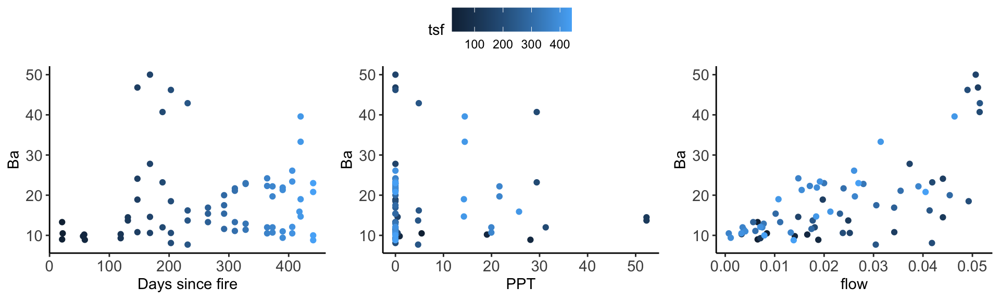

#### Ca Model

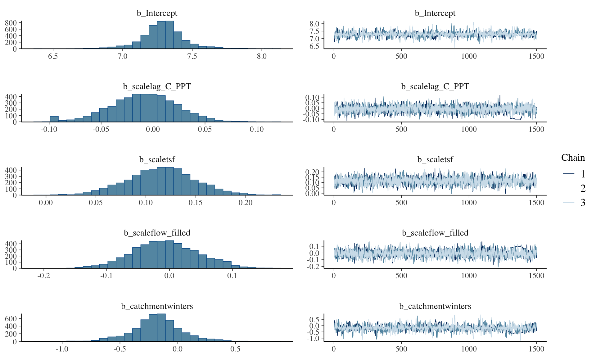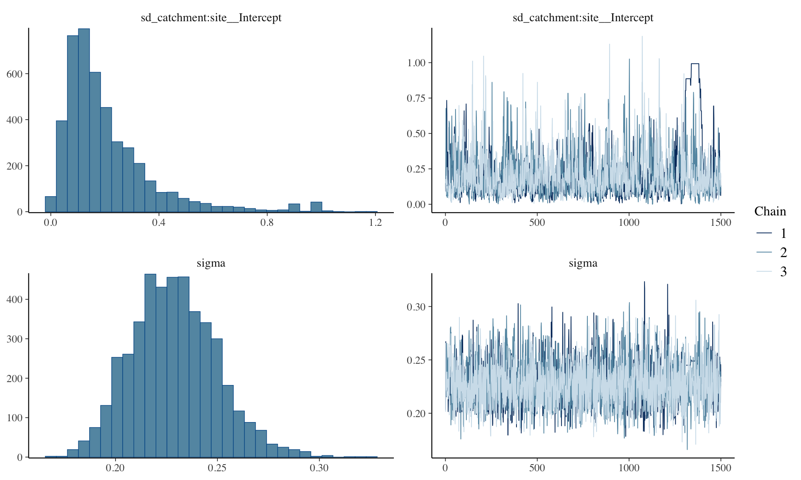

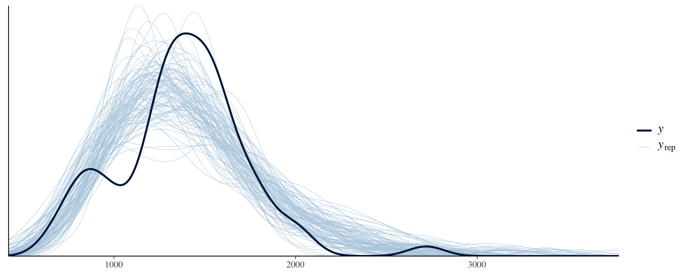

    ##  Family: lognormal 
    ##   Links: mu = identity; sigma = identity 
    ## Formula: Ca_QC ~ scale(lag_C_PPT) + scale(tsf) + scale(flow_filled) + catchment + (1 | catchment:site) 
    ##    Data: data (Number of observations: 69) 
    ##   Draws: 3 chains, each with iter = 3000; warmup = 1500; thin = 1;
    ##          total post-warmup draws = 4500
    ## 
    ## Multilevel Hyperparameters:
    ## ~catchment:site (Number of levels: 4) 
    ##               Estimate Est.Error l-95% CI u-95% CI Rhat Bulk_ESS Tail_ESS
    ## sd(Intercept)     0.21      0.17     0.03     0.75 1.00      295      123
    ## 
    ## Regression Coefficients:
    ##                  Estimate Est.Error l-95% CI u-95% CI Rhat Bulk_ESS Tail_ESS
    ## Intercept            7.29      0.16     6.95     7.64 1.01     1523     1269
    ## scalelag_C_PPT      -0.01      0.03    -0.08     0.05 1.01      489      139
    ## scaletsf             0.12      0.03     0.05     0.18 1.00     2489     2825
    ## scaleflow_filled    -0.01      0.05    -0.11     0.10 1.00      760      303
    ## catchmentwinters    -0.18      0.23    -0.64     0.30 1.00      648      193
    ## 
    ## Further Distributional Parameters:
    ##       Estimate Est.Error l-95% CI u-95% CI Rhat Bulk_ESS Tail_ESS
    ## sigma     0.23      0.02     0.19     0.27 1.00     2694     2779
    ## 
    ## Draws were sampled using sampling(NUTS). For each parameter, Bulk_ESS
    ## and Tail_ESS are effective sample size measures, and Rhat is the potential
    ## scale reduction factor on split chains (at convergence, Rhat = 1).

    ## 
    ## Computed from 4500 by 69 log-likelihood matrix.
    ## 
    ##          Estimate   SE
    ## elpd_loo   -495.9  6.3
    ## p_loo         7.5  1.4
    ## looic       991.9 12.5
    ## ------
    ## MCSE of elpd_loo is 0.1.
    ## MCSE and ESS estimates assume MCMC draws (r_eff in [0.1, 1.0]).
    ## 
    ## All Pareto k estimates are good (k < 0.7).
    ## See help('pareto-k-diagnostic') for details.

|  | term | estimate | l90 | u90 | estimate_exp | l90_exp | u90_exp | bayes_R2 |
|:---|:---|---:|---:|---:|---:|---:|---:|---:|
| b_Intercept | Intercept | 7.29 | 7.03 | 7.54 | 1463.68 | 1126.52 | 1886.12 | 0.36 |
| b_scalelag_C_PPT | scalelag_C_PPT | -0.01 | -0.07 | 0.04 | 0.99 | 0.94 | 1.04 | 0.36 |
| b_scaletsf | scaletsf | 0.12 | 0.06 | 0.17 | 1.12 | 1.06 | 1.19 | 0.36 |
| b_scaleflow_filled | scaleflow_filled | -0.01 | -0.09 | 0.08 | 0.99 | 0.91 | 1.09 | 0.36 |
| b_catchmentwinters | catchmentwinters | -0.18 | -0.58 | 0.20 | 0.84 | 0.56 | 1.22 | 0.36 |

Ca Model Effects (Log and Exponentiated Scale)

Look at solute with TSF, PPT, and flow

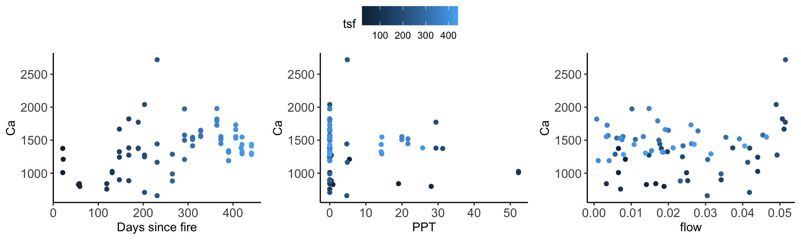

#### Al Model

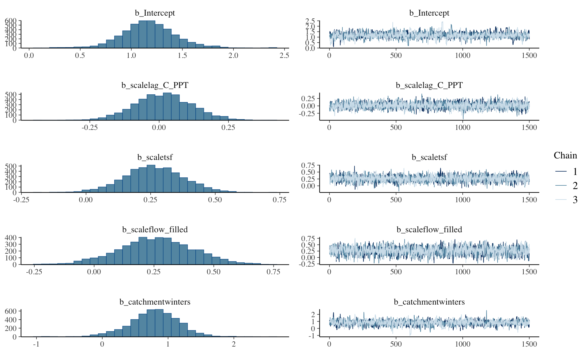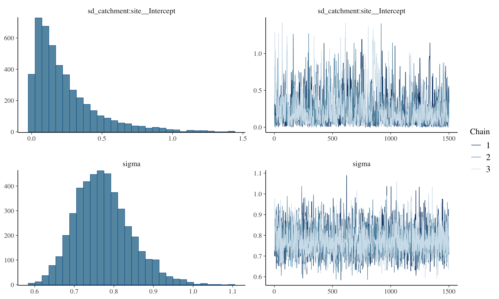

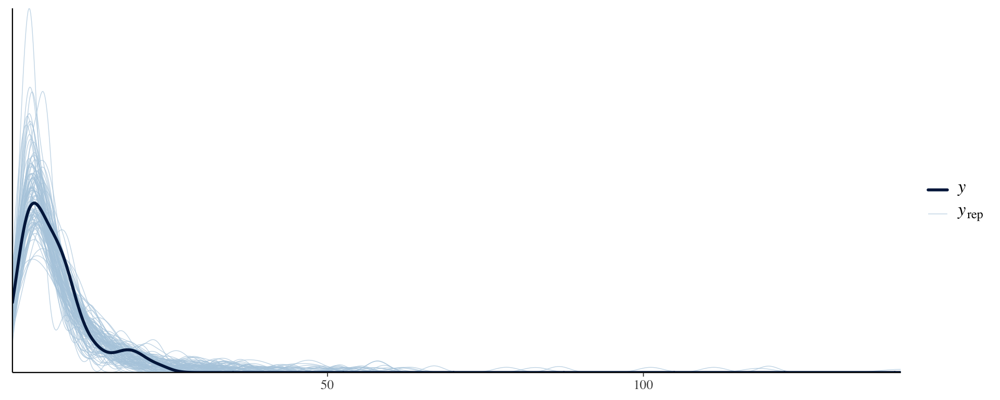

    ##  Family: lognormal 
    ##   Links: mu = identity; sigma = identity 
    ## Formula: Al_QC ~ scale(lag_C_PPT) + scale(tsf) + scale(flow_filled) + catchment + (1 | catchment:site) 
    ##    Data: data (Number of observations: 69) 
    ##   Draws: 3 chains, each with iter = 3000; warmup = 1500; thin = 1;
    ##          total post-warmup draws = 4500
    ## 
    ## Multilevel Hyperparameters:
    ## ~catchment:site (Number of levels: 4) 
    ##               Estimate Est.Error l-95% CI u-95% CI Rhat Bulk_ESS Tail_ESS
    ## sd(Intercept)     0.23      0.22     0.01     0.87 1.01      637      702
    ## 
    ## Regression Coefficients:
    ##                  Estimate Est.Error l-95% CI u-95% CI Rhat Bulk_ESS Tail_ESS
    ## Intercept            1.17      0.27     0.66     1.73 1.00     1186      882
    ## scalelag_C_PPT       0.02      0.10    -0.18     0.22 1.00     2761     2644
    ## scaletsf             0.26      0.11     0.04     0.48 1.00     2376     2307
    ## scaleflow_filled     0.26      0.16    -0.05     0.56 1.00     1636     2189
    ## catchmentwinters     0.79      0.37    -0.00     1.49 1.00     1209      814
    ## 
    ## Further Distributional Parameters:
    ##       Estimate Est.Error l-95% CI u-95% CI Rhat Bulk_ESS Tail_ESS
    ## sigma     0.77      0.07     0.65     0.92 1.00     3358     2917
    ## 
    ## Draws were sampled using sampling(NUTS). For each parameter, Bulk_ESS
    ## and Tail_ESS are effective sample size measures, and Rhat is the potential
    ## scale reduction factor on split chains (at convergence, Rhat = 1).

    ## 
    ## Computed from 4500 by 69 log-likelihood matrix.
    ## 
    ##          Estimate   SE
    ## elpd_loo   -195.6  7.6
    ## p_loo         6.5  1.3
    ## looic       391.3 15.1
    ## ------
    ## MCSE of elpd_loo is 0.1.
    ## MCSE and ESS estimates assume MCMC draws (r_eff in [0.5, 1.1]).
    ## 
    ## All Pareto k estimates are good (k < 0.7).
    ## See help('pareto-k-diagnostic') for details.

|  | term | estimate | l90 | u90 | estimate_exp | l90_exp | u90_exp | bayes_R2 |
|:---|:---|---:|---:|---:|---:|---:|---:|---:|
| b_Intercept | Intercept | 1.17 | 0.76 | 1.61 | 3.23 | 2.14 | 5.02 | 0.25 |
| b_scalelag_C_PPT | scalelag_C_PPT | 0.02 | -0.15 | 0.18 | 1.02 | 0.86 | 1.20 | 0.25 |
| b_scaletsf | scaletsf | 0.26 | 0.08 | 0.45 | 1.30 | 1.08 | 1.57 | 0.25 |
| b_scaleflow_filled | scaleflow_filled | 0.26 | -0.01 | 0.51 | 1.30 | 0.99 | 1.67 | 0.25 |
| b_catchmentwinters | catchmentwinters | 0.79 | 0.13 | 1.37 | 2.20 | 1.14 | 3.93 | 0.25 |

Al Model Effects (Log and Exponentiated Scale)

Look at solute with TSF, PPT, and flow

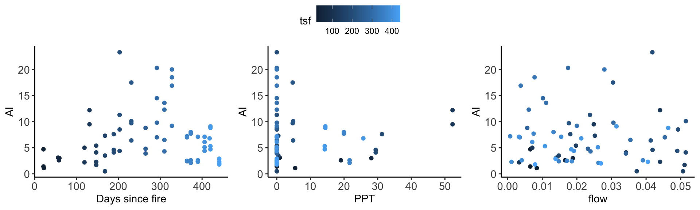

#### As Model

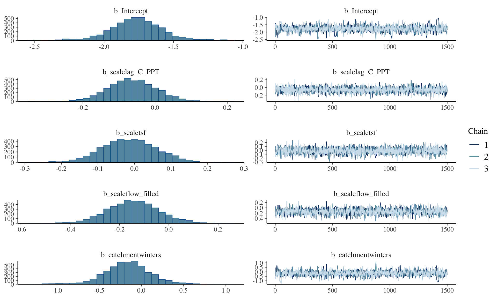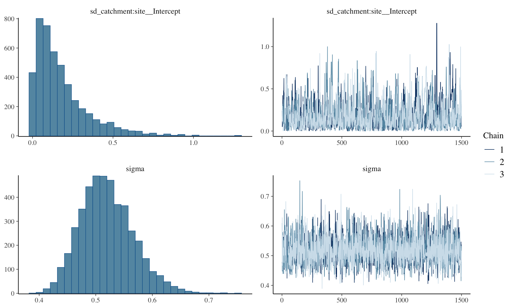

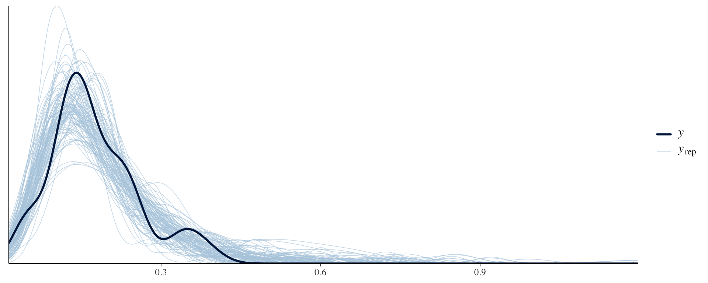

    ##  Family: lognormal 
    ##   Links: mu = identity; sigma = identity 
    ## Formula: As_QC ~ scale(lag_C_PPT) + scale(tsf) + scale(flow_filled) + catchment + (1 | catchment:site) 
    ##    Data: data (Number of observations: 69) 
    ##   Draws: 3 chains, each with iter = 3000; warmup = 1500; thin = 1;
    ##          total post-warmup draws = 4500
    ## 
    ## Multilevel Hyperparameters:
    ## ~catchment:site (Number of levels: 4) 
    ##               Estimate Est.Error l-95% CI u-95% CI Rhat Bulk_ESS Tail_ESS
    ## sd(Intercept)     0.18      0.17     0.01     0.63 1.00      909     1088
    ## 
    ## Regression Coefficients:
    ##                  Estimate Est.Error l-95% CI u-95% CI Rhat Bulk_ESS Tail_ESS
    ## Intercept           -1.77      0.20    -2.20    -1.36 1.00     1025      592
    ## scalelag_C_PPT      -0.06      0.07    -0.19     0.07 1.00     2568     3018
    ## scaletsf            -0.01      0.07    -0.16     0.13 1.00     2138     2305
    ## scaleflow_filled    -0.14      0.10    -0.35     0.07 1.00     1810     1610
    ## catchmentwinters    -0.16      0.28    -0.74     0.39 1.00     1239      882
    ## 
    ## Further Distributional Parameters:
    ##       Estimate Est.Error l-95% CI u-95% CI Rhat Bulk_ESS Tail_ESS
    ## sigma     0.52      0.05     0.44     0.62 1.00     3149     2924
    ## 
    ## Draws were sampled using sampling(NUTS). For each parameter, Bulk_ESS
    ## and Tail_ESS are effective sample size measures, and Rhat is the potential
    ## scale reduction factor on split chains (at convergence, Rhat = 1).

    ## 
    ## Computed from 4500 by 69 log-likelihood matrix.
    ## 
    ##          Estimate   SE
    ## elpd_loo     72.5  5.9
    ## p_loo         6.7  1.3
    ## looic      -144.9 11.8
    ## ------
    ## MCSE of elpd_loo is 0.1.
    ## MCSE and ESS estimates assume MCMC draws (r_eff in [0.5, 1.0]).
    ## 
    ## All Pareto k estimates are good (k < 0.7).
    ## See help('pareto-k-diagnostic') for details.

|  | term | estimate | l90 | u90 | estimate_exp | l90_exp | u90_exp | bayes_R2 |
|:---|:---|---:|---:|---:|---:|---:|---:|---:|
| b_Intercept | Intercept | -1.77 | -2.08 | -1.45 | 0.17 | 0.12 | 0.23 | 0.14 |
| b_scalelag_C_PPT | scalelag_C_PPT | -0.06 | -0.17 | 0.05 | 0.94 | 0.84 | 1.05 | 0.14 |
| b_scaletsf | scaletsf | -0.01 | -0.14 | 0.11 | 0.99 | 0.87 | 1.11 | 0.14 |
| b_scaleflow_filled | scaleflow_filled | -0.14 | -0.31 | 0.03 | 0.87 | 0.73 | 1.03 | 0.14 |
| b_catchmentwinters | catchmentwinters | -0.16 | -0.59 | 0.29 | 0.85 | 0.55 | 1.34 | 0.14 |

Al Model Effects (Log and Exponentiated Scale)

------------------------------------------------------------------------

------------------------------------------------------------------------

## Combined Results

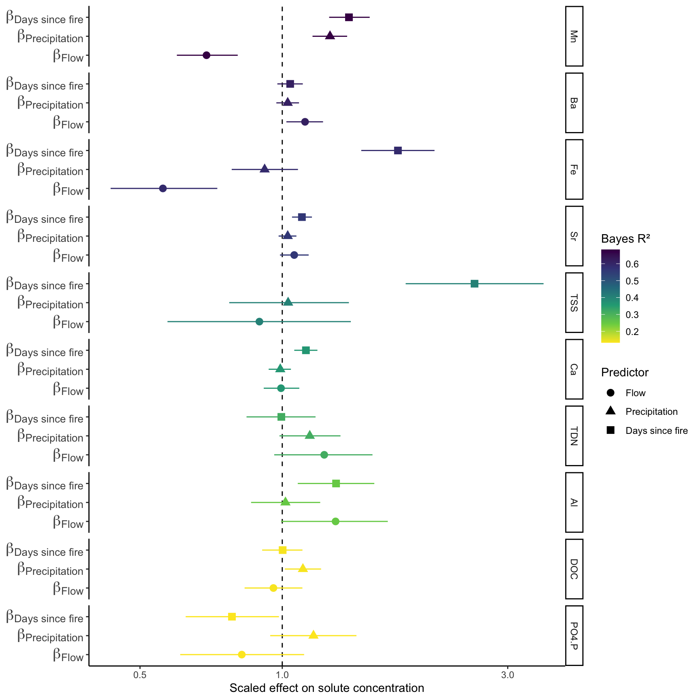

## Session Info

    ## R version 4.4.2 (2024-10-31)
    ## Platform: aarch64-apple-darwin20
    ## Running under: macOS Sequoia 15.7.4
    ## 
    ## Matrix products: default
    ## BLAS:   /Library/Frameworks/R.framework/Versions/4.4-arm64/Resources/lib/libRblas.0.dylib 
    ## LAPACK: /Library/Frameworks/R.framework/Versions/4.4-arm64/Resources/lib/libRlapack.dylib;  LAPACK version 3.12.0
    ## 
    ## locale:
    ## [1] en_US.UTF-8/en_US.UTF-8/en_US.UTF-8/C/en_US.UTF-8/en_US.UTF-8
    ## 
    ## time zone: America/Los_Angeles
    ## tzcode source: internal
    ## 
    ## attached base packages:
    ## [1] stats     graphics  grDevices utils     datasets  methods   base     
    ## 
    ## other attached packages:
    ##  [1] broom_1.0.7                slider_0.3.3              
    ##  [3] kableExtra_1.4.0           knitr_1.50                
    ##  [5] ggpmisc_0.6.3              ggpp_0.5.9                
    ##  [7] ggpubr_0.6.0               cowplot_1.1.3             
    ##  [9] viridis_0.6.5              viridisLite_0.4.2         
    ## [11] dataRetrieval_2.7.17       readxl_1.4.3              
    ## [13] loo_2.8.0                  PerformanceAnalytics_2.0.8
    ## [15] xts_0.14.1                 zoo_1.8-12                
    ## [17] MuMIn_1.48.4               brms_2.22.0               
    ## [19] Rcpp_1.1.0                 lmerTest_3.1-3            
    ## [21] lme4_1.1-35.5              Matrix_1.7-1              
    ## [23] here_1.0.1                 lubridate_1.9.4           
    ## [25] forcats_1.0.0              stringr_1.5.1             
    ## [27] dplyr_1.1.4                purrr_1.1.0               
    ## [29] readr_2.1.5                tidyr_1.3.1               
    ## [31] tibble_3.3.0               ggplot2_3.5.2             
    ## [33] tidyverse_2.0.0           
    ## 
    ## loaded via a namespace (and not attached):
    ##   [1] RColorBrewer_1.1-3   tensorA_0.36.2.1     rstudioapi_0.17.1   
    ##   [4] jsonlite_2.0.0       magrittr_2.0.3       TH.data_1.1-2       
    ##   [7] estimability_1.5.1   farver_2.1.2         nloptr_2.1.1        
    ##  [10] rmarkdown_2.29       ragg_1.3.3           vctrs_0.6.5         
    ##  [13] minqa_1.2.8          rstatix_0.7.2        htmltools_0.5.8.1   
    ##  [16] polynom_1.4-1        curl_7.0.0           distributional_0.5.0
    ##  [19] cellranger_1.1.0     Formula_1.2-5        StanHeaders_2.32.10 
    ##  [22] sass_0.4.10          KernSmooth_2.23-24   bslib_0.9.0         
    ##  [25] plyr_1.8.9           sandwich_3.1-1       emmeans_1.10.6      
    ##  [28] cachem_1.1.0         lifecycle_1.0.4      pkgconfig_2.0.3     
    ##  [31] R6_2.6.1             fastmap_1.2.0        digest_0.6.37       
    ##  [34] numDeriv_2016.8-1.1  colorspace_2.1-1     rprojroot_2.1.1     
    ##  [37] warp_0.2.2           textshaping_0.4.1    labeling_0.4.3      
    ##  [40] timechange_0.3.0     abind_1.4-8          compiler_4.4.2      
    ##  [43] proxy_0.4-27         bit64_4.5.2          withr_3.0.2         
    ##  [46] inline_0.3.20        backports_1.5.0      carData_3.0-5       
    ##  [49] DBI_1.2.3            QuickJSR_1.4.0       pkgbuild_1.4.8      
    ##  [52] ggsignif_0.6.4       MASS_7.3-61          quantreg_6.1        
    ##  [55] classInt_0.4-11      tools_4.4.2          units_0.8-7         
    ##  [58] glue_1.8.0           quadprog_1.5-8       nlme_3.1-166        
    ##  [61] grid_4.4.2           sf_1.0-21            checkmate_2.3.2     
    ##  [64] reshape2_1.4.4       generics_0.1.4       gtable_0.3.6        
    ##  [67] tzdb_0.4.0           class_7.3-22         hms_1.1.3           
    ##  [70] xml2_1.4.0           car_3.1-3            pillar_1.11.0       
    ##  [73] vroom_1.6.5          posterior_1.6.0      splines_4.4.2       
    ##  [76] lattice_0.22-6       survival_3.7-0       bit_4.5.0.1         
    ##  [79] SparseM_1.84-2       tidyselect_1.2.1     gridExtra_2.3       
    ##  [82] V8_6.0.0             svglite_2.1.3        stats4_4.4.2        
    ##  [85] xfun_0.53            bridgesampling_1.1-2 matrixStats_1.4.1   
    ##  [88] rstan_2.32.6         stringi_1.8.7        yaml_2.3.10         
    ##  [91] boot_1.3-31          evaluate_1.0.5       codetools_0.2-20    
    ##  [94] cli_3.6.5            RcppParallel_5.1.9   xtable_1.8-4        
    ##  [97] systemfonts_1.1.0    jquerylib_0.1.4      dichromat_2.0-0.1   
    ## [100] coda_0.19-4.1        parallel_4.4.2       rstantools_2.4.0    
    ## [103] MatrixModels_0.5-3   bayesplot_1.11.1     Brobdingnag_1.2-9   
    ## [106] mvtnorm_1.3-2        scales_1.4.0         e1071_1.7-16        
    ## [109] crayon_1.5.3         rlang_1.1.6          multcomp_1.4-26

------------------------------------------------------------------------

### 

``` r
# Clear all cached results
unlink("_cache", recursive = TRUE)
unlink("models", recursive = TRUE)

# Re-render (will take 2-3 hours for all models)
rmarkdown::render("ERDC_MS_solute_stats_REFACTORED.Rmd")
```
